```mermaid
flowchart TD
    Start([Agent wakes up<br/>7:00 AM]) --> OpenApp[Open Travel Umroh<br/>Mobile/Desktop]

    OpenApp --> Dashboard[Dashboard loads<br/>with status summary]

    Dashboard --> StatusScan{Visual scan<br/>3 seconds}

    StatusScan --> StatusUnderstood[Sees: 5🔴 3🟡 17🟢<br/>EMOTION: Clarity]

    StatusUnderstood --> Decision1{Any urgent<br/>red status?}

    Decision1 -->|Yes: 5 urgent| FilterRed[Tap: Show Red Only]
    Decision1 -->|No urgent| CheckYellow{Any soon<br/>yellow status?}

    FilterRed --> ViewUrgent[5 jamaah cards appear<br/>Kurang: KTP, Passport, etc]

    ViewUrgent --> SelectAll[Tap: Select All Red<br/>OR<br/>Manual checkbox 5x]

    SelectAll --> BulkAction[Floating button appears:<br/>Kirim Reminder 5]

    BulkAction --> TemplateSelect[Choose template:<br/>Reminder Dokumen Kurang]

    TemplateSelect --> Preview[Preview message:<br/>Assalamualaikum Ibu Siti,<br/>dokumen KTP masih kurang...]

    Preview --> Decision2{Preview OK?}

    Decision2 -->|Yes| SendBulk[Tap: Kirim ke 5 Jamaah]
    Decision2 -->|No| EditTemplate[Edit message]

    EditTemplate --> SendBulk

    SendBulk --> WhatsAppOpen[WhatsApp opens<br/>5 messages pre-filled]

    WhatsAppOpen --> SendInWA[Agent taps Send<br/>in WhatsApp 5x]

    SendInWA --> Confirmation[Success toast:<br/>5 reminder terkirim ✓<br/>EMOTION: Accomplishment]

    Confirmation --> TimeAwareness[Time tracking shows:<br/>Selesai dalam 5 menit<br/>Hemat 87% waktu!<br/>EMOTION: Relief + WOW]

    TimeAwareness --> CheckYellow

    CheckYellow -->|Yes: 3 soon| FilterYellow[Tap: Show Yellow Only]
    CheckYellow -->|No soon| Done

    FilterYellow --> ViewSoon[3 jamaah cicilan due]

    ViewSoon --> SelectYellow[Select all 3]

    SelectYellow --> SendPaymentReminder[Kirim Reminder Cicilan<br/>Same flow as above]

    SendPaymentReminder --> PaymentConfirm[3 reminder cicilan sent ✓]

    PaymentConfirm --> Done[Morning routine complete<br/>Total: 15 menit<br/>EMOTION: Empowerment]

    Done --> NextAction[Suggestion appears:<br/>Waktu tersisa untuk<br/>5 sales calls hari ini! 🚀]

    NextAction --> End([Agent closes dashboard<br/>Spends day on SALES])

    style Start fill:#EFF6FF
    style StatusUnderstood fill:#D1FAE5
    style Confirmation fill:#D1FAE5
    style TimeAwareness fill:#FEF3C7
    style Done fill:#D1FAE5
    style End fill:#EFF6FF
```

```mermaid
flowchart TD
    Start([Monday morning<br/>Check cicilan due]) --> Dashboard[Open Dashboard]

    Dashboard --> StatusScan[See: 3🟡 Cicilan Due]

    StatusScan --> FilterYellow[Tap: Show Yellow Only]

    FilterYellow --> ViewList[3 jamaah appear:<br/>Pak Ahmad: Cicilan 2<br/>Ibu Ani: Cicilan 1<br/>Pak Budi: Cicilan 3]

    ViewList --> ReviewDates{Check due dates}

    ReviewDates --> SelectRelevant[Select jamaah with<br/>cicilan due this week:<br/>✓ Pak Ahmad 28 Des<br/>✓ Ibu Ani 30 Des<br/>✗ Pak Budi 15 Jan next]

    SelectRelevant --> BulkAction[Tap: Kirim Reminder 2]

    BulkAction --> TemplateSelect[Choose:<br/>Reminder Cicilan]

    TemplateSelect --> TemplatePreview[Preview:<br/>Assalamualaikum Pak Ahmad,<br/><br/>Mengingatkan cicilan ke-2<br/>sebesar Rp 5.000.000<br/>jatuh tempo 28 Desember 2025.<br/><br/>Transfer ke:<br/>BCA 1234567890<br/>a.n. PT Berkah Umroh<br/>Virtual Account: VA8123456<br/><br/>Konfirmasi setelah transfer.<br/>Terima kasih 🙏]

    TemplatePreview --> MergeFields{Merge fields<br/>correct?}

    MergeFields -->|Yes| SendBulk[Tap: Kirim ke 2 Jamaah]
    MergeFields -->|No| EditMerge[Adjust template<br/>fields if needed]

    EditMerge --> SendBulk

    SendBulk --> WhatsAppOpen[WhatsApp opens<br/>2 messages ready]

    WhatsAppOpen --> AgentSend[Agent sends in WA<br/>24 seconds each]

    AgentSend --> Confirmation[Success:<br/>2 reminder terkirim ✓]

    Confirmation --> UpdateStatus[Status updated:<br/>Reminder sent<br/>2 min ago]

    UpdateStatus --> SetFollowUp[Auto follow-up:<br/>If not paid by 27 Des<br/>→ Send reminder again]

    SetFollowUp --> Done[Cicilan reminder<br/>complete]

    Done --> Optional{Want to track<br/>payment status?}

    Optional -->|Yes| PaymentTracker[Navigate to:<br/>Payment Tracker view]
    Optional -->|No| End([Return to Dashboard])

    PaymentTracker --> ViewPending[See pending payments:<br/>2 cicilan awaiting<br/>Total: Rp 10 juta]

    ViewPending --> End

    style Start fill:#EFF6FF
    style Confirmation fill:#D1FAE5
    style Done fill:#D1FAE5
    style End fill:#EFF6FF
```

```mermaid
flowchart TD
    Start([Trainer introduces system<br/>Bu Ratna: Saya ga bisa komputer]) --> Reassure[Trainer:<br/>Tenang Bu, ini simpel.<br/>Saya bantu dari awal.]

    Reassure --> CreateAccount[Trainer helps:<br/>Create account<br/>Login credentials]

    CreateAccount --> FirstLogin[Bu Ratna logs in<br/>First time]

    FirstLogin --> Welcome[Welcome screen:<br/>Selamat datang<br/>Bu Ratna! 👋<br/><br/>Mari mulai dengan<br/>3 aksi sederhana]

    Welcome --> SimplifiedMode[Auto-detect:<br/>First-time user<br/>→ Simplified Mode]

    SimplifiedMode --> Show3Buttons[Dashboard shows:<br/>3 LARGE buttons only<br/><br/>🏠 Jamaah Saya<br/>📤 Upload Dokumen<br/>📲 Kirim Pengingat]

    Show3Buttons --> TooltipGuide[Tooltip appears:<br/>Mari upload dokumen<br/>pertama untuk Jamaah Siti<br/>↓<br/>Tap button Upload]

    TooltipGuide --> BuRatnaReads{Bu Ratna<br/>reads & understands?}

    BuRatnaReads -->|Confused| TrainerHelp1[Trainer points:<br/>Yang ini Bu yang<br/>upload dokumen]
    BuRatnaReads -->|Understands| TapUpload[Bu Ratna taps:<br/>Upload Dokumen]

    TrainerHelp1 --> TapUpload

    TapUpload --> SelectJamaah[Screen shows:<br/>Pilih Jamaah<br/><br/>Large cards:<br/>☐ Ibu Siti Aminah<br/>☐ Pak Ahmad<br/>☐ Bu Ratna W]

    SelectJamaah --> TooltipJamaah[Tooltip:<br/>Pilih Ibu Siti]

    TooltipJamaah --> BuRatnaSelect{Finds & taps<br/>Ibu Siti?}

    BuRatnaSelect -->|Struggles| TrainerHelp2[Trainer:<br/>Ini Bu yang Ibu Siti,<br/>tap disini]
    BuRatnaSelect -->|Success| NextScreen[Screen shows:<br/>Pilih Jenis Dokumen<br/><br/>Large buttons:<br/>📄 KTP<br/>🛂 Passport<br/>📋 KK]

    TrainerHelp2 --> NextScreen

    NextScreen --> TooltipDoc[Tooltip:<br/>Pilih KTP]

    TooltipDoc --> BuRatnaDoc{Taps KTP?}

    BuRatnaDoc -->|Struggles| TrainerHelp3[Trainer:<br/>Yang ini Bu, KTP]
    BuRatnaDoc -->|Success| CameraOpen

    TrainerHelp3 --> CameraOpen[Camera opens<br/>with overlay guide:<br/><br/>Posisikan KTP<br/>dalam kotak]

    CameraOpen --> TooltipCamera[Large instruction:<br/>Tekan tombol bulat<br/>untuk foto]

    TooltipCamera --> BuRatnaPhoto{Takes photo?}

    BuRatnaPhoto -->|Struggle/Blur| TrainerHelp4[Trainer:<br/>Coba lagi Bu,<br/>cahaya lebih terang]
    BuRatnaPhoto -->|Success| PhotoPreview[Preview shows photo]

    TrainerHelp4 --> BuRatnaPhoto

    PhotoPreview --> ConfirmPhoto[Large button:<br/>✓ Gunakan Foto Ini]

    ConfirmPhoto --> BuRatnaConfirm{Taps confirm?}

    BuRatnaConfirm -->|Hesitant| TrainerEncourage[Trainer:<br/>Bagus Bu! Sekarang<br/>tap tombol hijau]
    BuRatnaConfirm -->|Taps| Upload

    TrainerEncourage --> Upload[Uploading...<br/>OCR processing<br/><br/>Progress: ████░░ 80%]

    Upload --> OCRComplete[OCR complete!<br/>Form auto-filled]

    OCRComplete --> ReviewSimple[Simple review form:<br/><br/>NIK: 3201234567 ✓<br/>Nama: SITI AMINAH ✓<br/>Alamat: Jl. Merdeka ✓<br/><br/>Large button:<br/>✓ Simpan]

    ReviewSimple --> TooltipSave[Tooltip:<br/>Semua sudah benar<br/>Tap Simpan]

    TooltipSave --> BuRatnaSave{Taps Simpan?}

    BuRatnaSave -->|Hesitant| TrainerFinal[Trainer:<br/>Tap yang hijau Bu]
    BuRatnaSave -->|Taps| SaveSuccess

    TrainerFinal --> SaveSuccess[HUGE SUCCESS<br/>ANIMATION<br/><br/>🎉 BERHASIL! 🎉<br/><br/>Dokumen KTP<br/>Ibu Siti tersimpan!]

    SaveSuccess --> Celebration[Confetti animation<br/>Green checkmark bounces<br/>Success sound]

    Celebration --> AhaMoment[Bu Ratna:<br/>Oh, ini SIMPLE!<br/>Cepat banget!<br/><br/>EMOTION:<br/>Surprise + Pride]

    AhaMoment --> TrainerPraise[Trainer:<br/>Bagus sekali Bu!<br/>Dalam 15 menit sudah<br/>upload dokumen!<br/><br/>Besok coba lagi ya?]

    TrainerPraise --> BuRatnaResponse{Bu Ratna's<br/>confidence?}

    BuRatnaResponse -->|High: Mau coba lagi!| NextDay[Tomorrow:<br/>Bu Ratna returns<br/>ADOPTION SUCCESS ✓]
    BuRatnaResponse -->|Medium: Masih ragu| Encourage[Trainer schedules<br/>1-on-1 follow-up]
    BuRatnaResponse -->|Low: Ga bisa| FAIL[Risk of abandonment<br/>Need intervention]

    NextDay --> End([System adopted<br/>Bu Ratna becomes user])
    Encourage --> End
    FAIL --> Intervention[Trainer escalates:<br/>Simplified mode + support]

    Intervention --> End

    style Start fill:#EFF6FF
    style AhaMoment fill:#FEF3C7
    style SaveSuccess fill:#D1FAE5
    style NextDay fill:#D1FAE5
    style FAIL fill:#FEE2E2
    style End fill:#EFF6FF
```

# UX Design Specification Travel Umroh

**Author:** Yopi
**Date:** 2025-12-24

---

## Executive Summary

### Project Vision

Travel Umroh is a next-generation multi-tenant SaaS platform designed specifically for Indonesian travel agencies operating in the umroh/haji market. The platform recognizes a critical market reality that competitors miss: **80% of Indonesian umroh business flows through agent networks providing full-service support**, not self-service pilgrims.

The UX strategy centers on **agent empowerment through radical simplification**. Where market leader Erahajj provides comprehensive features but suffers from complex, unintuitive workflows causing abandonment, Travel Umroh will deliver the same power through interfaces so simple that a 60-year-old agent can master core workflows in a single 3-hour training session.

**Core UX Promise:**
- **For Agents:** Transform 10 hours/week of Excel chaos into 2 hours/week with visual "My Jamaah" dashboard
- **For Owners:** Replace operational firefighting with strategic clarity through real-time business intelligence
- **For Admins:** Eliminate 83 hours/month of manual data entry through OCR-powered review workflows

The competitive advantage is not feature parity—it's **UX that matches how Indonesian agencies actually work**: WhatsApp-first, agent-driven, visual status clarity, one-click bulk operations.

### Target Users

**Primary Users (Design Priority):**

**1. Agent/Mitra (Ibu Siti) - THE CRITICAL USER**
- **Profile:** 38 years old, manages 25 jamaah, commission-based income, works from home + door-to-door
- **Tech-Savviness:** Moderate (comfortable with WhatsApp, intimidated by complex web portals)
- **Core Goal:** Spend time on SALES (closing deals) not ADMIN (data entry, reminders, status checking)
- **Current Pain:** 10 hr/week admin in Excel + manual WhatsApp → only 5 hr/week for sales
- **Success Vision:** "My Jamaah" dashboard shows 25 jamaah at-a-glance with red/yellow/green status, 1-click bulk reminder to 5 jamaah "dokumen kurang", 2 hr/week admin → 13 hr/week SALES
- **UX Requirement:** Must be simple enough that Ibu Siti can check dashboard in 15 minutes during morning routine vs 2 hours of Excel cross-referencing

**2. Travel Agency Owner (Pak Hadi) - BUSINESS DECISION MAKER**
- **Profile:** 45 years old, owns PT Berkah Umroh, 300-500 jamaah/year, 50 agents, 2 branch offices
- **Tech-Savviness:** High (comfortable with dashboards, analytics, business intelligence)
- **Core Goal:** Scale to 3,000 jamaah/month without operational chaos, make strategic decisions not firefighting
- **Current Pain:** Wakes up to 50+ WhatsApp messages asking basic questions, zero visibility into which agents are productive, projected revenue unknown
- **Success Vision:** Dashboard shows total revenue, active agents (40 of 50), revenue potential (Rp 8M pipeline), can identify top 10 vs bottom 10 agents instantly
- **UX Requirement:** Executive dashboard with KPIs at-a-glance, drill-down capability for details, real-time updates via WebSocket

**3. Admin/Operations (Mbak Rina) - OPERATIONS GATEKEEPER**
- **Profile:** 28 years old, Operations Manager, manages 3-person admin team, 500 documents/month processing
- **Tech-Savviness:** High (power user, keyboard shortcuts, efficiency-focused)
- **Core Goal:** Zero document errors, 100% on-time visa submission, handle 3x volume without hiring
- **Current Pain:** 83 hr/month manual data entry, answers 50+ repetitive agent questions daily across 10 WhatsApp groups, document mix-ups cause visa rejections
- **Success Vision:** OCR auto-extracts documents (83hr → 5hr/month review), AI chatbot deflects 80% agent questions, bulk approve 50 documents with 1 click
- **UX Requirement:** Review/approve workflow optimized for speed (keyboard shortcuts, bulk operations, clear error highlighting)

**Secondary Users (Support Workflows):**

**4. Jamaah/Pilgrim (Pak Budi)**
- **Profile:** 52 years old, first-time pilgrim, low tech-savvy (uses WhatsApp only)
- **Preference:** Full-service via agent - Ibu Siti handles EVERYTHING
- **UX Requirement:** Optional view-only mobile access (NOT required to actively use system)

**5. Family Member (Siti)**
- **Profile:** 25 years old, daughter, high tech-savvy, marketing professional
- **Goal:** Know parents are safe during umroh (real-time location, timeline, photos)
- **UX Requirement:** Family Portal with GPS tracking, simple login, push notifications

**User Hierarchy & Access Patterns:**
- **Agency Owner:** Weekly dashboard checks (3x/week), monthly batch operations (commission payouts)
- **Agents:** Daily morning routine (15-min dashboard check), throughout-day WhatsApp communication
- **Admins:** Continuous usage (8 hr/day document processing, agent support)
- **Jamaah:** Minimal to no usage (agent handles everything)
- **Family:** Occasional usage during umroh period (2-week tracking)

### Key Design Challenges

**1. Simplicity vs Power - The Bu Ratna Problem**

**Challenge:** System must serve both tech-savvy users (Pak Hadi, Mbak Rina) and struggling users (Bu Ratna, 60 years old, "Saya ga bisa komputer").

**UX Approach:**
- **Progressive Disclosure:** Show only 3 core features initially (My Jamaah Dashboard, Upload Document, Send Reminder) for new users
- **Role-Based Complexity:** Agency Owners see full analytics dashboard, Agents see simplified "My Jamaah" view
- **Training Mode:** First-time users get guided tooltips, power users can disable
- **Constraint:** If Bu Ratna can't master core workflow in 3-hour training, adoption will fail

**2. Multi-Role Complexity - 6 Personas, 6 Dashboards**

**Challenge:** 6 distinct roles (Owner, Agent, Affiliate, Admin, Jamaah, Family) with completely different permissions, workflows, and information needs.

**UX Approach:**
- **Tailored Dashboards:** Each role sees ONLY relevant features (Agents never see revenue analytics, Owners never see document review workflow)
- **Shared Design Language:** Consistent UI components across all dashboards (status indicators, bulk operations pattern)
- **Permission Transparency:** Visual badges showing "You're viewing as Agent" vs "You're viewing as Owner"
- **Constraint:** Must enforce wholesale pricing visibility (Agents see it, Affiliates don't) through UI, not just backend

**3. WhatsApp-First Integration - Meet Users Where They Are**

**Challenge:** Indonesian market prefers WhatsApp (90%+ agents) over traditional web portals. Cannot force users to choose "WhatsApp OR web app."

**UX Approach:**
- **WhatsApp CTA Buttons:** Every bulk operation includes "Send via WhatsApp" option
- **Direct-to-WhatsApp Links:** Click jamaah name → opens WhatsApp conversation with pre-filled message
- **Notification Strategy:** Critical updates push to WhatsApp (payment received, document approved), non-critical stay in-app
- **Constraint:** Must feel like "WhatsApp extension" not "separate system"

**4. Status Visibility at Scale - 50 Jamaah at-a-Glance**

**Challenge:** Agents managing 50 jamaah need instant clarity on "who needs what" without cognitive overload or manual checking.

**UX Approach:**
- **Color-Coded Status System:** Red (dokumen kurang), Yellow (cicilan due this week), Green (ready to depart)
- **Smart Filtering:** "Show me all red status" → 5 jamaah appear → "Send bulk reminder" → done in 2 minutes
- **Visual Hierarchy:** Most urgent (red) at top, least urgent (green) at bottom
- **Constraint:** If agent needs more than 15 minutes to understand dashboard status, design failed

### Design Opportunities

**1. Visual Status System - Replace Excel Chaos with Color Clarity**

**Opportunity:** Competitors provide data but no visual hierarchy. Agents spend 2 hours cross-referencing Excel columns to answer "siapa yang dokumen kurang?"

**UX Innovation:**
- **Traffic Light System:** Red/Yellow/Green status indicators visible in thumbnail view
- **Status Breakdown Widget:** "25 total → 5 red (dokumen kurang), 3 yellow (cicilan due), 17 green (ready)"
- **One-Glance Intelligence:** Agent opens dashboard → immediately knows "5 jamaah need action today"

**Competitive Advantage:** Erahajj shows table of data with no visual priority. Travel Umroh shows "what needs attention NOW" instantly.

**2. One-Click Bulk Operations - Where 80% Time Savings Happens**

**Opportunity:** Current workflow requires 20 individual WhatsApp messages for reminders. Each message takes 2-3 minutes to compose, find contact, send.

**UX Innovation:**
- **Checkbox Pattern:** Select multiple jamaah → "Send Reminder" button appears → choose template ("Dokumen Kurang", "Cicilan Due") → sent to all via WhatsApp
- **Saved Templates:** Pre-written Indonesian messages with merge fields {jamaah_name}, {document_type}, {due_date}
- **Undo Safety:** "5 reminders sent successfully. Undo within 30 seconds if needed."

**Impact Measurement:** Traditional workflow 20 jamaah × 3 min = 60 minutes. Bulk operation: 2 minutes total. **95% time reduction** on single task.

**3. Progressive Disclosure for Training - The Bu Ratna Onboarding**

**Opportunity:** Traditional training shows all features → overwhelming → users give up. Need to get struggling users (Bu Ratna) to "aha moment" within 30 minutes.

**UX Innovation:**
- **Simplified Onboarding Mode:** First login shows ONLY 3 buttons (My Jamaah, Upload, Reminder) with large icons and Indonesian labels
- **Guided First Action:** "Let's upload your first document for Jamaah Siti" → step-by-step overlay → success celebration
- **Gradual Feature Unlock:** After 5 successful document uploads → "Ready to try bulk operations?" → unlock next feature tier
- **Power User Exit:** Advanced users can click "Show all features" to skip progressive disclosure

**Success Metric:** 95% of agents (including Bu Ratna) complete first successful action within 30 minutes of training.

**4. WhatsApp-Native Experience - Seamless Channel Integration**

**Opportunity:** Current systems treat WhatsApp as "external communication" separate from the platform. Travel Umroh can make WhatsApp feel like native UI.

**UX Innovation:**
- **Click-to-WhatsApp Everywhere:** Jamaah name → WhatsApp conversation. Phone number → WhatsApp call. Document reminder → WhatsApp message with pre-filled template.
- **WhatsApp Status Preview:** Show "Last active on WhatsApp 5 minutes ago" next to jamaah name (using WhatsApp Business API)
- **Rich Media Integration:** Send itinerary PDF via WhatsApp directly from platform (not download → upload to WhatsApp manually)

**User Experience:** Agent thinks "I'm using WhatsApp with superpowers" not "I'm using web portal that also has WhatsApp."

---
## Core User Experience

### Defining Experience

**The Core User Loop: Agent Morning Routine**

The most frequent and critical user interaction is the **Agent Daily Morning Routine** - a 15-minute workflow that replaces 2 hours of Excel chaos:

1. **Login** → Dashboard loads with visual status summary
2. **Scan Status** → "25 total: 5 red (dokumen kurang), 3 yellow (cicilan due), 17 green (ready)"
3. **Filter Urgent** → Tap "Show Red Only" → 5 jamaah appear
4. **Bulk Action** → Select all 5 → "Send Reminder" → Choose template → WhatsApp messages sent
5. **Done** → Close dashboard, spend rest of day on SALES

**This single workflow delivers the core value proposition:**
- Visual clarity (red/yellow/green) vs Excel cross-referencing
- Bulk operations (1 click for 5 reminders) vs 5 manual WhatsApp messages
- Time savings (15 minutes vs 2 hours) = 80% reduction
- Focus shift (2 hr/week admin → 13 hr/week sales) = income increase

**If this workflow is effortless, agents adopt. If complex, they abandon.**

**Secondary Core Loops:**

- **Owner Weekly Review:** Dashboard → Revenue analytics → Agent performance ranking → Strategic decisions (15 min vs 2 hours firefighting)
- **Admin Continuous Processing:** Document queue → OCR review → Bulk approve → Next batch (90 min for 50 documents vs 8 hours manual entry)

**Critical Success Criteria:**
- Agent completes morning routine in ≤15 minutes (vs 2 hours currently)
- Bu Ratna (60 years old, low tech) masters workflow within 30 minutes of training
- Zero cognitive load - users operate on muscle memory after first week

### Platform Strategy

**Primary Platform: Mobile-Responsive Web Application**

**MVP Approach:**
- **Desktop-first for power users** (Admins, Owners) with keyboard shortcuts and advanced features
- **Mobile-optimized for agents** who work door-to-door and check status throughout day
- **Single responsive codebase** that adapts to screen size and input method

**Platform Requirements:**

**1. Multi-Device Optimization**
- **Desktop (1920×1080):** Full dashboard view, multiple widgets, side-by-side panels
- **Tablet (iPad):** Condensed dashboard, single-column layout, touch-optimized controls
- **Mobile (360×800):** Vertical stack, bottom navigation, thumb-zone CTAs

**2. Input Method Flexibility**
- **Touch-optimized:** 44×44px minimum tap targets, swipe gestures for filters, pull-to-refresh
- **Keyboard-optimized:** Shortcuts for power users (Cmd/Ctrl + K for search, arrow keys for navigation, Enter for bulk approve)
- **Hybrid support:** Works seamlessly whether user is on phone or desktop

**3. Browser Support**
- **Primary:** Chrome 90+, Safari 14+ (covers 90% Indonesian users)
- **Secondary:** Firefox 88+, Edge 90+
- **Constraint:** No IE11 support (end-of-life)

**4. Offline Capability (Progressive Web App)**
- **View cached data** when offline (jamaah list, status, last known state)
- **Queue actions** when offline (reminders, status updates) → sync when back online
- **Offline indicator:** "Last synced 2 minutes ago" banner
- **Critical for agents:** Working door-to-door with spotty mobile connection

**5. Native Integration Points**
- **WhatsApp Deep Links:** `whatsapp://send?phone=628123456789&text=...` (mobile) and `https://wa.me/628123456789?text=...` (desktop)
- **Phone Dialer:** `tel:+628123456789` for one-tap calling
- **SMS Fallback:** `sms:+628123456789?body=...` when WhatsApp unavailable
- **Web Push Notifications:** Critical updates (payment received, document approved)

**Phase 2 (Deferred):**
- Native iOS/Android apps with additional features (biometric login, offline-first, background sync)
- Rationale for MVP deferral: Web-responsive covers 95% use cases, native apps add complexity

**Platform Constraints:**
- **Indonesian Language Only** (MVP) - English Phase 2
- **Right-to-Left (RTL)** not required (Indonesian is LTR)
- **Network Resilience:** Must handle 3G/4G connections (not just fast WiFi)

### Effortless Interactions

**1. Status Understanding (Zero Cognitive Load)**

**Effortless Goal:** Agent opens dashboard → knows "who needs what" in 3 seconds without reading.

**How:**
- **Color-Coded Thumbnails:** Red circle (dokumen kurang), Yellow triangle (cicilan due), Green checkmark (ready)
- **Visual Hierarchy:** Urgent items (red) float to top, ready items (green) sink to bottom
- **Count Badges:** "5" in red circle = 5 jamaah need documents (no need to count manually)
- **Status Breakdown Widget:** "25 total → 5 red, 3 yellow, 17 green" summary at top

**Competitive Advantage:** Erahajj shows data table - agents must read every row. Travel Umroh shows visual priority - agents scan in 3 seconds.

**2. WhatsApp Integration (Click-to-Action)**

**Effortless Goal:** Agent needs to WhatsApp jamaah → one click, WhatsApp opens with pre-filled message.

**How:**
- **Name = WhatsApp Link:** Click "Ibu Siti" → WhatsApp conversation opens (mobile: app launches, desktop: web.whatsapp.com)
- **Pre-filled Templates:** "Send Reminder" → selects template → WhatsApp opens with: "Assalamualaikum Ibu Siti, dokumen KTP masih kurang. Mohon dilengkapi sebelum 25 Desember. Terima kasih."
- **Phone = Call Link:** Click phone icon → mobile dialer opens, one tap to call
- **No Manual Steps:** Zero copying phone numbers, zero typing messages, zero switching apps manually

**Eliminated Friction:**
- Traditional: Find phone number in Excel → copy → open WhatsApp → paste → type message = 2-3 minutes
- Travel Umroh: Click name → WhatsApp opens with message → send = 5 seconds

**3. Bulk Operations (Select Multiple → One Action)**

**Effortless Goal:** Agent needs to remind 5 jamaah about missing documents → 2 minutes total, not 15 minutes.

**How:**
- **Checkbox Pattern:** Tap checkbox on 5 jamaah cards (or "Select All Red")
- **Floating Action Button:** "Send Reminder" button appears when ≥1 selected
- **Template Picker:** Choose template ("Dokumen Kurang", "Cicilan Due", "Ready to Depart")
- **Batch Execute:** All 5 WhatsApp messages sent in parallel
- **Success Feedback:** "5 reminders sent successfully ✓ Undo within 30 seconds"

**Time Savings Math:**
- Traditional: 5 jamaah × 3 min/each = 15 minutes
- Bulk operation: Select (30 sec) + Choose template (10 sec) + Send (5 sec) = 45 seconds
- **95% time reduction on this single task**

**4. Auto-Reconciliation (Zero Manual Work)**

**Effortless Goal:** Jamaah pays cicilan → system automatically updates status, calculates commission, notifies agent. User does NOTHING.

**How:**
- **Virtual Account Payment:** Jamaah pays to unique VA number → bank webhook triggers
- **Auto-Match:** System matches payment to jamaah record (VA number = unique identifier)
- **Auto-Update:** Payment status changes to "Cicilan 2 paid ✓"
- **Auto-Calculate:** Commission splits calculated (Agent 10%, Parent Agent 4%, Grandparent 2%)
- **Auto-Notify:** WhatsApp notification to agent: "Ibu Siti's cicilan 2 received: Rp 5 juta ✓"

**Eliminated Work:**
- Traditional: Download bank statement → match payments manually → update Excel → calculate commission → notify agent = 2 hours/day
- Travel Umroh: Automatic (zero user intervention) = 0 minutes

**5. Real-Time Updates (No Manual Refresh)**

**Effortless Goal:** Dashboard always shows current state without user clicking refresh.

**How:**
- **WebSocket Connection:** Persistent connection for live updates
- **Auto-Refresh:** Payment received → dashboard updates in real-time (green badge appears)
- **Visual Feedback:** Subtle animation when status changes (card pulses briefly)
- **Optimistic UI:** User takes action → UI updates immediately (shows "Sending..." while API processes)

**User Experience:** Dashboard feels "alive" - changes happen automatically as events occur across the system.

**6. Progressive Disclosure (Complexity Adapts to User)**

**Effortless Goal:** Bu Ratna (struggling user) sees 3 buttons. Pak Hadi (power user) sees full analytics. Same platform.

**How:**
- **First Login Detection:** New users enter "Simplified Mode" automatically
- **3-Button Interface:** Large icons with Indonesian labels: "Jamaah Saya", "Upload Dokumen", "Kirim Pengingat"
- **Guided First Action:** Tooltip overlay: "Mari upload dokumen pertama untuk Jamaah Siti"
- **Gradual Unlock:** After 5 successful uploads → "Ready to try bulk operations?" → unlock next tier
- **Power User Escape:** "Show all features" link for advanced users to skip progressive disclosure

**Success Metric:** 95% of agents (including Bu Ratna) complete first successful action within 30 minutes.

### Critical Success Moments

**1. First 30 Minutes (Make or Break)**

**The "Bu Ratna Test"**

**Context:** Bu Ratna, 60 years old, low tech-savvy, says "Saya ga bisa komputer." If she can't succeed in first 30 minutes, adoption fails.

**Critical Success Path:**
1. **Login (5 min):** Trainer helps set up account, shows 3 buttons
2. **First View (2 min):** "Ini Jamaah Saya dashboard - shows your 10 jamaah"
3. **First Upload (15 min):** "Let's upload KTP for Jamaah Siti" → guided overlay → OCR auto-fills → "Cepat banget!" (aha moment)
4. **First Reminder (8 min):** "Now send reminder to Pak Ahmad" → click name → WhatsApp opens → send → success celebration

**Success Criteria:**
- Bu Ratna completes document upload independently
- Says "Oh, ini SIMPLE!" (not "terlalu ribet")
- Willing to try again tomorrow (not giving up)

**If Failed:** Bu Ratna tells other agents "System baru terlalu susah" → viral abandonment → agency adoption fails.

**2. Week 1 "Aha Moment" (Value Realization)**

**The "WOW, This Saves Time" Moment**

**Context:** Ibu Siti (typical agent) completes first full morning routine using new system.

**Critical Success Path:**
1. **Monday Morning:** Opens dashboard → sees 5 red, 3 yellow status at-a-glance
2. **Bulk Action:** Selects 5 red → sends bulk reminder → done in 2 minutes
3. **Time Check:** Looks at clock → "Biasanya 2 jam, sekarang 15 menit! WOW!"
4. **Mindset Shift:** "I have 1 hour 45 minutes extra → can make 5 sales calls today!"

**Success Criteria:**
- Completes morning routine in ≤15 minutes
- Reports time savings to agency owner or other agents
- Comes back daily (not abandoning after first week)

**If Failed:** Ibu Siti says "Masih sama aja, ga ada bedanya" (still the same, no difference) → tells Pak Hadi "waste of money" → churn risk.

**3. Month 1 "Income Increase" (ROI Proof)**

**The "I Can Handle 2x More" Realization**

**Context:** Ibu Siti realizes she can manage 40 jamaah (vs 25 before) without burnout because admin time dropped 80%.

**Critical Success Path:**
1. **Week 2:** Confidently takes on 5 new jamaah (30 total now)
2. **Week 3:** Morning routine still 15 minutes (scales effortlessly)
3. **Week 4:** Closes 15 new jamaah (vs usual 8/month) → income +50%
4. **Leaderboard:** Sees herself in Top 5 agents → "Rising Star" badge

**Success Criteria:**
- Manages 40-50 jamaah comfortably (vs 25 before)
- Income increased 30-50% (more sales time)
- NPS score >50 (would recommend to other agents)

**If Failed:** Ibu Siti plateaus at 25 jamaah → "system didn't help me grow" → neutral/negative review.

**4. Month 3 "Owner Confidence" (Scale Validation)**

**The "I Can Scale Without Chaos" Realization**

**Context:** Pak Hadi (owner) onboards 15 new agents confidently because system handles it smoothly.

**Critical Success Path:**
1. **Week 8:** Recruits 15 new agents from partner agency
2. **Week 9:** Onboards all 15 in single afternoon → nothing breaks
3. **Week 10:** Dashboard shows 65 agents active (was 50) → operations still smooth
4. **Mindset Shift:** "Finally, I can scale without chaos! Let's target 100 agents next quarter."

**Success Criteria:**
- Successfully scales from 50 → 65+ agents
- Zero operational chaos (no system crashes, no support overload)
- Confidence to keep scaling (not fearful of adding agents)

**If Failed:** Pak Hadi adds 15 agents → system slows down → agents complain → Pak Hadi thinks "I can't scale beyond 50" → churns.

**5. Critical Failure Scenarios (Must Prevent)**

**Interaction Failures That Ruin Experience:**

1. **Dashboard Confusion** (Bu Ratna can't understand)
   - Symptom: "Saya bingung, yang mana yang harus saya klik?" (I'm confused, which one to click?)
   - Prevention: Progressive disclosure, 3-button start, visual hierarchy
   - Recovery: Simplified onboarding mode, one-on-one training escalation

2. **Bulk Operation Failure** (Reminders don't send)
   - Symptom: Agent selects 5 jamaah → clicks send → error → must retry individually
   - Prevention: Robust error handling, queue failed messages, retry mechanism
   - Recovery: "3 of 5 sent successfully. Retry failed 2? [Yes/No]"

3. **OCR Accuracy Failure** (<98% accuracy)
   - Symptom: Admin must manually correct 50% of OCR fields → time savings destroyed
   - Prevention: Verihubs API 98% accuracy SLA, confidence scores, flag low-confidence extractions
   - Recovery: Manual correction workflow with field-level error highlighting

4. **WhatsApp Integration Broken** (Links don't work)
   - Symptom: Click jamaah name → nothing happens, or opens wrong app
   - Prevention: Progressive enhancement (fallback to phone number copy), platform detection
   - Recovery: "WhatsApp not available. Copy phone number? [Copy]"

### Experience Principles

**Guiding Principles for All UX Decisions:**

**1. Visual-First Clarity**

*"Use color, icons, and visual hierarchy to communicate status at-a-glance. Red/yellow/green beats tables of data. If agent needs to 'read and think,' we failed."*

**Application:**
- Every list item shows status via color (red circle, yellow triangle, green checkmark)
- Dashboards use visual widgets (progress bars, pie charts, trend lines) over data tables
- Urgent actions are visually prominent (red, larger, top of screen)
- Success states celebrate visually (checkmark animation, green pulse)

**Anti-Pattern:** Showing table of text data requiring users to read every row to find urgent items (like Erahajj does).

**2. One-Click Bulk Power**

*"Every repetitive action (reminders, approvals, payments) must have bulk operation. Select multiple → one action. This is where 80% time savings lives."*

**Application:**
- Checkbox appears on every list item (jamaah, documents, agents)
- "Select All [Filter]" shortcut (e.g., "Select All Red")
- Floating action button appears when ≥1 selected
- Templates/quick actions for common bulk operations
- Undo safety ("Undo within 30 seconds")

**Anti-Pattern:** Forcing users to repeat same action 20 times (open → action → close → repeat).

**3. WhatsApp-Native Integration**

*"Don't ask users to choose 'WhatsApp OR web app.' Make web app feel like WhatsApp extension. Click-to-WhatsApp everywhere, pre-filled messages, seamless channel switching."*

**Application:**
- Every phone number = WhatsApp link
- Every communication action includes WhatsApp option
- Templates generate WhatsApp-compatible messages (merge fields, emoji support)
- Rich media sends via WhatsApp (PDFs, images, itineraries)
- WhatsApp status indicators ("Last active 5 min ago")

**Anti-Pattern:** Treating WhatsApp as separate channel requiring manual phone number lookup and copy/paste.

**4. Progressive Simplicity**

*"Show Bu Ratna 3 buttons initially (My Jamaah, Upload, Reminder). Show Pak Hadi full analytics dashboard. Same platform, complexity adapts to user capability and role."*

**Application:**
- New users enter simplified mode (3 core features only)
- Role-based dashboards (Agent sees different UI than Owner)
- Gradual feature unlocking based on proficiency
- "Show advanced features" escape hatch for power users
- Contextual help/tooltips for first-time actions

**Anti-Pattern:** Showing all 50 features on first login (overwhelming) or dumbing down for everyone (frustrating power users).

**5. Zero Manual Reconciliation**

*"Automate everything that can be automated (payment matching, commission calculation, package updates broadcast). Users should NEVER do computer's job manually."*

**Application:**
- Virtual Account auto-reconciliation (no manual payment matching)
- Auto-commission calculation (multi-level splits calculated automatically)
- Auto-broadcast (package updates pushed to agents without manual messaging)
- Auto-status updates (document approved → status changes automatically)
- Real-time sync (WebSocket updates, no manual refresh)

**Anti-Pattern:** Requiring users to download bank statements, manually match payments, calculate commissions in Excel, broadcast updates to 10 WhatsApp groups.

**6. 30-Second Status Clarity**

*"Agent should know 'who needs what' within 30 seconds of opening dashboard. Owner should see business health at-a-glance. If users need to 'hunt for information,' design failed."*

**Application:**
- Dashboard loads with summary widgets at top ("5 red, 3 yellow, 17 green")
- Most urgent items shown first (red status auto-sorted to top)
- Filters applied by default ("Show actionable items" vs "Show everything")
- KPIs use large numbers with trend indicators (↑ ↓)
- Critical alerts prominently displayed (red banner for urgent issues)

**Anti-Pattern:** Burying important information in sub-menus, requiring multiple clicks to see status, showing all data without priority hierarchy.

---

## Desired Emotional Response

### Primary Emotional Goals

**The Core Emotional Transformation:**

Travel Umroh should transform users from **frustrated and overwhelmed** (current state with competitors) to **confident and empowered** (desired state).

**Primary Emotions by User Type:**

**1. Agents (Ibu Siti) - Relief + Empowerment**

**Current State (Erahajj):** "Waduh, ribet banget" (Wow, so complicated) → Frustration → Overwhelm → Abandonment

**Desired State (Travel Umroh):** "Oh, ini SIMPLE!" (Oh, this is simple!) → Relief → Confidence → "I can handle 2x more!"

**The Critical Emotional Shift:**
- From: Spending 10 hr/week on admin, feeling buried in Excel chaos
- To: Spending 2 hr/week on admin, feeling liberated to focus on sales
- Result: "WOW! Biasanya 2 jam, sekarang 15 menit!" (Usually 2 hours, now 15 minutes!)

**2. Owners (Pak Hadi) - Control + Strategic Clarity**

**Current State:** "Gue ga tau agen mana yang produktif" (I don't know which agents are productive) → Blind → Reactive firefighting

**Desired State:** "Akhirnya gue bisa lihat semuanya!" (Finally I can see everything!) → Informed → Strategic confidence

**The Critical Emotional Shift:**
- From: Waking up to 50+ WhatsApp questions, reactive management
- To: Dashboard shows business health at-a-glance, proactive decisions
- Result: "I can scale without chaos!"

**3. Admins (Mbak Rina) - Efficiency + Professional Pride**

**Current State:** Drowning in 83 hr/month manual data entry → Stress → Error anxiety

**Desired State:** "OH MY GOD. Ini game changer!" → Flow state → Pride in zero errors

**The Critical Emotional Shift:**
- From: Manual entry, document mix-ups causing visa rejections
- To: OCR auto-extract + bulk approve, 100% on-time submission
- Result: Professional accomplishment + confidence

**4. Struggling Users (Bu Ratna) - "I Can Do This!" Confidence**

**Current State:** "Saya ga bisa komputer" (I can't use computers) → Anxiety → Avoidance

**Desired State:** "Oh, ini SIMPLE!" → Pleasant surprise → Willingness to try

**The Critical Emotional Shift:**
- From: Overwhelmed by 50 features on first login
- To: Confident with 3 large buttons, guided tooltips
- Result: Successful first action within 30 minutes → adoption

**Differentiating Emotion:**

**Competitor (Erahajj):** Frustration → "Terlalu ribet, ga kepake" (Too complex, unusable) → Abandonment

**Travel Umroh:** Simplicity → "Oh, I can DO this!" → Relief → Adoption → Loyalty

**The emotion that drives word-of-mouth:** When Bu Ratna (lowest tech-savvy) succeeds, other agents think "If Bu Ratna can do it, so can I!" → viral confidence spreading.

### Emotional Journey Mapping

**Stage 1: Discovery (Intrigue + Cautious Hope)**

**Agents:**
- Initial: Skeptical → "Ah, system lagi... pasti ribet" (Another system... probably complicated)
- After demo: Intrigued → "Wait, this looks different from Erahajj"
- Emotional goal: Cautious optimism (not oversold hype)

**Owners:**
- Initial: Curious → "Teman saya bilang revenue naik 50%" (Friend says revenue up 50%)
- After sales pitch: Hopeful → "This might solve my scaling problem"
- Emotional goal: Credible promise (backed by stats, testimonials)

**Stage 2: Onboarding (Confidence Building)**

**First 30 Minutes (Bu Ratna Test):**
- Minute 0-5: Nervous → "Banyak banget fiturnya" → PREVENT with progressive disclosure
- Minute 5-10: Curious → "Oh, cuma 3 tombol untuk mulai" (Only 3 buttons to start)
- Minute 10-20: Engaged → Guided first upload, OCR auto-fills
- Minute 20-30: Confident → "Cepat banget! Oh, ini SIMPLE!" (So fast! This is simple!)
- Emotional goal: Early success → confidence → willingness to return tomorrow

**Stage 3: Core Workflow (Flow State)**

**Agent Morning Routine:**
- Minute 1-2: Recognition → "I see my 25 jamaah with colors"
- Minute 3-5: Understanding → "Red = urgent, green = ready"
- Minute 5-10: Action → Select 5 red, send bulk reminder
- Minute 10-15: Flow → Operating on muscle memory, zero friction
- Post-completion: Awareness → "Wait, I'm done? Usually 2 hours!" → **WOW moment**
- Emotional goal: Effortless execution → time awareness → satisfaction

**Admin Document Processing:**
- First 10 docs: Efficiency → "OCR is accurate, just review and approve"
- Mid-batch (20-40): Flow state → Keyboard shortcuts, rapid rhythm
- Completion (50): Pride → "90 minutes, zero errors, 100% on-time"
- Emotional goal: Professional flow → accomplishment → pride

**Owner Dashboard Review:**
- First glance: Clarity → "I see total revenue, agents, pipeline immediately"
- Exploration: Discovery → "10 agents inactive - I need to coach them"
- Post-review: Empowerment → "Now I can make strategic decisions"
- Emotional goal: Instant insight → control → confidence

**Stage 4: Task Completion (Accomplishment)**

**Post-Task Emotions:**

**Agents:**
- Immediate: Satisfaction → "Task done"
- Realization: Liberation → "I have 1 hour 45 min extra today!"
- Planning: Empowerment → "I can make 5 sales calls with this time"
- Result: Income opportunity mindset shift

**Admins:**
- Immediate: Accomplishment → "50 documents approved"
- Comparison: Validation → "Usually takes 8 hours, finished in 90 minutes"
- Confidence: Pride → "Zero errors, I'm a professional"

**Owners:**
- Immediate: Informed → "I know my business health"
- Strategic: Control → "I can identify problems and opportunities"
- Long-term: Confidence → "I can scale to 100 agents now"

**Stage 5: Error Handling (Informed Recovery)**

**When Things Go Wrong:**

**Competitor Pattern (Erahajj):**
Error → Generic message → Confusion → Frustration → Support ticket → Give up

**Travel Umroh Pattern:**
Error → Clear explanation → Guided recovery → Success → "Ok, I understand"

**Example Scenarios:**

**Bulk Operation Partial Failure:**
- Message: "3 of 5 reminders sent successfully. 2 failed due to invalid WhatsApp numbers."
- Action: "Retry failed 2? [Yes] [View Details] [Skip]"
- Emotion: Informed + In Control (not panicked)

**OCR Low Confidence:**
- Visual: Yellow highlight on uncertain field
- Message: "Low confidence on passport expiry date. Please verify."
- Action: Click to edit, auto-focus on field
- Emotion: Guided + Confident in correction

**Upload Error:**
- Message: "Photo quality too low for OCR. Try retaking with better lighting."
- Action: "Retake Photo" button with camera tips
- Emotion: Constructive guidance (not blame)

**Emotional Goal for Errors:** Users feel supported and guided, not abandoned or blamed.

**Stage 6: Return Visits (Mastery + Loyalty)**

**Emotional Progression Over Time:**

**Day 2 (Familiarity):**
- Emotion: Recognition → "I remember how this works"
- Behavior: Faster execution, fewer tooltips needed
- Goal: Reinforce muscle memory

**Week 2 (Confidence):**
- Emotion: Growing competence → "I'm getting faster"
- Behavior: Trying advanced features (landing page builder)
- Goal: Feature discovery, capability expansion

**Month 1 (Capability):**
- Emotion: "I can handle 2x more!" → Empowerment
- Behavior: Managing 40 jamaah (was 25), income up 50%
- Goal: ROI proof, value realization

**Month 2 (Mastery):**
- Emotion: Expertise → "I can do this in my sleep"
- Behavior: Muscle memory, teaching other agents
- Goal: Unconscious competence

**Month 3 (Loyalty):**
- Emotion: "Can't imagine going back" → Dependence (positive)
- Behavior: Defending product to skeptics, word-of-mouth
- Goal: Brand advocacy

**Long-term Emotional Arc:** Skepticism → Curiosity → Confidence → Mastery → Loyalty → Advocacy

### Micro-Emotions

**Critical Micro-Emotional States:**

**1. Confidence vs. Confusion (THE MAKE-OR-BREAK EMOTION)**

**Critical For:** Bu Ratna (60 years old, "Saya ga bisa komputer")

**Goal Emotion:** Confidence from minute 1 of first use

**How to Achieve:**
- Progressive disclosure: 3 large buttons only (not 50 features)
- Visual hierarchy: What to click is obvious (not hidden in menus)
- Indonesian labels: "Jamaah Saya" not "My Pilgrims" (language comfort)
- Guided tooltips: "Mari upload dokumen pertama" with arrow
- Success celebrations: Green checkmark + "Berhasil!" (Success!) message

**Anti-Pattern (Competitor):** Show all 50 features → overwhelming → confusion → "Saya ga ngerti" (I don't understand) → give up

**Success Metric:** 95% of agents (including Bu Ratna) complete first action within 30 minutes with confidence.

**2. Trust vs. Skepticism**

**Critical For:** Pak Hadi (Owner making purchase decision, migrating from Erahajj)

**Goal Emotion:** Trust that system can handle 3,000 jamaah/month at scale

**How to Achieve:**
- Load testing proof: "Tested for 3,000 jamaah/month, 500 concurrent users"
- Uptime guarantee: "99.9% uptime SLA"
- Security badges: "Bank-level encryption, ISO 27001 compliant"
- Customer testimonials: "670+ agencies trust us" with real names/photos
- Money-back guarantee: "7-day trial, full refund if not satisfied"

**Anti-Pattern:** Generic claims without proof, no social proof, hidden pricing

**Success Metric:** Conversion rate >30% from demo to paid customer.

**3. Excitement vs. Anxiety**

**Critical For:** Agents during onboarding week

**Goal Emotion:** Excitement about time savings (not anxiety about change)

**How to Achieve:**
- Time savings calculator: "You'll save 8 hours/week = Rp 2 juta/month value"
- Quick wins: First document OCR → "Cepat banget!" within first 15 minutes
- Progress indicators: "You've mastered 2 of 5 core features" → gamification
- Peer support: WhatsApp group with other agents, success stories

**Anti-Pattern:** Dump all features at once, no guidance, no peer support → overwhelm → anxiety

**Success Metric:** Agent retention >90% after first week.

**4. Accomplishment vs. Frustration**

**Critical For:** All users during core workflows

**Goal Emotion:** Sense of accomplishment after each task completion

**How to Achieve:**
- Visual feedback: Green checkmark animation (not static text)
- Success messages: "5 reminders sent successfully ✓" with confetti
- Progress tracking: "15 of 50 documents reviewed" → visual progress bar
- Undo safety: "Undo within 30 seconds" → reduces anxiety about mistakes
- Time awareness: "Task completed in 15 minutes" → reinforces efficiency

**Anti-Pattern:** Silent confirmations, no feedback, no undo → user unsure if action worked → frustration

**Success Metric:** Task completion rate >95%, NPS >50.

**5. Delight vs. Satisfaction**

**Critical For:** Long-term retention, word-of-mouth marketing

**Goal Emotion:** Moments of delight that surprise (beyond just satisfaction)

**How to Achieve:**
- **First bulk operation:** Agent selects 5 jamaah → "Wait, I can do 5 at once?!" → pleasant surprise
- **First auto-payment:** Payment received → dashboard updates in real-time → "It happened automatically!" → magic
- **Leaderboard milestone:** "You're Top 5 Agent of the Month!" → confetti animation → badge unlock → pride
- **Landing page first lead:** "Your landing page generated 3 leads this week!" → validation
- **Anniversary celebration:** "You've managed 100 jamaah this year!" → milestone recognition

**Anti-Pattern:** Purely functional, no personality, no celebration → boring → commoditized

**Success Metric:** Organic word-of-mouth referrals >20% of new signups.

**6. Belonging vs. Isolation**

**Critical For:** Agent retention, community building

**Goal Emotion:** Agents feel part of agent community (not isolated solo workers)

**How to Achieve:**
- **Leaderboard:** Visual ranking with avatars → "I'm #7 of 50 agents"
- **Badges:** "Rising Star" → "Top Performer" → "100 Jamaah Club" → social status
- **Contests:** "Top 3 agents this month win free umroh trip!" → competition + camaraderie
- **WhatsApp groups:** Agency-wide agent community, share tips, celebrate wins
- **Success stories:** Featured agent spotlight, "Agent of the Month" profile

**Anti-Pattern:** No social features, no recognition, agents work in silos → isolation → lower engagement

**Success Metric:** Daily active users >60%, community engagement >40%.

### Design Implications

**Emotion-to-Design Mapping:**

**1. Confidence (Bu Ratna) → Progressive Disclosure + Visual Clarity**

**Desired Emotion:** "Oh, ini SIMPLE!" (confidence from simplicity)

**Design Decisions:**
- **First login:** Show only 3 buttons (48×48px large) with icons + Indonesian labels
- **Button labels:** "Jamaah Saya" (My Pilgrims), "Upload Dokumen" (Upload Document), "Kirim Pengingat" (Send Reminder)
- **Color coding:** Consistent red/yellow/green throughout (learn once, apply everywhere)
- **Tooltips:** Guided overlay with arrows, "Mari mulai dengan..." (Let's start with...)
- **Success celebration:** Checkmark animation + "Berhasil! Anda sudah upload dokumen pertama!" (Success! You uploaded first document!)

**Anti-Pattern:** Small text, English jargon, no guidance, silent confirmations

**2. Relief (Ibu Siti) → Visual Status System + Time Awareness**

**Desired Emotion:** "Biasanya 2 jam, sekarang 15 menit!" (relief from time savings)

**Design Decisions:**
- **Dashboard summary widget:** "25 total → 5 red (dokumen kurang), 3 yellow (cicilan due), 17 green (ready)" at top
- **Visual status badges:** Red circle with "5" badge (not text "5 jamaah need documents")
- **Smart filtering:** "Tampilkan Merah Saja" (Show Red Only) button → instant focus
- **Time tracking:** "Tugas selesai dalam 15 menit" (Task completed in 15 minutes) → reinforce efficiency
- **Comparison messaging:** First use: "Biasanya 2 jam, hari ini 15 menit. Hemat waktu 87%!" (Usually 2 hours, today 15 min. Saved 87% time!)

**Anti-Pattern:** Data tables, no visual priority, no time awareness feedback

**3. Control (Pak Hadi) → Real-Time Analytics Dashboard**

**Desired Emotion:** "Akhirnya gue bisa lihat semuanya!" (empowerment from visibility)

**Design Decisions:**
- **KPI cards:** Large numbers (48px font) with trend indicators ↑ ↓
- **WebSocket updates:** Revenue counter increments in real-time when payment received
- **Drill-down:** Click "40 active agents" → see list with performance metrics
- **Export buttons:** Download CSV/PDF for deeper analysis
- **Alerts:** Red banner for critical issues (e.g., "5 agents haven't logged in for 7 days")

**Anti-Pattern:** Buried metrics in sub-menus, static data requiring refresh, no export capability

**4. Flow State (Mbak Rina) → Keyboard Shortcuts + Bulk Operations**

**Desired Emotion:** Professional efficiency, "I'm in the zone"

**Design Decisions:**
- **Keyboard shortcuts:**
  - Arrow keys: Navigate documents
  - Enter: Approve current document
  - Cmd/Ctrl+K: Quick search
  - Cmd/Ctrl+A: Select all visible
- **Bulk select:** Checkbox on every item, "Select All" at top
- **Review workflow:** Document → OCR fields highlighted → Tab through fields → Enter to approve
- **Progress indicator:** "15 of 50 documents" with progress bar → maintain momentum

**Anti-Pattern:** Mouse-only interface, no bulk operations, modal dialogs breaking flow

**5. Delight (All Users) → Micro-Interactions + Gamification**

**Desired Emotion:** Pleasant surprise, "This is fun!"

**Design Decisions:**
- **Checkmark animation:** Green circle expands with bounce effect (150ms)
- **Card pulse:** When status changes, card pulses briefly to draw attention
- **Confetti:** First milestone (10 jamaah managed) → confetti animation
- **Undo countdown:** "Undo in 28... 27... 26..." with circular progress
- **Achievement unlocks:** "Congratulations! You've uploaded 50 documents. Badge unlocked: Document Master 🏆"
- **Leaderboard climb:** "You moved from #10 to #7! Keep going!" with upward arrow animation

**Anti-Pattern:** Static UI, no personality, no celebration → boring utility

**6. Belonging (Agents) → Social Features + Recognition**

**Desired Emotion:** "I'm part of something bigger"

**Design Decisions:**
- **Leaderboard:** Avatars + names + metrics (not anonymous #1, #2, #3)
- **Badges:** Visual icons with unlock criteria, "3 more jamaah to reach Top Performer!"
- **Agent of the Month:** Featured profile with photo, testimonial, achievement
- **Activity feed:** "Ibu Siti just closed 5 new jamaah this week!" → peer awareness
- **WhatsApp integration:** "Share your achievement to WhatsApp Status" button
- **Team contests:** "Agency-wide goal: 100 jamaah this month. Current: 73. You contributed: 8!"

**Anti-Pattern:** No social features, anonymous rankings, individual isolation

### Emotional Design Principles

**Guiding Principles for Creating Desired Emotional Responses:**

**1. "Simplicity Builds Confidence"**

*"If Bu Ratna (60, low tech) can master core workflow in 30 minutes, we've succeeded. If she's confused, we've failed."*

**Application:**
- Every design decision asks: "Can Bu Ratna understand this?"
- Progressive disclosure: Show 3 features initially, unlock gradually
- Visual > Text: Use icons, colors, illustrations over long explanations
- Success celebrations: Reinforce "you did it right!" at every small win

**Success Metric:** 95% of struggling users complete first action within 30 minutes.

**2. "Visual Clarity Reduces Cognitive Load"**

*"Users should know 'who needs what' in 3 seconds without reading. Red/yellow/green beats tables of data."*

**Application:**
- Color-coded status everywhere (red = urgent, yellow = soon, green = ready)
- Visual hierarchy: Most important information largest, at top
- Iconography: Consistent icons (document icon, WhatsApp icon, calendar icon)
- White space: Don't crowd UI, let elements breathe

**Success Metric:** Users can answer "how many urgent items?" within 3 seconds.

**3. "Feedback Fuels Accomplishment"**

*"Every user action deserves acknowledgment. Silent confirmations create anxiety ('Did it work?'). Visible feedback creates confidence."*

**Application:**
- Success states: Green checkmark animation + message
- Progress indicators: "15 of 50" with visual progress bar
- Error states: Clear explanation + guided recovery (not generic "Error 500")
- Undo safety: Reduce anxiety about mistakes

**Success Metric:** User confidence in action completion >95% (measured via survey).

**4. "Delight Creates Loyalty"**

*"Satisfaction makes users stay. Delight makes them tell friends. Build moments of pleasant surprise into core workflows."*

**Application:**
- Micro-interactions: Animations, transitions, celebrations
- Gamification: Badges, leaderboards, milestones
- Personality: Friendly language, humor (appropriate to culture)
- Unexpected rewards: "You're on fire! 10 documents in 5 minutes!"

**Success Metric:** Organic word-of-mouth referrals >20% of new signups.

**5. "Automation Liberates Time"**

*"Users should NEVER do a computer's job manually. Auto-reconciliation, auto-calculation, auto-broadcast = time liberation."*

**Application:**
- Virtual Account auto-payment matching (not manual reconciliation)
- Commission auto-calculation (not Excel formulas)
- Real-time WebSocket updates (not manual refresh)
- Smart defaults: Pre-fill forms, suggest actions

**Success Metric:** 80% time reduction on repetitive tasks (measured via time tracking).

**6. "Community Creates Belonging"**

*"Solo workers feel isolated and churn. Community members feel connected and stay. Build social features that create peer awareness and recognition."*

**Application:**
- Leaderboards with faces (not anonymous rankings)
- Badges that unlock publicly (social status)
- Activity feeds showing peer successes
- Contests with team goals
- WhatsApp integration for social sharing

**Success Metric:** Daily active users >60%, community engagement >40%.

---

## UX Pattern Analysis & Inspiration

### Inspiring Products Analysis

**Analysis of Apps Indonesian Users Love:**

**1. WhatsApp (Primary Communication - 90%+ Agent Adoption)**

**What they do well:**
- **Zero friction onboarding** - Everyone already has it, no training needed
- **Universal adoption** - Entire Indonesian network uses it
- **Low bandwidth optimization** - Works on 3G/4G networks
- **Multi-format communication** - Text, voice notes, images, documents, group chats

**Key lessons:**
- Meet users where they are (don't force new communication channels)
- Simplicity > features (WhatsApp has fewer features than Telegram but dominates)
- Network effects create stickiness

**What to adopt for Travel Umroh:**
- Click-to-WhatsApp everywhere (not separate in-app messaging)
- Pre-filled message templates for common actions
- WhatsApp status integration ("Last active 5 min ago")

---

**2. Indonesian Banking Apps (BCA Mobile, Mandiri, BNI, BRI)**

**What they do well:**
- **Dashboard-first design** - Open app → see account balance immediately (no drilling down)
- **Color-coded status** - Green (success), Red (failed), Yellow (pending) - instant clarity
- **Favorites system** - Save frequent recipients → quick transfer without re-entering details
- **Multi-sensory confirmation** - Success = Green checkmark + sound + vibration
- **Clear error messages** - "Insufficient balance. You need Rp 50,000 more." (not "Error 500")
- **Transaction history** - Visual timeline with status indicators
- **Progressive security** - View balance (no PIN) vs Transfer money (requires PIN/biometric)

**Key lessons:**
- Users want status visibility FIRST, actions SECOND
- Visual indicators (colors) communicate faster than text
- Multi-sensory feedback reduces "did it work?" anxiety
- Balance security with convenience (progressive authentication)

**What to adopt for Travel Umroh:**
- Dashboard-first: Agent sees "5 red, 3 yellow, 17 green" immediately
- Color-coded status throughout (red/yellow/green consistency)
- Multi-sensory success confirmations (animation + message)
- Clear, actionable error messages with recovery guidance
- Transaction/activity history with visual timeline

---

**3. Gojek (Super-App Platform)**

**What they do well:**
- **Service grid layout** - 8-12 main services visible without scrolling (thumb-zone optimization)
- **Real-time tracking** - Live driver location on map, ETA updates every second
- **Bottom sheet modals** - Service details slide up from bottom (mobile-optimized)
- **Gamification** - GoPoints, achievement badges, leaderboards
- **Live updates** - "Mencari driver..." → "Driver ditemukan" → "Dalam perjalanan" (visual progress)
- **Icon-based navigation** - Services represented by clear, recognizable icons

**Key lessons:**
- Grid layout enables fast visual scanning (faster than text menus)
- Real-time updates build trust ("I know what's happening NOW")
- Bottom sheets maintain context on mobile (don't navigate away)
- Gamification drives engagement (badges, points, leaderboards)

**What to adopt for Travel Umroh:**
- Quick actions grid for agent dashboard (My Jamaah, Upload, Reminder, Landing Page, etc.)
- Real-time WebSocket updates (payment received → dashboard updates instantly)
- Bottom sheet modals for jamaah details (mobile), side panels (desktop)
- Agent leaderboard, badges, milestone celebrations
- Icon-based navigation with Indonesian labels

---

**4. Tokopedia (E-Commerce Platform)**

**What they do well:**
- **Visual status timeline** - "Pesanan Dikemas" → "Dikirim" → "Sampai" (progress visualization)
- **Badge system** - "Terlaris" (Best Seller), "Official Store", trust signals
- **Rating system** - Yellow stars + count "4.8 (2.3K reviews)" (social proof)
- **Filter system** - Price, rating, location, category - quick focus on relevant items
- **Grid layout** - 2-column product grid on mobile (scannable, visual-first)
- **Chat with seller** - In-app messaging for questions before purchase
- **Image-first cards** - Large photos with minimal text

**Key lessons:**
- Visual progress timelines reduce "where am I?" questions
- Badges + ratings build trust through social proof
- Filters enable quick focus from large datasets
- Image-first design > text-heavy interfaces

**What to adopt for Travel Umroh:**
- Jamaah journey timeline: "Registered" → "Docs Complete" → "Payment Complete" → "Departed"
- Agent badge system: "Rising Star" → "Top Performer" → "100 Jamaah Club"
- Filter system: Status (red/yellow/green), package, departure date, agent
- Card-based jamaah list with photos (not text-only table)

---

**5. Competitor Analysis: Erahajj (Market Leader - 670+ Agencies)**

**What they do well:**
- Comprehensive feature set (all umroh management needs covered)
- Proven market validation (670+ agencies use it)

**What they do POORLY (Critical Learning):**
- **"Terlalu ribet, ga kepake"** (too complex, unusable) - complex UX causing abandonment
- Feature overload on first screen → overwhelming for Bu Ratna
- Complex navigation hierarchy (features buried 3-4 levels deep)
- No visual status indicators (text-only data tables)
- Users spend 2 hours scanning Excel-like tables to find "siapa yang dokumen kurang"

**Key lessons (What NOT to do):**
- Feature parity ≠ success. UX simplicity is the differentiator.
- Overwhelming users with 50 features upfront = abandonment
- No visual hierarchy = users can't prioritize "what needs attention NOW"
- Complex navigation = users give up, return to Excel

**Competitive advantage for Travel Umroh:**
- Progressive disclosure (3 buttons for Bu Ratna initially, not 50 features)
- Visual-first status (red/yellow/green, not text tables)
- Max 2 clicks to any feature (not 3-4 levels deep)
- "Oh, ini SIMPLE!" emotional response (not "terlalu ribet")

---

### Transferable UX Patterns

**Pattern 1: Dashboard-First with Status Visibility**

**Source:** Banking apps + Gojek

**How it works:**
- **Banking:** Open app → See account balance immediately
- **Gojek:** Open app → See service grid + recent activity
- **Travel Umroh:** Open app → See jamaah status summary ("5 red, 3 yellow, 17 green") + quick actions grid

**Why it transfers:**
Users want instant context, zero navigation to see "what needs my attention NOW"

**Application:**
- Agent dashboard loads with status breakdown widget at top
- Owner dashboard shows KPIs (total revenue, active agents, pipeline) immediately
- No drilling down to see critical information

---

**Pattern 2: Grid Layout for Services/Actions**

**Source:** Gojek + Tokopedia

**How it works:**
- **Gojek:** 8-12 service icons in grid (GoRide, GoFood, GoPay...)
- **Tokopedia:** Product grid, 2-column on mobile
- **Travel Umroh:** Agent quick actions grid (My Jamaah, Upload Document, Send Reminder, Landing Page, View Payments, Reports, etc.)

**Why it transfers:**
Visual scanning is faster than text menus, thumb-friendly on mobile

**Application:**
- Simplified mode (Bu Ratna): 3 large buttons (48×48px)
- Standard mode: 6-8 quick actions in grid
- Power user mode: 12+ actions visible

---

**Pattern 3: Visual Status Timeline**

**Source:** Tokopedia order tracking + Banking transaction history

**How it works:**
- **Tokopedia:** "Pesanan Dikemas" → "Dikirim" → "Sampai"
- **Banking:** Transaction history with green/red/yellow status
- **Travel Umroh:** Jamaah journey timeline "Registered" → "Documents Complete" → "Payment Complete" → "Departed"

**Why it transfers:**
Visual progress reduces "where am I in the process?" questions

**Application:**
- Jamaah detail view shows horizontal timeline with checkmarks
- Current stage highlighted, completed stages green, pending stages gray
- Click stage to see details/actions needed

---

**Pattern 4: Rating/Badge System**

**Source:** Tokopedia + Gojek

**How it works:**
- **Tokopedia:** "Terlaris" (Best Seller), "Official Store", 4.8 star ratings
- **Gojek:** Driver ratings, achievement badges, GoPoints
- **Travel Umroh:** Agent leaderboard, performance badges, agency ratings

**Why it transfers:**
Social proof + gamification = motivation + trust

**Application:**
- Agent badges: "Rising Star", "Top Performer", "100 Jamaah Club"
- Leaderboard: Top 10 agents visible with climb indicators
- Milestone celebrations: "Congratulations! 50 jamaah managed!"

---

**Pattern 5: Real-Time Updates**

**Source:** Gojek + Banking

**How it works:**
- **Gojek:** Driver location updates every second, live ETA
- **Banking:** Push notification on every transaction
- **Travel Umroh:** WebSocket updates when payment received, document approved, status changes

**Why it transfers:**
Real-time visibility = trust ("I know what's happening NOW")

**Application:**
- Dashboard updates in real-time via WebSocket (no manual refresh)
- Push notifications for critical events (payment received, document approved)
- Visual pulse animation when status changes

---

**Pattern 6: Favorites/Quick Actions**

**Source:** Banking + Tokopedia wishlist

**How it works:**
- **Banking:** Save favorite recipients → quick transfer without re-entering details
- **Tokopedia:** Wishlist → save products for later
- **Travel Umroh:** Save message templates → quick bulk reminder, favorite filters

**Why it transfers:**
Reduces repetitive data entry for frequent actions

**Application:**
- Message template library with merge fields ({jamaah_name}, {document_type})
- Saved filters: "Show Red Only", "My Top Performers", "Package March 2025"
- Recent actions: "Send reminder to 5 jamaah dokumen kurang" becomes one-click repeat

---

**Pattern 7: Chat/Communication Integration**

**Source:** Tokopedia + WhatsApp

**How it works:**
- **Tokopedia:** In-app chat with seller before purchase
- **Travel Umroh:** Click jamaah name → WhatsApp conversation opens with pre-filled message

**Why it transfers:**
Context-aware communication, no manual lookup

**Application:**
- Every phone number = WhatsApp link
- Click "Send Reminder" → WhatsApp opens with pre-filled template
- No in-app chat (users already on WhatsApp 90% of time)

---

**Pattern 8: Multi-Sensory Confirmation**

**Source:** Banking + Gojek

**How it works:**
- **Banking:** Success = Green checkmark + sound + vibration
- **Gojek:** Driver arrived = Push notification + sound
- **Travel Umroh:** Success = Green checkmark animation + "Berhasil!" message

**Why it transfers:**
Multi-sensory feedback reduces "did it work?" anxiety

**Application:**
- Success: Green checkmark with bounce animation (150ms) + "Berhasil!" message
- Critical events: Sound + vibration (payment received)
- Errors: Red X with shake animation + clear explanation

---

**Pattern 9: Bottom Sheet Modals**

**Source:** Gojek mobile-first design

**How it works:**
- **Gojek:** Tap service → details slide up from bottom
- **Travel Umroh:** Tap jamaah card → details slide up (mobile), side panel (desktop)

**Why it transfers:**
Mobile-optimized, thumb-friendly, maintains context

**Application:**
- Mobile: Bottom sheet for jamaah details, document review, payment info
- Desktop: Right-side panel (similar to Gmail)
- Swipe down to dismiss (mobile), click outside to close

---

**Pattern 10: Gamification & Achievements**

**Source:** Gojek + Tokopedia

**How it works:**
- **Gojek:** GoPoints, achievement unlocks, leaderboard
- **Tokopedia:** Seller level progression, badges
- **Travel Umroh:** Agent leaderboard climb, milestone celebrations, contest prizes

**Why it transfers:**
Intrinsic motivation + social recognition = engagement

**Application:**
- Leaderboard: "You're #7 of 50 agents" with climb indicator "↑ moved up 3 spots!"
- Badges unlock publicly: "Ibu Siti earned 'Top Performer' badge!"
- Milestones: "50 jamaah managed!" with confetti animation
- Contests: "Top 3 agents this month win free umroh trip!"

---

**Pattern 11: Filter & Search**

**Source:** Tokopedia

**How it works:**
- **Tokopedia:** Filter products by price, rating, location, category
- **Travel Umroh:** Filter jamaah by status (red/yellow/green), package, departure date, agent

**Why it transfers:**
Quick focus on relevant subset from large dataset

**Application:**
- Quick filters: "Show Red Only", "Cicilan Due This Week", "Departing March 2025"
- Multi-select filters: Status + Package + Agent (combine filters)
- Search: Find jamaah by name, phone, passport number

---

**Pattern 12: Progressive Security**

**Source:** Banking apps

**How it works:**
- **Banking:** View balance (no PIN) vs Transfer money (requires PIN/biometric)
- **Travel Umroh:** View dashboard (no re-auth) vs Bulk approve documents (requires confirmation)

**Why it transfers:**
Balance security with convenience

**Application:**
- View-only actions: No re-authentication needed
- Bulk operations: Confirmation modal ("Send 5 reminders? [Cancel] [Confirm]")
- Critical actions: Admin approval for commission payouts

---

### Anti-Patterns to Avoid

**Anti-Pattern 1: Feature Overload on First Screen**

**Source:** Erahajj competitor mistake

**What they do wrong:**
- Show all 50 features on first login
- Overwhelming navigation with 10+ menu items
- No progressive disclosure

**User reaction:**
"Saya ga ngerti" (I don't understand) → "Terlalu ribet" (Too complicated) → Abandonment

**Why it fails:**
- Cognitive overload for Bu Ratna (60, low tech-savvy)
- Violates progressive disclosure principle
- Users don't know where to start

**Travel Umroh approach:**
- Simplified mode: 3 large buttons only (My Jamaah, Upload, Reminder)
- Gradual unlock: After 5 successful uploads → "Ready to try bulk operations?"
- Power user escape: "Show all features" link for advanced users

---

**Anti-Pattern 2: Complex Navigation Hierarchy**

**Source:** Erahajj competitor mistake

**What they do wrong:**
- Features buried 3-4 levels deep: Main Menu → Reports → Financial → Commissions → Export
- Users spend 5 minutes navigating to common actions

**User reaction:**
"Dimana ya fitur upload dokumen?" (Where's the upload feature?) → Frustration

**Why it fails:**
- Users give up searching, return to Excel
- Violates "max 2 clicks" principle

**Travel Umroh approach:**
- Dashboard-first: All common actions visible on home screen
- Max 2 clicks to any feature: Dashboard → Action
- Breadcrumbs for navigation context

---

**Anti-Pattern 3: No Visual Status Indicators**

**Source:** Erahajj competitor mistake

**What they do wrong:**
- Data tables with text-only status columns ("Pending", "Complete", "Incomplete")
- Equal visual weight to all items (no priority hierarchy)

**User reaction:**
Agents spend 2 hours scanning 25 rows to answer "siapa yang dokumen kurang?"

**Why it fails:**
- No visual hierarchy
- Reading text slower than scanning colors
- Urgent items don't stand out

**Travel Umroh approach:**
- Color-coded status: Red (urgent), Yellow (soon), Green (ready)
- Visual hierarchy: Urgent items float to top
- Count badges: "5" in red circle (instant awareness)

---

**Anti-Pattern 4: Silent Confirmations**

**Source:** Bad banking app examples

**What they do wrong:**
- Action completes with no visual/audio feedback
- User unsure if button click registered

**User reaction:**
"Apakah berhasil? Saya coba lagi..." → Duplicate transaction

**Why it fails:**
- Creates anxiety ("Did it work?")
- Users retry unnecessarily
- No sense of accomplishment

**Travel Umroh approach:**
- Multi-sensory confirmation: Green checkmark animation + "Berhasil!" message
- Sound + vibration for critical actions (payment received)
- Visual feedback on every user action

---

**Anti-Pattern 5: Generic Error Messages**

**Source:** Bad banking app examples

**What they do wrong:**
- "Error 500: Internal Server Error" with no context
- No guidance on how to fix
- Dead end (no "retry" or "contact support" action)

**User reaction:**
Confusion → Frustration → Support ticket → "This system doesn't work"

**Why it fails:**
- Doesn't help user recover
- Feels like system failure (not user error)
- No clear next action

**Travel Umroh approach:**
- Clear explanation: "3 of 5 reminders sent. 2 failed due to invalid WhatsApp numbers."
- Guided recovery: "Retry failed 2? [Yes] [View Details] [Skip]"
- Contextual help: Link to "How to fix invalid WhatsApp numbers"

---

**Anti-Pattern 6: Aggressive Pop-ups**

**Source:** Bad e-commerce examples

**What they do wrong:**
- Pop-up on every visit: "Download app!", "Subscribe newsletter!", "Get 10% off!"
- Modal blocks content, requires dismissal

**User reaction:**
Annoyance, immediate dismiss without reading, disable notifications

**Why it fails:**
- Interrupts user flow
- Feels pushy, not helpful
- Users learn to ignore all pop-ups

**Travel Umroh approach:**
- One-time contextual suggestions: "Try bulk operations for faster workflow"
- Easy dismiss: X button or click outside
- No pop-ups on critical workflows (agent morning routine)

---

**Anti-Pattern 7: Infinite Scroll Without Pagination**

**Source:** Bad e-commerce/social media examples

**What they do wrong:**
- No "back to top" button after scrolling 100+ items
- Lose place after viewing item details and returning
- No way to jump to specific section

**User reaction:**
"Where was that jamaah I just saw 50 scrolls ago?" → Frustration

**Why it fails:**
- No bookmarking or quick navigation
- Memory burden on user to remember position

**Travel Umroh approach:**
- Virtual scrolling with "back to top" button (appears after 20 items)
- Pagination option: "Show 25/50/100 per page"
- "Jump to" alphabetical index for large lists

---

**Anti-Pattern 8: Too Many Notifications**

**Source:** Bad super-app examples

**What they do wrong:**
- Push notification for every minor event: "New promo!", "You have 10 points!", "Try this feature!"
- 10-20 notifications per day

**User reaction:**
Notification fatigue → Disable ALL notifications → Miss important updates (payment received)

**Why it fails:**
- Users tune out when overwhelmed
- Critical notifications buried in noise
- Loss of trust in notification system

**Travel Umroh approach:**
- Only critical push notifications: Payment received, document approved, urgent alerts
- Non-critical in-app only: New feature available, leaderboard update
- User control: Notification preferences (choose what to receive)

---

**Anti-Pattern 9: Small Touch Targets**

**Source:** Bad mobile UX examples

**What they do wrong:**
- Buttons <44×44px (Apple guideline minimum)
- Links too close together (accidental taps)
- No spacing between interactive elements

**User reaction:**
Miss-taps, frustration, "This app is hard to use on my phone"

**Why it fails:**
- Violates iOS/Android touch guidelines
- Human finger pad averages 44-57px

**Travel Umroh approach:**
- 44×44px minimum tap targets (48×48px preferred)
- 8px minimum spacing between interactive elements
- Large CTAs for primary actions (56×56px)

---

**Anti-Pattern 10: Desktop-Only Thinking**

**Source:** Bad responsive design examples

**What they do wrong:**
- Hover-only interactions (tooltips appear on hover, not tap)
- Right-click context menus (no mobile equivalent)
- Keyboard shortcuts as only method (no touch alternative)

**User reaction:**
Features don't work on mobile, confused users, "Is this broken?"

**Why it fails:**
- 60% of agents use mobile throughout day
- Hover doesn't exist on touch screens
- Breaks core workflows on mobile

**Travel Umroh approach:**
- Touch-first design (hover as enhancement, not requirement)
- Tap-and-hold for context menus (mobile equivalent of right-click)
- Keyboard shortcuts for power users (desktop), but all features accessible via touch

---

### Design Inspiration Strategy

**Strategic Framework for Using Inspiration:**

**What to Adopt (Use As-Is from Inspiration Sources)**

1. **Dashboard-First Pattern** (Banking + Gojek)
   - Agent sees status summary immediately: "5 red, 3 yellow, 17 green"
   - Owner sees KPIs: Total revenue, active agents, pipeline
   - Zero navigation to critical information

2. **Color-Coded Status System** (Banking)
   - Red = urgent, Yellow = soon, Green = ready
   - Consistent throughout entire app
   - Learn once, apply everywhere

3. **Multi-Sensory Confirmation** (Banking + Gojek)
   - Success = Green checkmark animation + "Berhasil!" message
   - Sound + vibration for critical events
   - Reduces "did it work?" anxiety

4. **Real-Time Updates** (Gojek + Banking)
   - WebSocket live updates when status changes
   - Dashboard feels "alive" not static
   - Push notifications for critical events only

5. **Bottom Sheet Modals** (Gojek mobile-first)
   - Tap jamaah card → details slide up from bottom (mobile)
   - Side panel for desktop
   - Maintains context, mobile-optimized

---

**What to Adapt (Modify for Travel Umroh Context)**

1. **Grid Layout for Quick Actions** (Gojek)
   - **Original:** 8-12 service icons always visible
   - **Adaptation:** 3 icons for Bu Ratna (simplified mode), 8-12 for power users
   - **Why:** Progressive disclosure for struggling users vs feature access for experts

2. **Badge/Rating System** (Tokopedia + Gojek)
   - **Original:** Product ratings (public), seller badges
   - **Adaptation:** Agent performance badges ("Top Performer"), agency internal ratings
   - **Why:** B2B context focuses on internal motivation, not public reviews

3. **Chat Integration** (Tokopedia)
   - **Original:** In-app chat with seller
   - **Adaptation:** Click-to-WhatsApp (not in-app chat)
   - **Why:** Users already on WhatsApp 90% of time, don't fragment communication

4. **Timeline Status Tracking** (Tokopedia orders)
   - **Original:** E-commerce order tracking (3-5 days journey)
   - **Adaptation:** Jamaah journey (2-6 months journey): "Registered" → "Docs Complete" → "Payment Complete" → "Departed"
   - **Why:** Longer timeline, more statuses, different milestones

5. **Filter System** (Tokopedia)
   - **Original:** Price, rating, location, category filters
   - **Adaptation:** Status (red/yellow/green), package, departure date, agent
   - **Why:** Different data types, simpler filter needs for B2B

6. **Gamification** (Gojek GoPoints)
   - **Original:** Points economy, redeemable rewards (transactional)
   - **Adaptation:** Leaderboard, badges, milestone celebrations (recognition-based)
   - **Why:** B2B focus on peer recognition vs consumer rewards program

---

**What to Avoid (Anti-Patterns from Competitor & Bad Examples)**

1. **Feature Overload** (Erahajj mistake)
   - Don't show all 50 features on first login → use progressive disclosure

2. **Complex Navigation** (Erahajj mistake)
   - Don't bury features 3-4 levels deep → max 2 clicks to any feature

3. **Text-Only Status** (Erahajj mistake)
   - Don't use data tables without visual indicators → color-coded status

4. **Silent Confirmations** (Bad banking apps)
   - Don't complete actions without feedback → multi-sensory confirmation

5. **Generic Error Messages** (Bad banking apps)
   - Don't show "Error 500" → clear explanation + guided recovery

6. **Aggressive Pop-ups** (Bad e-commerce)
   - Don't interrupt user flow → contextual suggestions, easy dismiss

7. **Notification Spam** (Bad super-apps)
   - Don't push notify for every minor event → critical only

8. **Small Touch Targets** (Bad mobile UX)
   - Don't use buttons <44×44px → 44×44px minimum, 48×48px preferred

9. **Desktop-Only Interactions** (Bad responsive design)
   - Don't rely on hover-only → touch-first design, hover as enhancement

---

**Strategy Summary Matrix:**

| UX Pattern | Source | Action | Application in Travel Umroh |
|------------|--------|--------|------------------------------|
| Dashboard-first | Banking, Gojek | ✅ Adopt | Status summary at top: "5 red, 3 yellow, 17 green" |
| Color-coded status | Banking | ✅ Adopt | Red/yellow/green throughout app |
| Multi-sensory feedback | Banking, Gojek | ✅ Adopt | Animation + message for all actions |
| Real-time updates | Gojek, Banking | ✅ Adopt | WebSocket updates, push notifications |
| Bottom sheet modals | Gojek | ✅ Adopt | Jamaah details slide up (mobile) |
| Grid quick actions | Gojek | 🔄 Adapt | 3 buttons (Bu Ratna) → 8-12 (power users) |
| Badge/rating system | Tokopedia, Gojek | 🔄 Adapt | Agent badges, internal leaderboard |
| Chat integration | Tokopedia | 🔄 Adapt | Click-to-WhatsApp (not in-app chat) |
| Timeline tracking | Tokopedia | 🔄 Adapt | Jamaah journey (2-6 month timeline) |
| Filter system | Tokopedia | 🔄 Adapt | Status, package, date, agent filters |
| Gamification | Gojek | 🔄 Adapt | Recognition-based (not points economy) |
| Feature overload | Erahajj | ❌ Avoid | Progressive disclosure instead |
| Complex navigation | Erahajj | ❌ Avoid | Max 2 clicks to any feature |
| Silent confirmations | Banking | ❌ Avoid | Always provide feedback |
| Generic errors | Banking | ❌ Avoid | Clear + actionable messages |
| Aggressive pop-ups | E-commerce | ❌ Avoid | Contextual, easy dismiss |
| Notification spam | Super-apps | ❌ Avoid | Critical events only |
| Small touch targets | Mobile | ❌ Avoid | 44×44px minimum |
| Desktop-only design | Web | ❌ Avoid | Touch-first approach |

This strategy gives us a solid foundation of proven patterns to build upon while avoiding common pitfalls that cause user abandonment.

---


## Design System Foundation

### Design System Choice

**Selected: shadcn/ui + Tailwind CSS + Radix UI**

shadcn/ui is a modern component library built on Radix UI primitives with Tailwind CSS styling. Unlike traditional component libraries distributed via npm, shadcn/ui uses a unique "copy-paste" approach where components are added directly to your codebase, giving complete customization freedom.

**Technology Stack:**

| Technology | Purpose | Why Selected |
|------------|---------|--------------|
| **shadcn/ui** | Component library (copy-paste approach) | Complete customization for unique Travel Umroh patterns |
| **Radix UI** | Unstyled, accessible UI primitives | WCAG AAA accessibility, keyboard navigation, ARIA |
| **Tailwind CSS** | Utility-first CSS framework | Rapid styling, consistent design tokens, responsive |
| **TanStack Table v8** | Headless table library | Advanced data tables (sorting, filtering, pagination, row selection) |
| **Tremor** | Dashboard components | Analytics charts, KPI cards, trend visualizations |
| **React Hook Form** | Form state management | Performance, validation, minimal re-renders |
| **Zod** | Schema validation | Type-safe validation, seamless RHF integration |
| **Lucide React** | Icon library | 1000+ icons, tree-shakeable, consistent style |
| **Recharts** | Chart library (via Tremor) | Responsive charts for analytics dashboards |

---

### Rationale for Selection

**Why shadcn/ui is the optimal choice for Travel Umroh:**

**1. Complete Customization for Unique Requirements**

Travel Umroh has domain-specific patterns not found in standard component libraries:

- **Red/Yellow/Green Status System:** Custom Badge variants with Travel Umroh-specific colors
- **WhatsApp Integration Buttons:** Custom Button with WhatsApp green branding
- **Progressive Disclosure:** Custom dashboard layouts adapting to user role
- **Multi-Role Dashboards:** Tailored components for Agent/Owner/Admin views

**shadcn/ui Advantage:** Components copied to `/components/ui/` → modify directly without fighting library abstractions.

**Alternative Rejected (Ant Design):** Theming overrides complex, fighting library opinions, harder to achieve unique UX.

---

**2. Production-Grade Accessibility (Radix UI Foundation)**

Travel Umroh must serve diverse users including Bu Ratna (60 years old, low tech-savvy):

- **WCAG AAA Compliance:** Contrast ratios, focus indicators, screen reader support
- **Keyboard Navigation:** Full keyboard access (critical for Mbak Rina power user workflows)
- **ARIA Labels:** Proper semantic HTML for assistive technologies
- **Focus Management:** Automatic focus handling for modals, dropdowns

**Radix UI Primitives Provide:** Accessibility built-in, no custom implementation needed.

---

**3. Tailwind CSS for Rapid Development**

With shadcn/ui + Tailwind, we can:

- **Design tokens in one place:** `tailwind.config.js` defines all colors, spacing, typography
- **Consistent spacing:** `space-y-4`, `gap-6` enforce visual rhythm
- **Responsive design:** `md:grid-cols-2`, `lg:grid-cols-3` for mobile-first layouts
- **Custom utilities:** `text-status-urgent`, `bg-whatsapp` for domain-specific styles

**Time Savings:** Build complex layouts 3-5x faster than traditional CSS.

---

**4. Advanced Data Tables (TanStack Table + shadcn/ui)**

Travel Umroh has data-heavy workflows:

- **Agent Dashboard:** Jamaah list with sorting, filtering, bulk selection
- **Admin Document Queue:** 50-100 documents with OCR review workflow
- **Owner Analytics:** Agent performance table with metrics

**TanStack Table Features:**
- **Headless architecture:** Full control over UI rendering
- **Row selection:** Multi-select with checkboxes for bulk operations
- **Server-side pagination:** Handle 1000+ jamaah efficiently
- **Column sorting/filtering:** Quick focus on urgent items
- **Virtual scrolling:** Smooth performance for large datasets

**shadcn/ui Data Table:** Pre-built integration with TanStack Table, just customize.

---

**5. Dashboard Analytics (Tremor Components)**

Owner and Admin dashboards need rich visualizations:

- **KPI Cards:** Total revenue, active agents, pipeline value
- **Trend Charts:** Revenue over time, agent performance
- **Progress Bars:** Document completion, payment status
- **Donut Charts:** Status breakdown (red/yellow/green distribution)

**Tremor Benefits:**
- Built on Tailwind CSS (consistent with design system)
- Responsive charts (mobile to desktop)
- Copy-paste components (like shadcn/ui philosophy)
- Uses Recharts under the hood (battle-tested)

---

**6. Indonesian Language & RTL Support**

Travel Umroh is Indonesian-first:

- **Bahasa Indonesia UI:** All labels, messages, validation errors
- **LTR Layout:** Indonesian is left-to-right (not RTL like Arabic)
- **Locale-Aware Formatting:** `Rp 5.000.000`, date formats `25 Desember 2025`

**Tailwind + shadcn/ui:** No RTL complexity, straightforward i18n implementation.

---

**7. Component Examples Pre-Built**

shadcn/ui provides ready-to-use components covering 90% of Travel Umroh needs:

- ✅ **Forms:** Input, Textarea, Select, Checkbox, Radio, DatePicker
- ✅ **Navigation:** Command Menu (Cmd+K search), Breadcrumbs, Tabs
- ✅ **Feedback:** Alert, Toast, Dialog, Sheet (bottom/side panels)
- ✅ **Data:** Table, Badge, Card, Accordion
- ✅ **Layout:** Responsive grids, spacing utilities

**Missing:** WhatsApp button, status badges, agent leaderboard → **easy to build** with existing primitives.

---

### Implementation Approach

**Phase 1: Foundation Setup (Week 1)**

**1. Initialize Next.js + TypeScript + Tailwind**

```bash
npx create-next-app@latest travel-umroh-frontend \
  --typescript \
  --tailwind \
  --app \
  --src-dir \
  --import-alias "@/*"

cd travel-umroh-frontend
```

**2. Install shadcn/ui**

```bash
npx shadcn-ui@latest init
```

**Configuration prompts:**
```
✔ Would you like to use TypeScript? … yes
✔ Which style would you like to use? › Default
✔ Which color would you like to use as base color? › Slate
✔ Where is your global CSS file? … src/app/globals.css
✔ Would you like to use CSS variables for colors? … yes
✔ Where is your tailwind.config.js located? … tailwind.config.ts
✔ Configure the import alias for components? … @/components
✔ Configure the import alias for utils? … @/lib/utils
✔ Are you using React Server Components? … yes
```

**3. Configure Tailwind for Travel Umroh Design Tokens**

```typescript
// tailwind.config.ts
import type { Config } from 'tailwindcss'

const config: Config = {
  content: [
    './src/pages/**/*.{js,ts,jsx,tsx,mdx}',
    './src/components/**/*.{js,ts,jsx,tsx,mdx}',
    './src/app/**/*.{js,ts,jsx,tsx,mdx}',
  ],
  theme: {
    extend: {
      colors: {
        // Status colors (Traffic Light System)
        status: {
          urgent: {
            DEFAULT: '#EF4444', // Red 500
            foreground: '#FFFFFF',
            light: '#FEE2E2', // Red 100
            dark: '#B91C1C', // Red 700
          },
          soon: {
            DEFAULT: '#F59E0B', // Amber 500
            foreground: '#FFFFFF',
            light: '#FEF3C7', // Amber 100
            dark: '#D97706', // Amber 600
          },
          ready: {
            DEFAULT: '#10B981', // Emerald 500
            foreground: '#FFFFFF',
            light: '#D1FAE5', // Emerald 100
            dark: '#059669', // Emerald 600
          },
        },

        // WhatsApp branding
        whatsapp: {
          DEFAULT: '#25D366',
          hover: '#20BA5A',
          light: '#E7F9EF',
        },

        // Travel Umroh brand colors
        brand: {
          primary: '#2563EB', // Blue 600
          secondary: '#7C3AED', // Violet 600
          accent: '#F59E0B', // Amber 500
        },
      },

      // Typography scale
      fontSize: {
        'kpi': '48px', // Large KPI numbers
        'heading-1': '36px',
        'heading-2': '24px',
        'heading-3': '20px',
        'body': '16px',
        'small': '14px',
        'tiny': '12px',
      },

      // Spacing for Indonesian text
      lineHeight: {
        'relaxed-id': '1.75', // Indonesian text readability
      },

      // Animation durations
      animation: {
        'checkmark': 'checkmark 0.4s ease-in-out',
        'pulse-subtle': 'pulse 2s cubic-bezier(0.4, 0, 0.6, 1) infinite',
        'slide-up': 'slideUp 0.3s ease-out',
      },

      keyframes: {
        checkmark: {
          '0%': { transform: 'scale(0.8)', opacity: '0' },
          '50%': { transform: 'scale(1.1)', opacity: '1' },
          '100%': { transform: 'scale(1)', opacity: '1' },
        },
        slideUp: {
          '0%': { transform: 'translateY(100%)' },
          '100%': { transform: 'translateY(0)' },
        },
      },
    },
  },
  plugins: [require('tailwindcss-animate')],
}

export default config
```

**4. Install Core shadcn/ui Components**

```bash
# Essential components for MVP
npx shadcn-ui@latest add button
npx shadcn-ui@latest add card
npx shadcn-ui@latest add badge
npx shadcn-ui@latest add input
npx shadcn-ui@latest add form
npx shadcn-ui@latest add table
npx shadcn-ui@latest add dialog
npx shadcn-ui@latest add sheet
npx shadcn-ui@latest add select
npx shadcn-ui@latest add checkbox
npx shadcn-ui@latest add toast
npx shadcn-ui@latest add command
npx shadcn-ui@latest add dropdown-menu
npx shadcn-ui@latest add tabs
```

**5. Install Additional Dependencies**

```bash
# TanStack Table for advanced data tables
npm install @tanstack/react-table

# Tremor for dashboard analytics
npm install @tremor/react

# React Hook Form + Zod for forms
npm install react-hook-form zod @hookform/resolvers

# Lucide icons
npm install lucide-react

# Date handling
npm install date-fns

# Utilities
npm install clsx tailwind-merge
```

---

**Phase 2: Custom Components (Week 2)**

**1. Status Badge Component**

```tsx
// src/components/ui/status-badge.tsx
import { Badge } from "@/components/ui/badge"
import { cn } from "@/lib/utils"
import { AlertCircle, Clock, CheckCircle } from "lucide-react"

type StatusType = 'urgent' | 'soon' | 'ready'

interface StatusBadgeProps {
  status: StatusType
  count?: number
  showIcon?: boolean
  className?: string
}

const statusConfig = {
  urgent: {
    label: 'Dokumen Kurang',
    className: 'bg-status-urgent text-status-urgent-foreground',
    icon: AlertCircle,
    emoji: '🔴'
  },
  soon: {
    label: 'Cicilan Due',
    className: 'bg-status-soon text-status-soon-foreground',
    icon: Clock,
    emoji: '🟡'
  },
  ready: {
    label: 'Ready',
    className: 'bg-status-ready text-status-ready-foreground',
    icon: CheckCircle,
    emoji: '🟢'
  }
}

export function StatusBadge({
  status,
  count,
  showIcon = true,
  className
}: StatusBadgeProps) {
  const config = statusConfig[status]
  const Icon = config.icon

  return (
    <Badge className={cn(config.className, className)}>
      {showIcon && <Icon className="mr-1 h-3 w-3" />}
      {config.label}
      {count !== undefined && ` (${count})`}
    </Badge>
  )
}

// Usage:
// <StatusBadge status="urgent" count={5} />
// Output: 🔴 Dokumen Kurang (5)
```

---

**2. WhatsApp Button Component**

```tsx
// src/components/ui/whatsapp-button.tsx
import { Button, ButtonProps } from "@/components/ui/button"
import { MessageCircle, Phone } from "lucide-react"
import { cn } from "@/lib/utils"

interface WhatsAppButtonProps extends Omit<ButtonProps, 'onClick'> {
  phoneNumber: string
  message?: string
  mode?: 'chat' | 'call'
}

export function WhatsAppButton({
  phoneNumber,
  message = '',
  mode = 'chat',
  className,
  children,
  ...props
}: WhatsAppButtonProps) {

  const handleClick = () => {
    // Remove leading 0, add country code +62 for Indonesia
    const formattedNumber = phoneNumber.replace(/^0/, '62')

    if (mode === 'call') {
      window.open(`https://wa.me/${formattedNumber}`, '_blank')
    } else {
      const encodedMessage = encodeURIComponent(message)
      const url = `https://wa.me/${formattedNumber}${message ? `?text=${encodedMessage}` : ''}`
      window.open(url, '_blank')
    }
  }

  return (
    <Button
      onClick={handleClick}
      className={cn(
        "bg-whatsapp hover:bg-whatsapp-hover text-white",
        className
      )}
      {...props}
    >
      {mode === 'chat' ? (
        <MessageCircle className="mr-2 h-4 w-4" />
      ) : (
        <Phone className="mr-2 h-4 w-4" />
      )}
      {children || (mode === 'chat' ? 'Kirim via WhatsApp' : 'Telepon via WhatsApp')}
    </Button>
  )
}

// Usage:
// <WhatsAppButton
//   phoneNumber="08123456789"
//   message="Assalamualaikum Ibu Siti, dokumen KTP masih kurang..."
// />
```

---

**3. Jamaah Table with Bulk Selection (TanStack Table + shadcn/ui)**

```tsx
// src/components/dashboard/jamaah-table.tsx
"use client"

import { useState } from "react"
import {
  useReactTable,
  getCoreRowModel,
  getSortedRowModel,
  getFilteredRowModel,
  getPaginationRowModel,
  ColumnDef,
  flexRender,
} from "@tanstack/react-table"
import {
  Table,
  TableBody,
  TableCell,
  TableHead,
  TableHeader,
  TableRow,
} from "@/components/ui/table"
import { Checkbox } from "@/components/ui/checkbox"
import { Button } from "@/components/ui/button"
import { StatusBadge } from "@/components/ui/status-badge"
import { WhatsAppButton } from "@/components/ui/whatsapp-button"
import { Input } from "@/components/ui/input"
import { Send } from "lucide-react"

interface Jamaah {
  id: string
  name: string
  phone: string
  status: 'urgent' | 'soon' | 'ready'
  package: string
  departureDate: string
}

interface JamaahTableProps {
  data: Jamaah[]
}

export function JamaahTable({ data }: JamaahTableProps) {
  const [rowSelection, setRowSelection] = useState({})
  const [globalFilter, setGlobalFilter] = useState('')

  const columns: ColumnDef<Jamaah>[] = [
    {
      id: 'select',
      header: ({ table }) => (
        <Checkbox
          checked={table.getIsAllPageRowsSelected()}
          onCheckedChange={(value) => table.toggleAllPageRowsSelected(!!value)}
          aria-label="Pilih semua"
        />
      ),
      cell: ({ row }) => (
        <Checkbox
          checked={row.getIsSelected()}
          onCheckedChange={(value) => row.toggleSelected(!!value)}
          aria-label="Pilih baris"
        />
      ),
      enableSorting: false,
      enableHiding: false,
    },
    {
      accessorKey: 'name',
      header: 'Nama Jamaah',
      cell: ({ row }) => (
        <div className="font-medium">{row.getValue('name')}</div>
      ),
    },
    {
      accessorKey: 'phone',
      header: 'Telepon',
      cell: ({ row }) => (
        <div className="text-sm text-muted-foreground">
          {row.getValue('phone')}
        </div>
      ),
    },
    {
      accessorKey: 'status',
      header: 'Status',
      cell: ({ row }) => (
        <StatusBadge status={row.getValue('status')} />
      ),
    },
    {
      accessorKey: 'package',
      header: 'Paket',
    },
    {
      accessorKey: 'departureDate',
      header: 'Keberangkatan',
      cell: ({ row }) => (
        <div className="text-sm">
          {new Date(row.getValue('departureDate')).toLocaleDateString('id-ID', {
            day: 'numeric',
            month: 'short',
            year: 'numeric'
          })}
        </div>
      ),
    },
    {
      id: 'actions',
      header: 'Aksi',
      cell: ({ row }) => (
        <WhatsAppButton
          phoneNumber={row.original.phone}
          message={`Assalamualaikum ${row.original.name}, mengingatkan dokumen yang masih kurang untuk paket ${row.original.package}.`}
          size="sm"
          variant="ghost"
        >
          <span className="sr-only">Kirim WhatsApp</span>
        </WhatsAppButton>
      ),
    },
  ]

  const table = useReactTable({
    data,
    columns,
    getCoreRowModel: getCoreRowModel(),
    getSortedRowModel: getSortedRowModel(),
    getFilteredRowModel: getFilteredRowModel(),
    getPaginationRowModel: getPaginationRowModel(),
    onRowSelectionChange: setRowSelection,
    onGlobalFilterChange: setGlobalFilter,
    state: {
      rowSelection,
      globalFilter,
    },
  })

  const selectedCount = Object.keys(rowSelection).length

  return (
    <div className="space-y-4">
      {/* Search & Bulk Actions */}
      <div className="flex items-center justify-between">
        <Input
          placeholder="Cari jamaah..."
          value={globalFilter ?? ''}
          onChange={(e) => setGlobalFilter(e.target.value)}
          className="max-w-sm"
        />

        {selectedCount > 0 && (
          <div className="flex items-center gap-2">
            <span className="text-sm text-muted-foreground">
              {selectedCount} jamaah dipilih
            </span>
            <Button size="sm">
              <Send className="mr-2 h-4 w-4" />
              Kirim Reminder Bulk
            </Button>
          </div>
        )}
      </div>

      {/* Table */}
      <div className="rounded-md border">
        <Table>
          <TableHeader>
            {table.getHeaderGroups().map((headerGroup) => (
              <TableRow key={headerGroup.id}>
                {headerGroup.headers.map((header) => (
                  <TableHead key={header.id}>
                    {header.isPlaceholder
                      ? null
                      : flexRender(
                          header.column.columnDef.header,
                          header.getContext()
                        )}
                  </TableHead>
                ))}
              </TableRow>
            ))}
          </TableHeader>
          <TableBody>
            {table.getRowModel().rows?.length ? (
              table.getRowModel().rows.map((row) => (
                <TableRow
                  key={row.id}
                  data-state={row.getIsSelected() && "selected"}
                >
                  {row.getVisibleCells().map((cell) => (
                    <TableCell key={cell.id}>
                      {flexRender(cell.column.columnDef.cell, cell.getContext())}
                    </TableCell>
                  ))}
                </TableRow>
              ))
            ) : (
              <TableRow>
                <TableCell colSpan={columns.length} className="h-24 text-center">
                  Tidak ada data.
                </TableCell>
              </TableRow>
            )}
          </TableBody>
        </Table>
      </div>

      {/* Pagination */}
      <div className="flex items-center justify-between">
        <div className="text-sm text-muted-foreground">
          {table.getFilteredSelectedRowModel().rows.length} dari{" "}
          {table.getFilteredRowModel().rows.length} baris dipilih
        </div>
        <div className="flex items-center gap-2">
          <Button
            variant="outline"
            size="sm"
            onClick={() => table.previousPage()}
            disabled={!table.getCanPreviousPage()}
          >
            Sebelumnya
          </Button>
          <Button
            variant="outline"
            size="sm"
            onClick={() => table.nextPage()}
            disabled={!table.getCanNextPage()}
          >
            Selanjutnya
          </Button>
        </div>
      </div>
    </div>
  )
}
```

---

**4. Dashboard KPI Card (Tremor Integration)**

```tsx
// src/components/dashboard/kpi-card.tsx
import { Card } from '@tremor/react'
import { ArrowUp, ArrowDown, Minus } from 'lucide-react'
import { cn } from '@/lib/utils'

interface KPICardProps {
  title: string
  value: string | number
  trend?: {
    value: number
    direction: 'up' | 'down' | 'neutral'
  }
  description?: string
  className?: string
}

export function KPICard({ title, value, trend, description, className }: KPICardProps) {
  const TrendIcon = trend?.direction === 'up' ? ArrowUp :
                     trend?.direction === 'down' ? ArrowDown : Minus

  const trendColor = trend?.direction === 'up' ? 'text-emerald-600' :
                      trend?.direction === 'down' ? 'text-red-600' : 'text-gray-600'

  return (
    <Card className={cn("p-6", className)}>
      <div className="space-y-2">
        <p className="text-sm font-medium text-muted-foreground">{title}</p>
        <div className="flex items-baseline gap-2">
          <h3 className="text-4xl font-bold tracking-tight">{value}</h3>
          {trend && (
            <div className={cn("flex items-center text-sm font-medium", trendColor)}>
              <TrendIcon className="h-4 w-4 mr-1" />
              {Math.abs(trend.value)}%
            </div>
          )}
        </div>
        {description && (
          <p className="text-sm text-muted-foreground">{description}</p>
        )}
      </div>
    </Card>
  )
}

// Usage:
// <KPICard
//   title="Total Revenue"
//   value="Rp 45.3M"
//   trend={{ value: 12.5, direction: 'up' }}
//   description="vs bulan lalu"
// />
```

---

**Phase 3: Mobile Optimization (Week 3)**

**1. Responsive Dashboard Grid**

```tsx
// src/components/dashboard/agent-dashboard.tsx
import { KPICard } from './kpi-card'
import { JamaahTable } from './jamaah-table'
import { StatusBadge } from '@/components/ui/status-badge'

export function AgentDashboard({ data }: { data: any }) {
  const statusSummary = {
    urgent: data.filter((j: any) => j.status === 'urgent').length,
    soon: data.filter((j: any) => j.status === 'soon').length,
    ready: data.filter((j: any) => j.status === 'ready').length,
  }

  return (
    <div className="space-y-6 p-4 md:p-6 lg:p-8">
      {/* Status Summary - Stack on mobile, grid on desktop */}
      <div className="grid grid-cols-1 md:grid-cols-3 gap-4">
        <KPICard
          title="Dokumen Kurang"
          value={statusSummary.urgent}
          className="bg-status-urgent-light border-status-urgent"
        />
        <KPICard
          title="Cicilan Due"
          value={statusSummary.soon}
          className="bg-status-soon-light border-status-soon"
        />
        <KPICard
          title="Ready to Depart"
          value={statusSummary.ready}
          className="bg-status-ready-light border-status-ready"
        />
      </div>

      {/* Quick Actions Grid - 2 cols mobile, 4 cols desktop */}
      <div className="grid grid-cols-2 md:grid-cols-4 gap-4">
        {/* Quick action buttons */}
      </div>

      {/* Jamaah Table - Full width, horizontal scroll on mobile */}
      <JamaahTable data={data} />
    </div>
  )
}
```

**2. Mobile Bottom Sheet (shadcn/ui Sheet)**

```tsx
// src/components/dashboard/jamaah-detail-sheet.tsx
import {
  Sheet,
  SheetContent,
  SheetDescription,
  SheetHeader,
  SheetTitle,
  SheetTrigger,
} from "@/components/ui/sheet"
import { Button } from "@/components/ui/button"
import { StatusBadge } from "@/components/ui/status-badge"
import { WhatsAppButton } from "@/components/ui/whatsapp-button"

interface JamaahDetailSheetProps {
  jamaah: {
    name: string
    phone: string
    status: 'urgent' | 'soon' | 'ready'
    package: string
    departureDate: string
  }
  trigger: React.ReactNode
}

export function JamaahDetailSheet({ jamaah, trigger }: JamaahDetailSheetProps) {
  return (
    <Sheet>
      <SheetTrigger asChild>
        {trigger}
      </SheetTrigger>
      <SheetContent
        side="bottom"
        className="h-[80vh] rounded-t-xl"
      >
        <SheetHeader>
          <SheetTitle>{jamaah.name}</SheetTitle>
          <SheetDescription>
            Detail jamaah dan progres keberangkatan
          </SheetDescription>
        </SheetHeader>

        <div className="mt-6 space-y-4">
          <div className="flex items-center justify-between">
            <span className="text-sm font-medium">Status</span>
            <StatusBadge status={jamaah.status} />
          </div>

          <div className="flex items-center justify-between">
            <span className="text-sm font-medium">Paket</span>
            <span className="text-sm">{jamaah.package}</span>
          </div>

          <div className="flex items-center justify-between">
            <span className="text-sm font-medium">Keberangkatan</span>
            <span className="text-sm">{jamaah.departureDate}</span>
          </div>

          <div className="pt-4 space-y-2">
            <WhatsAppButton
              phoneNumber={jamaah.phone}
              message={`Assalamualaikum ${jamaah.name}, mengingatkan dokumen yang masih kurang.`}
              className="w-full"
            />
            <Button variant="outline" className="w-full">
              Lihat Detail Lengkap
            </Button>
          </div>
        </div>
      </SheetContent>
    </Sheet>
  )
}
```

---

**Phase 4: Progressive Disclosure (Week 4)**

**1. Simplified Mode for Bu Ratna**

```tsx
// src/components/dashboard/simplified-dashboard.tsx
import { Card, CardContent, CardHeader, CardTitle } from "@/components/ui/card"
import { FileUp, Users, Send } from "lucide-react"

export function SimplifiedDashboard() {
  const actions = [
    {
      title: "Jamaah Saya",
      description: "Lihat daftar jamaah Anda",
      icon: Users,
      href: "/jamaah",
      color: "bg-blue-500"
    },
    {
      title: "Upload Dokumen",
      description: "Upload KTP, Passport, atau KK",
      icon: FileUp,
      href: "/documents/upload",
      color: "bg-emerald-500"
    },
    {
      title: "Kirim Pengingat",
      description: "Reminder via WhatsApp",
      icon: Send,
      href: "/reminders",
      color: "bg-amber-500"
    }
  ]

  return (
    <div className="p-6 space-y-6">
      <div className="text-center space-y-2">
        <h1 className="text-2xl font-bold">Selamat Datang!</h1>
        <p className="text-muted-foreground">
          Pilih salah satu aksi di bawah untuk memulai
        </p>
      </div>

      <div className="grid grid-cols-1 md:grid-cols-3 gap-6">
        {actions.map((action) => {
          const Icon = action.icon
          return (
            <Card
              key={action.title}
              className="cursor-pointer hover:shadow-lg transition-shadow"
              onClick={() => window.location.href = action.href}
            >
              <CardHeader>
                <div className={`w-16 h-16 rounded-lg ${action.color} flex items-center justify-center mb-4`}>
                  <Icon className="h-8 w-8 text-white" />
                </div>
                <CardTitle className="text-xl">{action.title}</CardTitle>
              </CardHeader>
              <CardContent>
                <p className="text-sm text-muted-foreground">
                  {action.description}
                </p>
              </CardContent>
            </Card>
          )
        })}
      </div>
    </div>
  )
}
```

---

### Customization Strategy

**Brand Theming**

```typescript
// src/styles/themes/travel-umroh-theme.ts
export const travelUmrohTheme = {
  colors: {
    // Primary brand color
    primary: {
      50: '#EFF6FF',
      100: '#DBEAFE',
      500: '#2563EB', // Main brand blue
      600: '#1D4ED8',
      900: '#1E3A8A',
    },

    // Status system
    status: {
      urgent: '#EF4444',
      soon: '#F59E0B',
      ready: '#10B981',
    },

    // WhatsApp
    whatsapp: '#25D366',
  },

  typography: {
    fontFamily: {
      sans: ['Inter', 'system-ui', 'sans-serif'],
      display: ['Poppins', 'Inter', 'sans-serif'],
    },
  },

  spacing: {
    buttonHeight: {
      sm: '36px',
      md: '44px', // Touch-friendly
      lg: '56px', // Primary CTAs
    },
  },
}
```

**Indonesian Localization**

```typescript
// src/lib/i18n/id.ts
export const indonesianLabels = {
  common: {
    search: 'Cari',
    filter: 'Filter',
    export: 'Ekspor',
    save: 'Simpan',
    cancel: 'Batal',
    delete: 'Hapus',
    edit: 'Ubah',
  },

  status: {
    urgent: 'Dokumen Kurang',
    soon: 'Cicilan Due',
    ready: 'Ready',
  },

  dashboard: {
    welcome: 'Selamat Datang',
    myJamaah: 'Jamaah Saya',
    totalRevenue: 'Total Pendapatan',
    activeAgents: 'Agen Aktif',
  },

  validation: {
    required: 'Wajib diisi',
    invalidPhone: 'Nomor telepon tidak valid',
    invalidEmail: 'Email tidak valid',
  },
}
```

---

### Benefits Summary

**Why shadcn/ui + Tailwind + TanStack Table for Travel Umroh:**

| Requirement | Solution | Benefit |
|-------------|----------|---------|
| **Unique UX patterns** (red/yellow/green, WhatsApp integration) | shadcn/ui copy-paste approach | Complete customization freedom |
| **Bu Ratna accessibility** (60, low tech) | Radix UI primitives | WCAG AAA, keyboard nav, screen readers |
| **Rapid development** (tight timeline) | Tailwind utility-first | 3-5x faster than traditional CSS |
| **Data-heavy tables** (jamaah, documents, agents) | TanStack Table + shadcn/ui | Sorting, filtering, bulk selection, performance |
| **Dashboard analytics** (owner KPIs, trends) | Tremor components | Pre-built charts, responsive, Tailwind-based |
| **Mobile-first** (60% agents use mobile) | Tailwind responsive utilities | `md:grid-cols-2`, `lg:grid-cols-3`, touch-optimized |
| **Progressive disclosure** (Bu Ratna → power users) | Custom components on shadcn/ui base | Simplified/standard/advanced modes in one codebase |
| **Indonesian language** | Easy i18n with Tailwind | No RTL complexity, straightforward translation |
| **Type safety** | TypeScript + Zod validation | Catch errors at compile time, robust forms |
| **Accessibility** | Radix UI foundation | Built-in ARIA, focus management, keyboard nav |

---

**Next Steps:**

1. ✅ Design system selected: shadcn/ui + Tailwind CSS
2. 🔜 Continue to Step 7: Defining Experience (wireframes, user flows, interaction details)
3. 🔜 Component library implementation (after UX spec complete)
4. 🔜 Frontend development (after design finalized)

---

## Defining Core Experience

### The Defining Interaction

**Every successful product has a defining experience** - the core interaction that, if we nail it, makes everything else follow.

**Famous examples:**
- **Tinder:** Swipe to match with people
- **Instagram:** Share perfect moments with filters
- **Spotify:** Discover and play any song instantly

**For Travel Umroh, the defining experience is:**

> **"Agent Jamaah Management Hub: Visual dashboard menampilkan status kelengkapan dokumen 25 jamaah (red = kurang dokumen, yellow = cicilan due, green = complete) → Agent langsung tahu WHO needs WHAT → Bulk reminder via WhatsApp untuk 5 jamaah kurang dokumen → Update lapangan via broadcast ke multiple channels → Sisanya waktu untuk SALES calls ke prospek baru"**

**Why this is THE defining experience:**

1. **Most frequent user action:** Agents execute this workflow daily (vs document upload monthly, analytics weekly)
2. **Core value proposition:** Visual clarity + bulk operations = 80% time reduction (10 hr/week → 2 hr/week admin)
3. **"Aha moment" trigger:** First time agent completes morning routine in 15 minutes (vs usual 2 hours) → "WOW, biasanya 2 jam!"
4. **Competitive advantage:** Erahajj requires manual Excel scanning + individual WhatsApp messages (2 hours). Travel Umroh delivers visual dashboard + bulk action (15 minutes).
5. **Income impact:** Admin time freed up (8.75 hours/week) → redirected to SALES → close 15 jamaah/month (vs 8 before) → income +87.5%

**The core mechanic:**
- **Input:** Visual scan of dashboard (red/yellow/green status)
- **Action:** Checkbox bulk selection + template-based WhatsApp reminder + field update broadcast
- **Output:** WhatsApp messages sent + status updated + success confirmation
- **Emotion:** Relief → "Biasanya 2 jam, sekarang 15 menit!" → Empowerment → "Saya punya waktu untuk sales!"

---

### User Mental Model: How Agents Think About Their Work

**Current State (Without Travel Umroh):**

**Pagi (Morning Routine - 2 hours):**
1. ☕ Buka laptop → Excel file "Data Jamaah 2025.xlsx"
2. 📋 Scan 25 rows manual → cek kolom "Dokumen KTP", "Passport", "KK", "Foto" → identify 5 jamaah yang dokumen kurang
3. 📱 Buka WhatsApp → cari kontak "Ibu Siti" → ketik manual: "Assalamualaikum Bu, dokumen KTP masih kurang ya. Mohon dilengkapi sebelum 25 Desember. Terima kasih 🙏"
4. 🔁 Repeat for 5 jamaah (15 minutes total just for reminders)
5. 💰 Download bank statement PDF → match payments manual ke Excel → update status cicilan
6. 📊 Update Excel dengan perubahan

**Siang (Field Updates - 1 hour):**
1. 📞 Dapat telpon dari travel agency: "Visa approved untuk batch March 2025!"
2. 📋 Cek Excel → identify 15 jamaah dalam batch March
3. 📱 Copy-paste pesan ke 10 WhatsApp groups berbeda (agency group, batch March group, family groups, dll)
4. 💬 Send individual WhatsApp messages ke 15 jamaah: "Alhamdulillah Bu, visa sudah approved!"

**Sore (Sales Time - Only 5 hours/week available):**
1. 📞 Follow up 10 prospek baru via WhatsApp (rushed, not enough time)
2. 🏠 Door-to-door meeting dengan 2-3 calon jamaah (limited capacity)
3. ✍️ Close 8 jamaah/month (could be more if had time)

**Total time breakdown:**
- Admin: 10 hours/week (Excel, manual WhatsApp, bank reconciliation)
- Sales: 5 hours/week (not enough time to maximize income)

---

**Desired State (With Travel Umroh):**

**Pagi (Morning Routine - 15 minutes):**
1. ☕ Buka dashboard Travel Umroh on mobile/laptop
2. 👀 **Visual scan** (3 seconds):
   ```
   📊 Jamaah Saya (25 total)
   🔴 5 Dokumen Kurang  🟡 3 Cicilan Due  🟢 17 Ready
   ```
3. 🎯 Tap "Tampilkan Merah Saja" → 5 jamaah cards appear
4. ✅ Select all 5 → "Kirim Reminder Dokumen" → Choose template → WhatsApp opens with pre-filled messages → Send to 5 jamaah → **Done in 2 minutes**
5. 💰 Payment auto-reconciliation via Virtual Account → status updated automatically (zero manual work)
6. ✓ Morning routine complete: "15 menit, done!"

**Siang (Field Updates - 10 minutes):**
1. 📞 Dapat update dari travel: "Visa approved batch March!"
2. 🎯 Tap "Broadcast Update" → Select "Visa Approved" template
3. 🔍 Filter jamaah: "Keberangkatan = March 2025" → 15 jamaah auto-selected
4. 📢 Choose channels: WhatsApp individual + WhatsApp groups + In-app notification → "Broadcast ke 15 Jamaah" → **Done in 2 minutes**

**Sore (Sales Time - 13 hours/week available!):**
1. 📞 Follow up 20+ prospek baru (2x capacity vs before)
2. 🏠 Door-to-door meeting dengan 5-6 calon jamaah (2x capacity)
3. ✍️ Close 15 jamaah/month (vs 8 before) → **Income +87.5%**

**Total time breakdown:**
- Admin: 2 hours/week (visual dashboard, bulk operations, auto-reconciliation)
- Sales: 13 hours/week (time liberated for income generation)

---

**Mental Model Expectations:**

Agents expect the system to:

1. **"Saya mau langsung LIHAT siapa yang kurang apa"**
   - Visual dashboard with red/yellow/green (not Excel cross-referencing)
   - Urgent items float to top automatically
   - Count badges: "5 jamaah kurang dokumen" instant awareness

2. **"Saya mau SEKALI KLIK kirim reminder ke banyak orang"**
   - Checkbox bulk selection (familiar from email)
   - Pre-written templates with merge fields (not typing same message 5 times)
   - WhatsApp integration (not copying phone numbers manually)

3. **"Saya mau FOKUS KE SALES, bukan admin"**
   - Auto-reconciliation for payments (not manual bank statement matching)
   - Real-time updates (not manual refresh)
   - Time awareness: "Done in 15 minutes" (reinforce efficiency)

4. **"Saya mau update lapangan cepat ke semua jamaah"**
   - Multi-channel broadcast from one action
   - Filter by criteria (batch, package, departure date)
   - Send to individuals + groups simultaneously

---

### Success Criteria for Core Experience

**Agent says "This just works!" when:**

#### 1. Visual Clarity (3-Second Understanding)

**Success indicator:**
- Agent opens dashboard → within 3 seconds knows: "5 jamaah kurang dokumen, 3 cicilan due this week, 17 ready"
- Zero Excel cross-referencing needed
- Color recognition faster than reading text

**Measurement:**
- User testing: Time to answer "How many jamaah need urgent attention?" ≤ 3 seconds
- 95% agents can identify urgent items without reading text

**What makes it work:**
- Status breakdown widget at dashboard top: "🔴 5 🟡 3 🟢 17"
- Visual cards with large status badges (red circle, yellow triangle, green checkmark)
- Automatic sorting: Urgent (red) at top → Soon (yellow) middle → Ready (green) bottom

---

#### 2. Bulk Efficiency (2-Minute Execution)

**Success indicator:**
- Select 5 jamaah → Choose template → WhatsApp messages sent → Complete in ≤ 2 minutes
- vs. traditional: 5 jamaah × 3 min each = 15 minutes
- **95% time reduction on single task**

**Measurement:**
- Time tracking: Median bulk reminder time ≤ 2 minutes
- 90% agents use bulk operations (vs individual messages)

**What makes it work:**
- Checkbox pattern (familiar from email, file managers)
- Templates with merge fields: `{nama}`, `{dokumen_kurang}`, `{deadline}`
- WhatsApp deep link integration: Click → app opens with pre-filled message
- Floating action button: "Kirim Reminder (5)" appears when ≥1 selected

---

#### 3. Field Update Broadcast (1-Click Distribution)

**Success indicator:**
- Update status: "Visa batch March approved ✓" → Select 15 jamaah → Broadcast to WhatsApp (individuals + groups) + In-app → Complete in ≤ 3 minutes
- vs. traditional: Copy-paste to 10 WhatsApp groups + 15 individual messages = 30 minutes
- **90% time reduction on broadcast**

**Measurement:**
- Time tracking: Median broadcast time ≤ 3 minutes
- Multi-channel usage: 80% agents use simultaneous WhatsApp + In-app broadcast

**What makes it work:**
- Filter-based selection: "Keberangkatan = March 2025" → 15 jamaah auto-selected
- Multi-channel checkboxes: ✅ WhatsApp individual, ✅ WhatsApp groups, ✅ In-app, ✅ SMS
- Template library: Pre-written updates for common scenarios (visa approved, flight confirmed, hotel ready)

---

#### 4. Time Liberation for Sales

**Success indicator:**
- Admin work reduced from 10 hr/week → 2 hr/week (80% reduction)
- Sales time increased from 5 hr/week → 13 hr/week (160% increase)
- Close 15 jamaah/month (vs 8 baseline) → Income +87.5%

**Measurement:**
- Dashboard analytics: "Time saved this week: 8 hours"
- Agent performance: Jamaah closed per month (target: ≥15)
- Agent self-report: "I have more time for sales" (NPS question)

**What makes it work:**
- Visual dashboard eliminates Excel scanning (2 hr/week saved)
- Bulk operations eliminate repetitive WhatsApp typing (3 hr/week saved)
- Auto-reconciliation eliminates manual payment matching (3 hr/week saved)
- Real-time updates eliminate manual data entry (2 hr/week saved)

---

#### 5. First-Time Success (Bu Ratna Test)

**Success indicator:**
- Bu Ratna (60 years old, low tech-savvy) completes first bulk reminder within 30 minutes of training
- Says "Oh, ini SIMPLE!" (not "terlalu ribet")
- Willing to use system again tomorrow (not giving up)

**Measurement:**
- Onboarding success rate: 95% agents complete first action within 30 minutes
- Retention: 90% agents return daily within first week

**What makes it work:**
- Progressive disclosure: Show only 3 buttons initially (Jamaah Saya, Upload Dokumen, Kirim Reminder)
- Guided tooltips: "Mari pilih 5 jamaah yang dokumen kurang" with arrow
- Success celebration: Green checkmark animation + "Berhasil! 5 reminder terkirim ✓"
- Undo safety: "Undo dalam 30 detik" reduces anxiety

---

### Experience Mechanics: Detailed Workflows

#### Workflow 1: Document Reminder (Core Daily Workflow)

**User Goal:** Send reminder to jamaah with missing documents

**Frequency:** Daily (morning routine)

**Time Budget:** ≤ 2 minutes (vs 15 minutes traditional)

---

**Step-by-Step Flow:**

**1. Initiation (0-30 seconds)**

**Trigger:**
- Agent wakes up → morning coffee → opens Travel Umroh app

**Entry Point:**
- **Mobile:** Tap PWA icon (saved to home screen)
- **Desktop:** Browser bookmark → Dashboard

**First Screen:**
- Dashboard loads with status breakdown widget:
  ```
  📊 Jamaah Saya (25 total)
  🔴 5 Dokumen Kurang  🟡 3 Cicilan Due  🟢 17 Ready
  ```
- Visual cards below sorted by urgency (red at top)

**Agent's First Thought:**
- "Oh, 5 jamaah need my attention. I see them immediately."

---

**2. Interaction: Filter & Select (30-60 seconds)**

**Action 2.1: Focus on urgent**
- Tap "Tampilkan Merah Saja" (Show Red Only) quick filter button
- 5 jamaah cards appear, others hidden
- Card shows: Photo + Name + Status badge + Missing documents list

**Visual Example:**
```
┌────────────────────────────────┐
│ [Photo] Ibu Siti               │
│ 🔴 Dokumen Kurang              │
│                                │
│ Kurang:                        │
│ • KTP (deadline: 25 Des)       │
│ • Foto 4×6                     │
│                                │
│ Paket: Umroh 9 Hari            │
│ Keberangkatan: 15 Jan 2025     │
│                                │
│ [☐ Select] [💬 WhatsApp]       │
└────────────────────────────────┘
```

**Action 2.2: Review & Select**
- Quick scan of 5 cards (10 seconds)
  - Ibu Siti - KTP + Foto kurang
  - Pak Ahmad - Passport expired
  - Bu Ratna - Kartu Keluarga kurang
  - Pak Budi - Foto 4×6 kurang
  - Ibu Ani - KTP + KK kurang

**Action 2.3: Bulk Selection**
- Option A: Tap checkbox on each card individually (5 taps)
- Option B: Tap "Select All Red" button (1 tap)
- Checkboxes turn blue ✓
- Selected count updates: "5 dipilih"

**Visual Feedback:**
- Floating Action Button slides up from bottom:
  ```
  ┌─────────────────────────┐
  │ Kirim Reminder (5)      │
  │ 📤                      │
  └─────────────────────────┘
  ```

---

**3. Interaction: Template Selection (30-45 seconds)**

**Action 3.1: Open template picker**
- Tap "Kirim Reminder (5)" floating button
- Bottom sheet slides up (mobile) or modal appears (desktop)

**Template Options:**
```
┌────────────────────────────────────┐
│ Pilih Template Reminder            │
├────────────────────────────────────┤
│ 📄 Reminder Dokumen Umum           │
│ 🆔 Reminder KTP                    │
│ 🛂 Reminder Passport               │
│ 📋 Reminder Kartu Keluarga         │
│ 📸 Reminder Foto 4×6               │
│ 💰 Reminder Cicilan                │
│ ✏️ Custom Message                  │
└────────────────────────────────────┘
```

**Action 3.2: Select template**
- Tap "📄 Reminder Dokumen Umum"
- Preview appears with merge fields:

```
Assalamualaikum {nama},

Mengingatkan dokumen untuk paket {paket}
yang masih kurang:
{dokumen_kurang_list}

Mohon segera dilengkapi sebelum
{deadline}.

Terima kasih 🙏

[Nama Agent]
[Travel Agency Name]
```

**Action 3.3: Customize (optional)**
- Agent can edit text if needed
- Or just proceed with default template
- Merge fields auto-populate per jamaah:
  - `{nama}` → "Ibu Siti"
  - `{paket}` → "Umroh 9 Hari"
  - `{dokumen_kurang_list}` → "• KTP\n• Foto 4×6"
  - `{deadline}` → "25 Desember 2025"

---

**4. Interaction: Send via WhatsApp (30-60 seconds)**

**Action 4.1: Initiate send**
- Tap "Kirim ke 5 Jamaah via WhatsApp" button
- Loading indicator: "Mempersiapkan pesan..."

**Action 4.2: WhatsApp integration**
- **Mobile:** WhatsApp app opens with first contact (Ibu Siti)
- **Desktop:** WhatsApp Web opens in new tab
- Pre-filled message ready:
  ```
  Assalamualaikum Ibu Siti,

  Mengingatkan dokumen untuk paket Umroh 9 Hari
  yang masih kurang:
  • KTP
  • Foto 4×6

  Mohon segera dilengkapi sebelum 25 Desember 2025.

  Terima kasih 🙏

  Ibu Siti (Agent)
  PT Berkah Umroh
  ```

**Action 4.3: Agent taps Send in WhatsApp**
- Agent reviews message (2 seconds)
- Taps WhatsApp "Send" button
- Returns to Travel Umroh app
- Next contact opens automatically (Pak Ahmad)
- Repeat for all 5 jamaah

**Time:** 5 contacts × 10 seconds each = 50 seconds total

**Alternative (Future - Phase 4 WhatsApp Business API):**
- One-click send all 5 messages automatically
- No need to tap Send 5 times
- Time: 5 seconds total

---

**5. Feedback: Success Confirmation (Real-time)**

**Visual Feedback:**

**Immediate:**
- Green checkmark animation appears on each jamaah card (bounces in)
- Card status updates: "Reminder sent 2 min ago"

**Toast Notification:**
```
┌────────────────────────────────┐
│ ✓ 5 reminder terkirim!         │
│ Undo dalam 30 detik            │
│                                │
│ [Undo] [Ok]                    │
└────────────────────────────────┘
```

**Dashboard Update:**
- Status breakdown refreshes
- Activity feed shows: "You sent reminders to 5 jamaah (2 min ago)"

**Agent's Feeling:**
- Accomplishment → "Done! That was so fast!"
- Relief → "Biasanya 15 menit, sekarang 2 menit"

---

**6. Safety: Undo Mechanism**

**Error Recovery:**

If agent accidentally sent to wrong jamaah:
- Tap "Undo" button within 30 seconds
- System marks reminders as canceled
- Visual indicator on cards: "Reminder canceled"
- Agent can re-send corrected version

**Why This Matters:**
- Reduces anxiety about bulk operations
- "I can fix mistakes" → confidence to use feature
- Without undo: Agents afraid to use bulk (fear of errors)

---

**7. Completion: Time Awareness**

**Final Feedback:**

**Time Tracking Display:**
```
┌────────────────────────────────┐
│ ✓ Morning routine selesai      │
│                                │
│ ⏱️ Waktu: 2 menit              │
│ 📊 Biasanya: 15 menit          │
│ 💡 Hemat: 87% waktu            │
│                                │
│ 5 reminder dokumen terkirim    │
└────────────────────────────────┘
```

**Agent's Realization:**
- "WOW! Biasanya 15 menit, sekarang cuma 2 menit!"
- "I have 13 minutes extra today!"

**Next Action Suggestion:**
- "Anda punya 10 prospek baru. Mau follow up sekarang?"
- Tap → Navigate to "Prospek Baru" tab

---

#### Workflow 2: Payment Reminder (Similar Mechanics)

**User Goal:** Remind jamaah about upcoming cicilan payment

**Frequency:** Weekly (cicilan due this week)

**Time Budget:** ≤ 1 minute

---

**Simplified Flow:**

1. **Filter:** Tap "Tampilkan Kuning Saja" (Show Yellow Only) → 3 jamaah with cicilan due appear
2. **Select:** Tap "Select All Yellow" → 3 checkboxes selected
3. **Template:** Tap "Kirim Reminder (3)" → Choose "Reminder Cicilan" template:
   ```
   Assalamualaikum {nama},

   Mengingatkan cicilan ke-{cicilan_number} sebesar
   Rp {amount} jatuh tempo tanggal {due_date}.

   Transfer ke:
   BCA 1234567890 a.n. PT Berkah Umroh
   Virtual Account: {va_number}

   Terima kasih 🙏
   ```
4. **Send:** WhatsApp opens → Send to 3 jamaah
5. **Confirm:** "3 reminder terkirim ✓"

**Time:** 1 minute (vs 10 minutes traditional)

---

#### Workflow 3: Field Update Broadcast (Multi-Channel)

**User Goal:** Broadcast field update to multiple jamaah via multiple channels

**Scenario:** Travel agency announces "Visa batch March 2025 approved!"

**Frequency:** Ad-hoc (when updates arrive)

**Time Budget:** ≤ 3 minutes

---

**Step-by-Step Flow:**

**1. Initiation (10 seconds)**

**Trigger:**
- Agent receives phone call from travel agency: "Visa approved untuk batch March!"
- Agent opens dashboard → taps "Broadcast Update" button

---

**2. Create Update Message (60 seconds)**

**Action 2.1: Select update type**
- Bottom sheet opens with update types:
  ```
  ┌────────────────────────────────┐
  │ Pilih Jenis Update             │
  ├────────────────────────────────┤
  │ ✅ Visa Approved               │
  │ ✈️ Flight Confirmed            │
  │ 🏨 Hotel Ready                 │
  │ 📋 Document Requirement        │
  │ 📍 Meeting Location            │
  │ ⚠️ Important Notice            │
  │ ✏️ Custom Update               │
  └────────────────────────────────┘
  ```

**Action 2.2: Choose "✅ Visa Approved"**
- Template pre-fills:
  ```
  Alhamdulillah! 🎉

  Visa untuk keberangkatan {departure_date}
  sudah approved!

  Jamaah yang termasuk batch ini:
  {jamaah_list}

  Proses selanjutnya:
  Tiket pesawat akan diurus minggu depan.

  Jika ada pertanyaan, silakan hubungi saya.

  Terima kasih 🙏
  ```

**Action 2.3: Customize message**
- Agent edits if needed
- Or proceeds with template

---

**3. Select Recipients (30 seconds)**

**Action 3.1: Filter by criteria**
- Tap "Pilih Penerima" → Filter options appear:
  ```
  Filter by:
  Keberangkatan: [March 2025 ▼]
  Paket: [All ▼]
  Status: [All ▼]

  [Apply Filter]
  ```

**Action 3.2: Apply filter**
- Select "Keberangkatan = March 2025"
- Tap "Apply Filter"
- 15 jamaah auto-selected
- Preview shows: "15 jamaah dipilih"

**Action 3.3: Review recipients (optional)**
- Scroll through list to verify
- Deselect any if needed

---

**4. Choose Distribution Channels (20 seconds)**

**Multi-Channel Selection:**
```
┌────────────────────────────────────┐
│ Kirim via:                         │
├────────────────────────────────────┤
│ ✅ WhatsApp Individual Messages    │
│    (15 jamaah)                     │
│                                    │
│ ✅ WhatsApp Group                  │
│    Group: Batch March 2025         │
│                                    │
│ ✅ In-App Notification             │
│    Push notification to phones     │
│                                    │
│ ☐ SMS Fallback                    │
│    For jamaah without WhatsApp     │
│                                    │
│ ☐ Email                            │
│    Send to registered emails       │
└────────────────────────────────────┘
```

**Agent selects:**
- ✅ WhatsApp Individual (reach everyone personally)
- ✅ WhatsApp Group (group announcement)
- ✅ In-App Notification (instant alert on phones)

---

**5. Send Broadcast (10 seconds)**

**Action 5.1: Review & confirm**
- Preview screen shows:
  ```
  Ready to broadcast:

  📤 15 WhatsApp individual messages
  📤 1 WhatsApp group message
  📤 15 in-app notifications

  Total recipients: 15 jamaah

  [Cancel] [Broadcast Sekarang]
  ```

**Action 5.2: Execute**
- Tap "Broadcast Sekarang"
- Progress indicator: "Mengirim... 5/15"
- Completes in 10 seconds

---

**6. Feedback: Multi-Channel Confirmation**

**Success Screen:**
```
┌────────────────────────────────────┐
│ ✓ Broadcast terkirim!              │
│                                    │
│ 📊 Statistik:                      │
│ • 15 WhatsApp individual ✓         │
│ • 1 WhatsApp group ✓               │
│ • 15 In-app notifications ✓        │
│                                    │
│ ⏱️ Waktu: 3 menit                  │
│ 💡 Biasanya: 30 menit              │
│ 💡 Hemat: 90% waktu                │
│                                    │
│ [Lihat Detail] [Selesai]           │
└────────────────────────────────────┘
```

**Agent's Feeling:**
- "Done! Everyone got the update simultaneously!"
- "No more copy-pasting to 10 different WhatsApp groups!"

---

**7. Tracking & Analytics**

**Delivery Status Tracking:**
- Dashboard shows: "15/15 delivered ✓"
- Read receipts (if WhatsApp Business API):
  - 12 read (80%)
  - 3 delivered (waiting to be read)
- In-app notification opens: 10/15 opened (67%)

**Analytics for Owner:**
- Broadcast efficiency reports
- Agent communication patterns
- Jamaah engagement metrics

---

### Novel vs. Established UX Patterns

#### Established Patterns We're Adopting

**These patterns are proven and familiar to users - we use them as-is:**

**1. Dashboard-First Pattern**

**Source:** Banking apps (BCA Mobile, Mandiri) + Gojek

**Why Established:**
- Users expect to see critical information immediately
- No learning curve - everyone understands dashboard concept
- Proven to reduce time-to-information

**Our Implementation:**
- Status breakdown widget at top: "🔴 5 🟡 3 🟢 17"
- KPI cards below (total jamaah, pending payments, upcoming departures)
- Quick action grid (My Jamaah, Upload, Reminder, Reports)

**No user education needed:** Agents immediately understand "this shows my work at-a-glance"

---

**2. Color-Coded Status System (Traffic Light)**

**Source:** Universal design pattern (traffic lights, banking apps, Tokopedia order status)

**Why Established:**
- Red = urgent/danger, Yellow = warning/soon, Green = safe/complete
- Cultural universality (works across languages)
- Faster recognition than text

**Our Implementation:**
- 🔴 Red: Dokumen Kurang (urgent action needed)
- 🟡 Yellow: Cicilan Due (attention soon)
- 🟢 Green: Ready to Depart (all clear)

**No user education needed:** "Red means I need to act now" is instinctive

---

**3. Checkbox Bulk Selection**

**Source:** Email clients (Gmail, Outlook), file managers (Windows Explorer, Finder)

**Why Established:**
- Checkbox = "select this item" is learned behavior
- "Select All" is familiar concept
- Bulk operations pattern widely understood

**Our Implementation:**
- Checkbox on jamaah cards
- "Select All Red" / "Select All Yellow" quick shortcuts
- Floating action button appears when ≥1 selected

**No user education needed:** "Checkbox means I can select multiple" is familiar

---

**4. Bottom Sheet Modals (Mobile)**

**Source:** Gojek, Google Maps, iOS native apps

**Why Established:**
- Thumb-zone friendly (easier than top navigation)
- Maintains context (underlying screen visible)
- Swipe-down to dismiss is learned gesture

**Our Implementation:**
- Template picker slides up from bottom
- Jamaah detail view slides up
- Filter panel slides up

**No user education needed:** "Swipe down to close" is mobile standard

---

**5. Real-Time Updates (WebSocket)**

**Source:** Gojek driver tracking, banking transaction notifications, WhatsApp message delivery

**Why Established:**
- Users expect live data (not stale information)
- Push notifications standard on mobile
- "Instant = reliable" perception

**Our Implementation:**
- Payment received → dashboard updates in real-time
- Document approved → status badge changes instantly
- Visual pulse animation when status changes

**No user education needed:** "If I see it change, it's updated" is expected

---

#### Our Unique Twists on Established Patterns

**These are innovative combinations or novel applications - require minimal education:**

**1. Red/Yellow/Green for Jamaah Status (Novel Application)**

**Established Pattern:** Traffic light color system

**Our Twist:** Apply to people (jamaah) instead of objects/transactions

**Novelty:**
- Banking apps use colors for transaction status (paid/pending/failed)
- We use colors for people management (needs attention/due soon/ready)

**User Education Needed:**
- ✅ Minimal - tooltip on first use: "🔴 Red = needs your attention today"
- Guided tour shows: "This jamaah is red because documents are missing"

**Why It Works:**
- Leverages familiar color meanings (red = urgent)
- Applied to new domain (people vs transactions)
- Cognitive leap is small (users understand immediately)

---

**2. Merge Field Templates for Bulk WhatsApp (Novel Combination)**

**Established Patterns:**
- Email marketing: Merge fields (`{name}`, `{company}`)
- WhatsApp: Business messaging
- Bulk operations: Select multiple → one action

**Our Twist:** Combine all three for agent-to-jamaah communication

**Novelty:**
- Email merge fields are familiar to marketers (not agents)
- WhatsApp is personal (not typically "bulk")
- Combining bulk selection + personalized messages + WhatsApp is unique

**User Education Needed:**
- 🎓 Template preview shows: "`{nama}` akan diganti dengan nama jamaah"
- First use: Tooltip explains "Setiap jamaah akan menerima pesan personal"
- Example: "Ibu Siti akan menerima: 'Assalamualaikum Ibu Siti, dokumen KTP masih kurang...'"

**Why It Works:**
- Maintains personal touch (message says "Ibu Siti", not generic "Dear Customer")
- Saves typing time (agent doesn't write 5 separate messages)
- WhatsApp familiarity (agents already use it, just faster now)

---

**3. Multi-Channel Broadcast from Single Interface (Novel Integration)**

**Established Patterns:**
- WhatsApp groups: Manual copy-paste to multiple groups
- In-app notifications: Developer sends from backend
- SMS: Separate platform

**Our Twist:** One action → simultaneous delivery across WhatsApp individual + WhatsApp groups + In-app + SMS

**Novelty:**
- Most systems silo channels (WhatsApp OR in-app OR SMS)
- We unify: Choose message once → select channels → broadcast to all

**User Education Needed:**
- 🎓 Checkbox interface: "Pilih mana yang mau dipakai"
- Preview shows: "15 WhatsApp individual + 1 WhatsApp group + 15 in-app"
- First broadcast: Success screen shows statistics per channel

**Why It Works:**
- Agents currently copy-paste to 10 WhatsApp groups manually (painful)
- "One message → many channels" reduces 30 minutes to 3 minutes
- Familiar checkbox pattern (select multiple channels like bulk selection)

---

**4. Time-Awareness Feedback (Novel UX Enhancement)**

**Established Pattern:** Success confirmations ("Message sent ✓")

**Our Twist:** Show time saved comparison ("Biasanya 2 jam, sekarang 15 menit!")

**Novelty:**
- Traditional apps just confirm success
- We reinforce efficiency with time comparison
- Emotional impact: "WOW, I saved 87% time!"

**User Education Needed:**
- ✅ None - appears after task completion
- Self-explanatory: "Waktu: 15 menit | Biasanya: 2 jam | Hemat: 87%"

**Why It Works:**
- Reinforces value proposition every use
- Creates "aha moment" repeatedly
- Motivates continued usage (gamification of efficiency)

---

**5. Progressive Disclosure by Role (Novel Adaptive UI)**

**Established Pattern:** Progressive disclosure (show simple → unlock complex)

**Our Twist:** Adapt complexity based on user role AND proficiency level

**Novelty:**
- Traditional progressive disclosure: Beginner → Advanced (one path)
- Our approach: Bu Ratna (struggling) → Ibu Siti (standard) → Mbak Rina (power user)
- ALSO: Agent role → Owner role → Admin role (different UIs entirely)

**User Education Needed:**
- 🎓 First login: "Anda adalah Agent. Lihat dashboard khusus untuk Agent."
- Settings: "Simplified Mode" toggle for struggling users
- Power users: "Show advanced features" link visible

**Why It Works:**
- Bu Ratna sees 3 large buttons (not overwhelmed)
- Pak Hadi sees full analytics dashboard (not dumbed down)
- Same platform, personalized experience
- Role-based access control through UX (not just backend permissions)

---

#### Pattern Decision Matrix

| UX Pattern | Source | Familiarity | Education Needed | Our Implementation |
|------------|--------|-------------|------------------|-------------------|
| **Dashboard-First** | Banking, Gojek | ✅ High | None | Status summary at top |
| **Color-Coded Status** | Traffic lights, universal | ✅ High | Tooltip only | Red/Yellow/Green badges |
| **Checkbox Bulk Selection** | Email, file managers | ✅ High | None | Select jamaah for bulk action |
| **Bottom Sheet Modals** | Gojek, iOS | ✅ High | None | Template picker, filters |
| **Real-Time Updates** | WhatsApp, banking | ✅ High | None | WebSocket live dashboard |
| **WhatsApp Deep Links** | Tokopedia chat | ✅ Medium | None | Click → WhatsApp opens |
| **Merge Field Templates** | Email marketing | ⚠️ Medium | Preview + example | `{nama}` → "Ibu Siti" |
| **Multi-Channel Broadcast** | Novel | ⚠️ Low | Checkbox UI + preview | WhatsApp + In-app + SMS |
| **Time-Awareness Feedback** | Novel | ⚠️ Low | None (self-explanatory) | "Hemat 87% waktu!" |
| **Role-Adaptive UI** | Novel | ⚠️ Low | Role badge + settings | Agent vs Owner vs Admin dashboards |

---

#### User Education Strategy

**Minimal Education for Established Patterns:**
- No onboarding needed for dashboard, colors, checkboxes
- Users bring existing mental models

**Guided Discovery for Novel Twists:**

**First Use Tooltips:**
```
┌────────────────────────────────────┐
│ 💡 Merge Fields                    │
│                                    │
│ {nama} akan diganti dengan nama    │
│ jamaah secara otomatis.            │
│                                    │
│ Contoh: "Ibu Siti" untuk Ibu Siti  │
│         "Pak Ahmad" untuk Pak Ahmad│
│                                    │
│ [Mengerti] [Lihat Contoh]          │
└────────────────────────────────────┘
```

**Interactive Tutorial (First 3 Actions):**
1. **First bulk reminder:** Tooltip overlay guides: "Pilih 5 jamaah → Kirim Reminder → WhatsApp"
2. **First merge field:** Preview shows before/after: "`{nama}` → Ibu Siti"
3. **First broadcast:** Multi-channel checkboxes explained: "Centang semua channel yang mau dipakai"

**In-Context Help:**
- ❓ icon next to novel features
- Hover/tap → explanation appears
- Link to video tutorial (30-second demo)

---

### Summary: Defining Experience Foundation

**The Core Experience We're Designing:**

> **Agent Jamaah Management Hub:** Visual dashboard → Instant status clarity → Bulk actions (reminders, updates) → WhatsApp integration → Time liberation for sales

**Why This Works:**

1. **Leverages Familiar Patterns:** Dashboard, colors, checkboxes, WhatsApp (no learning curve)
2. **Innovative Combinations:** Merge fields + bulk + WhatsApp (novel but intuitive)
3. **Measurable Impact:** 15-minute morning routine (vs 2 hours) = 80% time reduction
4. **Emotional Payoff:** "WOW, biasanya 2 jam!" → Relief → Empowerment → Income growth

**Critical Success Factors:**

- ✅ Visual clarity: 3-second status understanding (red/yellow/green)
- ✅ Bulk efficiency: 2-minute execution (vs 15 minutes traditional)
- ✅ WhatsApp native: Click → app opens with pre-filled message
- ✅ Time awareness: "Hemat 87% waktu!" feedback reinforces value
- ✅ Bu Ratna test: 95% agents succeed in first 30 minutes

**Next Steps:**

- Visual foundation: Color palette, typography, iconography
- Wireframes: Screen-by-screen layouts
- Interaction design: Animations, transitions, micro-interactions

---

## Visual Design Foundation

### Color System

**Design Strategy:**

Travel Umroh's color system balances **trust and professionalism** (financial transactions, travel planning) with **warmth and spiritual connection** (umroh pilgrimage). The palette must support both data-heavy workflows (agent dashboards, document management) and emotional moments (departure celebrations, achievement badges).

---

#### Primary Color Palette

**Primary: Islamic Teal/Blue (#2563EB - Blue 600)**

**Rationale:**
- **Trust & Security:** Banking-level trustworthiness for payment handling
- **Professional:** Appeals to travel agency owners (Pak Hadi)
- **Calm & Focus:** Reduces cognitive load for data-heavy dashboards
- **Cultural Fit:** Blue associated with spirituality in Islamic contexts (mosque domes, prayer spaces)

**Usage:**
- Primary buttons (CTA: "Kirim Reminder", "Upload Dokumen")
- Navigation active states
- Links and interactive elements
- Dashboard headers

**Shades:**
```
Blue 50:  #EFF6FF (backgrounds, hover states)
Blue 100: #DBEAFE (light backgrounds)
Blue 500: #2563EB (primary brand)
Blue 600: #1D4ED8 (primary buttons)
Blue 700: #1E40AF (button hover/active)
Blue 900: #1E3A8A (dark text on light backgrounds)
```

---

**Secondary: Islamic Gold/Amber (#F59E0B - Amber 500)**

**Rationale:**
- **Achievement & Celebration:** Badge unlocks, milestone celebrations
- **Warmth:** Balances cool blue with approachable warmth
- **Premium Feel:** Gold associated with value and quality
- **Islamic Aesthetic:** Gold domes, Islamic art motifs

**Usage:**
- Achievement badges ("Top Performer", "100 Jamaah Club")
- Highlight important metrics (revenue, commissions)
- Secondary CTAs
- Warning/attention states (non-critical)

**Shades:**
```
Amber 50:  #FFFBEB (subtle highlights)
Amber 100: #FEF3C7 (light backgrounds)
Amber 500: #F59E0B (secondary brand)
Amber 600: #D97706 (hover states)
```

---

**Accent: Deep Purple (#7C3AED - Violet 600)**

**Rationale:**
- **Premium Positioning:** Differentiates from commodity competitors
- **Spirituality:** Purple associated with wisdom, spiritual growth
- **Modern Tech:** Positions as innovative SaaS platform

**Usage:**
- AI features badges ("AI Chatbot", "OCR Powered")
- Premium tier indicators
- Special announcements
- Marketing highlights

**Shades:**
```
Violet 50:  #F5F3FF
Violet 100: #EDE9FE
Violet 600: #7C3AED (accent)
Violet 700: #6D28D9 (hover)
```

---

#### Semantic Color System

**Success: Emerald Green (#10B981 - Emerald 500)**

**Rationale:**
- **Positive Completion:** Documents complete, payments received
- **Status "Ready":** Green checkmark universal understanding
- **Growth & Progress:** Agent income growth, jamaah count increase

**Usage:**
- Success messages ("5 reminder terkirim ✓")
- Status badge "Ready" (green checkmark)
- Positive metrics (revenue up, documents complete)
- Confirmation animations

**Shades:**
```
Emerald 50:  #ECFDF5 (success backgrounds)
Emerald 100: #D1FAE5 (light success states)
Emerald 500: #10B981 (success primary)
Emerald 600: #059669 (success dark)
Emerald 700: #047857 (success text)
```

---

**Warning: Amber Yellow (#F59E0B - Amber 500)**

**Rationale:**
- **Attention Soon:** Cicilan due this week (not urgent yet)
- **Status "Soon":** Yellow triangle (traffic light metaphor)
- **Caution Without Panic:** Needs attention but not critical

**Usage:**
- Status badge "Cicilan Due" (yellow triangle)
- Warning messages (non-destructive)
- Upcoming deadlines (not yet overdue)

**Shades:**
```
Amber 50:  #FFFBEB
Amber 100: #FEF3C7 (warning backgrounds)
Amber 500: #F59E0B (warning primary)
Amber 600: #D97706
```

---

**Error/Urgent: Red (#EF4444 - Red 500)**

**Rationale:**
- **Immediate Action Required:** Documents missing, deadlines passed
- **Status "Urgent":** Red circle (traffic light metaphor)
- **Critical Alerts:** System errors, validation failures

**Usage:**
- Status badge "Dokumen Kurang" (red circle)
- Error messages (validation, system errors)
- Destructive actions (delete confirmations)
- Overdue indicators

**Shades:**
```
Red 50:  #FEF2F2 (error backgrounds)
Red 100: #FEE2E2 (light error states)
Red 500: #EF4444 (error primary)
Red 600: #DC2626 (error buttons)
Red 700: #B91C1C (error dark)
```

---

**Info: Sky Blue (#0EA5E9 - Sky 500)**

**Rationale:**
- **Informational:** Tips, help text, onboarding guidance
- **Non-Critical Updates:** System announcements, feature releases

**Usage:**
- Info banners ("New feature available!")
- Help tooltips
- Onboarding overlays
- Educational content

**Shades:**
```
Sky 50:  #F0F9FF
Sky 100: #E0F2FE
Sky 500: #0EA5E9 (info primary)
Sky 600: #0284C7
```

---

#### Domain-Specific Colors

**Status System (Traffic Light Metaphor)**

Already defined above, consolidated here:

```
🔴 Urgent (Red 500):    #EF4444 - Dokumen Kurang, immediate action
🟡 Soon (Amber 500):    #F59E0B - Cicilan Due, attention soon
🟢 Ready (Emerald 500): #10B981 - Complete, ready to depart
```

**Visual Usage:**
- Badge backgrounds with white text
- Card borders (2px solid)
- Icon fills (circle, triangle, checkmark)
- Filter buttons ("Show Red Only")

---

**WhatsApp Integration (#25D366)**

**Rationale:**
- **Brand Recognition:** Exact WhatsApp green for familiarity
- **Action Association:** "Click → WhatsApp opens" mental model
- **Trust:** Leverages WhatsApp's established trust

**Usage:**
- WhatsApp buttons (background color)
- WhatsApp icons
- "Send via WhatsApp" CTAs
- WhatsApp status indicators

**Shades:**
```
WhatsApp Default: #25D366
WhatsApp Hover:   #20BA5A (slightly darker)
WhatsApp Light:   #E7F9EF (backgrounds, hover states)
```

---

#### Neutral Palette (Slate)

**Rationale:**
- **Professional Foundation:** Text, borders, backgrounds
- **High Contrast:** Accessibility WCAG AAA compliance
- **Modern Aesthetic:** Cooler gray (not warm/yellow)

**Usage:**
- Body text: Slate 700 (#334155)
- Headings: Slate 900 (#0F172A)
- Borders: Slate 200 (#E2E8F0)
- Disabled states: Slate 400 (#94A3B8)
- Backgrounds: Slate 50 (#F8FAFC)

**Full Scale:**
```
Slate 50:  #F8FAFC (page backgrounds)
Slate 100: #F1F5F9 (card backgrounds)
Slate 200: #E2E8F0 (borders)
Slate 300: #CBD5E1 (dividers)
Slate 400: #94A3B8 (disabled text)
Slate 500: #64748B (secondary text)
Slate 600: #475569 (tertiary text)
Slate 700: #334155 (body text)
Slate 800: #1E293B (headings)
Slate 900: #0F172A (dark headings)
```

---

#### Accessibility & Contrast Ratios

**WCAG AAA Compliance (7:1 for body text, 4.5:1 for large text)**

**Text on White Backgrounds:**
- ✅ Slate 700 on White: 10.67:1 (AAA)
- ✅ Slate 900 on White: 16.89:1 (AAA)
- ✅ Blue 600 on White: 8.59:1 (AAA)
- ✅ Red 600 on White: 6.72:1 (AA large text)

**White Text on Color Backgrounds:**
- ✅ White on Blue 600: 8.59:1 (AAA)
- ✅ White on Emerald 600: 5.08:1 (AAA large text)
- ✅ White on Red 600: 6.72:1 (AA large text)
- ✅ White on Amber 600: 4.98:1 (AA large text)

**Status Badges (White text on color backgrounds):**
- 🔴 White on Red 500: Meets AA (4.52:1)
- 🟡 White on Amber 600: Meets AA (4.98:1) - using 600 not 500 for better contrast
- 🟢 White on Emerald 500: Meets AA (4.54:1)

**Critical for Bu Ratna (60 years old, potential vision decline):**
- Large touch targets: 48×48px minimum
- High contrast text: Slate 700+ on light backgrounds
- Clear visual indicators: Not relying on color alone

---

#### Color Usage Matrix

| Element | Color | Hex | Rationale |
|---------|-------|-----|-----------|
| **Primary CTA** | Blue 600 | #1D4ED8 | Trust, action |
| **Secondary CTA** | Amber 500 | #F59E0B | Warmth, highlight |
| **Success state** | Emerald 500 | #10B981 | Positive completion |
| **Error state** | Red 500 | #EF4444 | Critical attention |
| **Warning state** | Amber 500 | #F59E0B | Caution |
| **Info state** | Sky 500 | #0EA5E9 | Informational |
| **WhatsApp action** | WhatsApp | #25D366 | Brand recognition |
| **Status: Urgent** | Red 500 | #EF4444 | Immediate action |
| **Status: Soon** | Amber 600 | #D97706 | Attention needed |
| **Status: Ready** | Emerald 500 | #10B981 | Complete |
| **Body text** | Slate 700 | #334155 | Readability |
| **Headings** | Slate 900 | #0F172A | Hierarchy |
| **Borders** | Slate 200 | #E2E8F0 | Subtle separation |
| **Backgrounds** | Slate 50 | #F8FAFC | Clean foundation |

---

### Typography System

**Design Strategy:**

Travel Umroh serves users with vastly different tech proficiency (Bu Ratna to Mbak Rina) and content types (data-heavy tables to celebratory messages). Typography must balance **clarity for struggling users** with **efficiency for power users**.

---

#### Font Families

**Primary Font: Inter (Sans-Serif)**

**Rationale:**
- **Exceptional Readability:** Designed for UI/screen reading
- **Tabular Figures:** Numbers align in tables (critical for financial data)
- **Wide Language Support:** Latin, Arabic (future RTL if needed)
- **Open Source:** No licensing costs
- **Variable Font:** Single file for all weights (performance)

**Usage:**
- Body text (16px)
- UI labels, buttons
- Data tables
- Form inputs

**Weights Used:**
- Regular (400): Body text, form inputs
- Medium (500): Emphasized text, labels
- Semibold (600): Buttons, badges
- Bold (700): Headings H3-H6

---

**Display Font: Poppins (Sans-Serif)**

**Rationale:**
- **Friendly & Approachable:** Reduces intimidation for Bu Ratna
- **Geometric Clarity:** Large headings (H1, H2) easy to scan
- **Modern Premium:** Positions as innovative platform
- **Indonesian Market Fit:** Popular in Indonesian design

**Usage:**
- Large headings (H1, H2)
- Dashboard KPI numbers (48px)
- Marketing headers
- Celebration messages

**Weights Used:**
- Semibold (600): H2 headings
- Bold (700): H1 headings, KPI numbers
- Extrabold (800): Hero sections (marketing)

---

#### Type Scale

**Based on 16px body text (1rem) with modular scale 1.25 (major third)**

```
H1 (Hero):         48px / 3rem      Poppins Bold       Line height: 1.2
H2 (Section):      36px / 2.25rem   Poppins Semibold   Line height: 1.3
H3 (Subsection):   24px / 1.5rem    Inter Bold         Line height: 1.4
H4 (Card title):   20px / 1.25rem   Inter Bold         Line height: 1.5
H5 (Label):        18px / 1.125rem  Inter Semibold     Line height: 1.5
H6 (Small label):  16px / 1rem      Inter Semibold     Line height: 1.5

Body Large:        18px / 1.125rem  Inter Regular      Line height: 1.75
Body (default):    16px / 1rem      Inter Regular      Line height: 1.75
Body Small:        14px / 0.875rem  Inter Regular      Line height: 1.75
Caption:           12px / 0.75rem   Inter Regular      Line height: 1.5

KPI Number:        48px / 3rem      Poppins Bold       Line height: 1.0
Metric Number:     36px / 2.25rem   Poppins Semibold   Line height: 1.0
```

---

#### Line Height Strategy

**Relaxed Line Heights for Indonesian Text (1.75 default)**

**Rationale:**
- Indonesian words tend to be longer than English (e.g., "kelengkapan" vs "completeness")
- Tighter line heights feel cramped with longer words
- Bu Ratna (60 years) needs generous spacing for readability

**Usage:**
- Body text: 1.75 (28px for 16px text)
- Headings: 1.2-1.4 (tighter for visual hierarchy)
- UI labels: 1.5 (balance between compact and readable)
- KPI numbers: 1.0 (no multi-line expected)

---

#### Font Size Guidelines by Context

**Agent Dashboard (Mobile):**
- Status count badges: 36px (Poppins Bold) - glanceable from distance
- Jamaah name: 16px (Inter Semibold) - readable, scannable
- Status label: 14px (Inter Regular) - compact
- Timestamps: 12px (Inter Regular, Slate 500) - de-emphasized

**Owner Dashboard (Desktop):**
- KPI numbers: 48px (Poppins Bold) - immediate impact
- KPI labels: 14px (Inter Medium, Slate 600) - secondary
- Table headers: 14px (Inter Semibold) - clear hierarchy
- Table data: 14px (Inter Regular) - efficient density

**Forms:**
- Label: 14px (Inter Medium) - clear instruction
- Input text: 16px (Inter Regular) - readable, prevents iOS zoom
- Helper text: 12px (Inter Regular, Slate 500) - guidance
- Error text: 12px (Inter Medium, Red 600) - noticeable

**Buttons:**
- Large CTA: 16px (Inter Semibold) - primary actions
- Medium button: 14px (Inter Semibold) - secondary actions
- Small button: 12px (Inter Semibold) - tertiary actions

---

#### Accessibility Considerations

**Minimum Font Sizes:**
- Body text: 16px minimum (prevents iOS auto-zoom on inputs)
- Small text: 12px minimum (WCAG recommendation)
- Touch targets: 14px+ text in 44×44px buttons

**Font Weight Contrast:**
- Don't rely on weight alone (Regular vs Medium too subtle)
- Use size + weight + color for hierarchy
- Example: H3 = 24px + Bold + Slate 900 (three signals, not one)

**Indonesian Diacritics:**
- Inter supports Indonesian characters perfectly (no missing glyphs)
- Avoid script fonts (poor readability with diacritics)

---

### Spacing & Layout Foundation

**Design Strategy:**

Travel Umroh balances **data density** (jamaah tables, document lists) with **breathing room** (Bu Ratna needs uncluttered interfaces). The spacing system enables both compact power-user dashboards and spacious simplified-mode views.

---

#### Base Spacing Unit: 4px

**Rationale:**
- **Flexible Scaling:** 4, 8, 12, 16, 24, 32, 48, 64px covers all needs
- **Tailwind Default:** Matches Tailwind CSS (space-1 = 4px, space-2 = 8px, etc.)
- **Divisible by 2:** Easy responsive scaling (mobile: 16px → desktop: 24px)

**Spacing Scale:**
```
1:  4px   (0.25rem)  - Tight spacing (icon to text)
2:  8px   (0.5rem)   - Minimal spacing (between form label and input)
3:  12px  (0.75rem)  - Compact spacing (card padding small)
4:  16px  (1rem)     - Default spacing (between elements)
6:  24px  (1.5rem)   - Comfortable spacing (card padding)
8:  32px  (2rem)     - Generous spacing (section padding)
12: 48px  (3rem)     - Large spacing (page margins)
16: 64px  (4rem)     - Extra large spacing (hero sections)
```

---

#### Component Spacing Patterns

**Cards:**
```
Mobile:
- Padding: 16px (space-4)
- Gap between elements: 12px (space-3)
- Border radius: 12px

Desktop:
- Padding: 24px (space-6)
- Gap between elements: 16px (space-4)
- Border radius: 16px
```

**Forms:**
```
- Label to input: 8px (space-2)
- Input height: 44px (touch-friendly)
- Input padding: 12px horizontal, 10px vertical
- Between form fields: 16px (space-4)
- Form section spacing: 32px (space-8)
```

**Buttons:**
```
Small:  px-12 py-6  (12px horizontal, 6px vertical)  = 36px height
Medium: px-16 py-10 (16px horizontal, 10px vertical) = 44px height (touch-friendly)
Large:  px-24 py-12 (24px horizontal, 12px vertical) = 56px height (primary CTA)
```

**Lists (Jamaah Table, Document Queue):**
```
Mobile:
- Row padding: 16px
- Gap between rows: 1px border (Slate 200)
- Content spacing: 8px (compact)

Desktop:
- Row padding: 12px vertical, 16px horizontal
- Gap between rows: 1px border
- Content spacing: 12px
```

**Dashboards:**
```
Page margins:
- Mobile: 16px
- Tablet: 24px
- Desktop: 32px

Widget spacing:
- Mobile: 16px gap (stack vertically)
- Desktop: 24px gap (grid layout)

Widget padding:
- Mobile: 16px
- Desktop: 24px
```

---

#### Grid System

**12-Column Grid (Desktop)**

**Rationale:**
- **Flexible Layouts:** Divisible by 2, 3, 4, 6 (supports many layout combinations)
- **Industry Standard:** Bootstrap, Tailwind, Material Design all use 12 columns
- **Content-Density Scaling:** Compact (4 cols) → Standard (3 cols) → Spacious (2 cols)

**Breakpoints (Tailwind defaults):**
```
sm:  640px   (Mobile landscape)
md:  768px   (Tablet portrait)
lg:  1024px  (Tablet landscape / Small laptop)
xl:  1280px  (Desktop)
2xl: 1536px  (Large desktop)
```

**Common Grid Layouts:**

**Agent Dashboard:**
```
Mobile (sm):     1 column  (status cards stack)
Tablet (md):     2 columns (status cards side-by-side)
Desktop (lg):    3 columns (status + quick actions grid)
Large (xl):      4 columns (compact power-user view)
```

**Owner Dashboard:**
```
Mobile (sm):     1 column  (KPI cards stack)
Tablet (md):     2 columns (2 KPIs per row)
Desktop (lg):    4 columns (4 KPIs per row)
Charts:          Full width (12 columns) on all screens
```

**Form Layouts:**
```
Mobile:   1 column (full width inputs)
Desktop:  2 columns (side-by-side for related fields)
          Example: "First Name | Last Name" (col-6 each)
```

---

#### Layout Density Modes

**Simplified Mode (Bu Ratna):**
- Larger spacing: 32px between sections (space-8)
- Larger touch targets: 56×56px buttons
- Fewer items per row: Max 2 columns on desktop
- Generous padding: 24px card padding even on mobile

**Standard Mode (Ibu Siti):**
- Default spacing: 16-24px (space-4 to space-6)
- Standard touch targets: 44×44px buttons
- Responsive columns: 1-3 columns depending on screen
- Standard padding: 16px mobile, 24px desktop

**Power User Mode (Mbak Rina):**
- Compact spacing: 12px between sections (space-3)
- Smaller UI: 36px buttons acceptable
- Dense columns: Up to 4 columns on large screens
- Minimal padding: 12px card padding

**Implementation:**
- User preference setting (saved to profile)
- CSS class modifier: `.layout-simplified`, `.layout-compact`
- Tailwind config: `space-simple-4`, `space-compact-3`

---

#### Responsive Spacing Strategy

**Mobile-First Approach:**

```
Base (Mobile):        space-4 (16px)
Tablet (md):          space-6 (24px)
Desktop (lg):         space-8 (32px)

Example:
<div class="p-4 md:p-6 lg:p-8">
  <!-- Padding: 16px mobile, 24px tablet, 32px desktop -->
</div>
```

**Vertical Rhythm:**
- Consistent vertical spacing between sections
- Use `space-y-{n}` utility for vertical stacks
- Maintain rhythm: All section spacing uses same scale (16px, 24px, 32px, etc.)

---

### Iconography System

**Icon Library: Lucide React**

**Rationale:**
- **Consistent Style:** Outlined icons, 24×24px default
- **Large Library:** 1000+ icons cover all Travel Umroh needs
- **Tree-Shakeable:** Only import icons you use (performance)
- **React Native:** Same icons for web + mobile apps (future)

**Icon Sizes:**
```
Small:   16×16px (inline with text)
Default: 24×24px (buttons, list items)
Large:   32×32px (feature icons, empty states)
Hero:    48×48px (marketing, illustrations)
```

**Icon Usage:**

**Status Indicators:**
- 🔴 Urgent: `<AlertCircle className="h-5 w-5 text-red-500" />`
- 🟡 Soon: `<Clock className="h-5 w-5 text-amber-600" />`
- 🟢 Ready: `<CheckCircle className="h-5 w-5 text-emerald-500" />`

**Actions:**
- WhatsApp: `<MessageCircle className="h-5 w-5 text-whatsapp" />`
- Upload: `<Upload className="h-5 w-5" />`
- Send: `<Send className="h-5 w-5" />`
- Edit: `<Pencil className="h-5 w-5" />`
- Delete: `<Trash2 className="h-5 w-5 text-red-600" />`

**Navigation:**
- Dashboard: `<LayoutDashboard />`
- Jamaah: `<Users />`
- Documents: `<FileText />`
- Reports: `<BarChart3 />`
- Settings: `<Settings />`

---

### Accessibility Considerations

**WCAG 2.1 AAA Compliance**

**Color Contrast:**
- ✅ All body text: 7:1 minimum (Slate 700 on White = 10.67:1)
- ✅ Large text (18px+): 4.5:1 minimum
- ✅ UI components: 3:1 minimum (buttons, borders)

**Focus Indicators:**
- 2px solid ring in primary color (Blue 600)
- 4px offset from element
- Visible in all states (not just on some browsers)
- Example: `focus:ring-2 focus:ring-blue-600 focus:ring-offset-4`

**Touch Targets (Mobile):**
- Minimum: 44×44px (Apple/Android guidelines)
- Preferred: 48×48px (easier for all users)
- Critical actions (WhatsApp send): 56×56px (generous)

**Keyboard Navigation:**
- Tab order follows visual hierarchy
- Skip links ("Skip to main content")
- Arrow key navigation for lists and tables
- Escape key closes modals/sheets
- Enter/Space activates buttons

**Screen Reader Support:**
- Semantic HTML (`<button>`, `<nav>`, `<main>`, `<article>`)
- ARIA labels for icon-only buttons
- ARIA live regions for dynamic updates (status changes, notifications)
- Descriptive alt text for images
- Form labels properly associated with inputs

**Motion & Animation:**
- Respect `prefers-reduced-motion` media query
- Disable animations for users who prefer reduced motion
- Alternative: Instant state changes instead of transitions

**Text Scaling:**
- Support up to 200% text scaling (WCAG requirement)
- Layout doesn't break when text enlarged
- Use relative units (rem, em) not fixed pixels

**Color Blindness:**
- Don't rely on color alone (use icons + text)
- Status badges: Color + icon + text label
  - Red + AlertCircle + "Dokumen Kurang"
  - Yellow + Clock + "Cicilan Due"
  - Green + CheckCircle + "Ready"
- Test with color blindness simulators

---

### Implementation in Tailwind Config

**Complete Tailwind Configuration:**

```typescript
// tailwind.config.ts
import type { Config } from 'tailwindcss'

const config: Config = {
  content: [
    './src/pages/**/*.{js,ts,jsx,tsx,mdx}',
    './src/components/**/*.{js,ts,jsx,tsx,mdx}',
    './src/app/**/*.{js,ts,jsx,tsx,mdx}',
  ],
  theme: {
    extend: {
      // Color System
      colors: {
        // Primary
        primary: {
          50: '#EFF6FF',
          100: '#DBEAFE',
          500: '#2563EB',
          600: '#1D4ED8',
          700: '#1E40AF',
          900: '#1E3A8A',
        },

        // Secondary
        secondary: {
          50: '#FFFBEB',
          100: '#FEF3C7',
          500: '#F59E0B',
          600: '#D97706',
        },

        // Accent
        accent: {
          50: '#F5F3FF',
          100: '#EDE9FE',
          600: '#7C3AED',
          700: '#6D28D9',
        },

        // Status System
        status: {
          urgent: {
            DEFAULT: '#EF4444',
            foreground: '#FFFFFF',
            light: '#FEE2E2',
            dark: '#B91C1C',
          },
          soon: {
            DEFAULT: '#D97706', // Amber 600 for better contrast
            foreground: '#FFFFFF',
            light: '#FEF3C7',
            dark: '#B45309',
          },
          ready: {
            DEFAULT: '#10B981',
            foreground: '#FFFFFF',
            light: '#D1FAE5',
            dark: '#059669',
          },
        },

        // WhatsApp
        whatsapp: {
          DEFAULT: '#25D366',
          hover: '#20BA5A',
          light: '#E7F9EF',
        },

        // Semantic Colors
        success: {
          50: '#ECFDF5',
          100: '#D1FAE5',
          500: '#10B981',
          600: '#059669',
          700: '#047857',
        },
        warning: {
          50: '#FFFBEB',
          100: '#FEF3C7',
          500: '#F59E0B',
          600: '#D97706',
        },
        error: {
          50: '#FEF2F2',
          100: '#FEE2E2',
          500: '#EF4444',
          600: '#DC2626',
          700: '#B91C1C',
        },
        info: {
          50: '#F0F9FF',
          100: '#E0F2FE',
          500: '#0EA5E9',
          600: '#0284C7',
        },
      },

      // Typography
      fontFamily: {
        sans: ['Inter', 'system-ui', 'sans-serif'],
        display: ['Poppins', 'Inter', 'system-ui', 'sans-serif'],
      },

      fontSize: {
        // Type scale
        'kpi': ['48px', { lineHeight: '1.0', fontWeight: '700' }],
        'h1': ['48px', { lineHeight: '1.2', fontWeight: '700' }],
        'h2': ['36px', { lineHeight: '1.3', fontWeight: '600' }],
        'h3': ['24px', { lineHeight: '1.4', fontWeight: '700' }],
        'h4': ['20px', { lineHeight: '1.5', fontWeight: '700' }],
        'h5': ['18px', { lineHeight: '1.5', fontWeight: '600' }],
        'h6': ['16px', { lineHeight: '1.5', fontWeight: '600' }],
        'body-lg': ['18px', { lineHeight: '1.75' }],
        'body': ['16px', { lineHeight: '1.75' }],
        'body-sm': ['14px', { lineHeight: '1.75' }],
        'caption': ['12px', { lineHeight: '1.5' }],
      },

      // Spacing (already in Tailwind, documented here)
      spacing: {
        // Base 4px unit
        // 1: 4px, 2: 8px, 3: 12px, 4: 16px,
        // 6: 24px, 8: 32px, 12: 48px, 16: 64px
      },

      // Border Radius
      borderRadius: {
        'sm': '8px',
        'DEFAULT': '12px',
        'md': '12px',
        'lg': '16px',
        'xl': '20px',
        '2xl': '24px',
      },

      // Box Shadow (depth system)
      boxShadow: {
        'card': '0 1px 3px 0 rgba(0, 0, 0, 0.1), 0 1px 2px -1px rgba(0, 0, 0, 0.1)',
        'card-hover': '0 4px 6px -1px rgba(0, 0, 0, 0.1), 0 2px 4px -2px rgba(0, 0, 0, 0.1)',
        'dialog': '0 20px 25px -5px rgba(0, 0, 0, 0.1), 0 8px 10px -6px rgba(0, 0, 0, 0.1)',
      },

      // Animation
      animation: {
        'checkmark': 'checkmark 0.4s ease-in-out',
        'pulse-subtle': 'pulse 2s cubic-bezier(0.4, 0, 0.6, 1) infinite',
        'slide-up': 'slideUp 0.3s ease-out',
        'slide-down': 'slideDown 0.3s ease-out',
      },

      keyframes: {
        checkmark: {
          '0%': { transform: 'scale(0.8)', opacity: '0' },
          '50%': { transform: 'scale(1.1)', opacity: '1' },
          '100%': { transform: 'scale(1)', opacity: '1' },
        },
        slideUp: {
          '0%': { transform: 'translateY(100%)' },
          '100%': { transform: 'translateY(0)' },
        },
        slideDown: {
          '0%': { transform: 'translateY(-100%)' },
          '100%': { transform: 'translateY(0)' },
        },
      },
    },
  },
  plugins: [
    require('tailwindcss-animate'),
    require('@tailwindcss/forms'),
  ],
}

export default config
```

---

### Visual Foundation Summary

**Color Strategy:**
- **Primary Blue:** Trust, professionalism, Islamic spirituality
- **Secondary Gold:** Achievement, warmth, premium feel
- **Status System:** Red/Yellow/Green (traffic light metaphor)
- **WhatsApp Green:** Brand recognition, action clarity
- **Accessibility:** WCAG AAA compliance, high contrast

**Typography Strategy:**
- **Inter:** Readability, tabular data, UI efficiency
- **Poppins:** Friendly headings, approachable for Bu Ratna
- **Relaxed Line Height:** 1.75 for Indonesian text readability
- **Modular Scale:** Consistent hierarchy (1.25 ratio)

**Spacing Strategy:**
- **4px Base Unit:** Flexible, scales smoothly
- **Three Density Modes:** Simplified (Bu Ratna) → Standard (Ibu Siti) → Compact (Mbak Rina)
- **12-Column Grid:** Industry standard, flexible layouts
- **Mobile-First:** 16px → 24px → 32px responsive progression

**Accessibility Strategy:**
- **WCAG AAA:** Color contrast, focus indicators, keyboard nav
- **Bu Ratna Friendly:** Large touch targets (48px), high contrast, generous spacing
- **Screen Reader:** Semantic HTML, ARIA labels, live regions
- **Motion:** Respects `prefers-reduced-motion`

---

**This visual foundation provides:**
1. ✅ Consistent brand identity (trust + spirituality + innovation)
2. ✅ Emotional design alignment (confidence, relief, empowerment)
3. ✅ Accessibility for all users (Bu Ratna to Mbak Rina)
4. ✅ Implementation-ready (Tailwind config complete)
5. ✅ Scalability (works from mobile to desktop, simplified to power user)

---

## Design Direction Decision

### Design Directions Explored

We explored three distinct design directions for the Travel Umroh agent dashboard, each optimized for different user profiles and interaction patterns:

**Direction 1: Visual Card Dashboard**
- **Layout Approach:** Spacious card-based layout with large visual status indicators
- **Information Hierarchy:** Status communicated through card border colors (red/yellow/green), self-contained information units
- **Interaction Pattern:** Touch-optimized, checkbox selection for bulk operations, large tap targets (48×48px)
- **Visual Weight:** Generous spacing (24px gaps), low density, high visual clarity
- **Target User:** Bu Ratna (60 years, low tech-savvy), mobile-first agents, first-time users

**Direction 2: Data-Dense Table**
- **Layout Approach:** Efficient table view with sortable columns and compact row height
- **Information Hierarchy:** Column-based organization, status as badge in dedicated column
- **Interaction Pattern:** Keyboard navigation, column sorting, horizontal scrolling on mobile
- **Visual Weight:** High density, compact spacing (12px gaps), maximum information per screen
- **Target User:** Mbak Rina (power user), desktop-primary workflows, admin document processing

**Direction 3: Hybrid Dashboard (KPI Cards + Table)**
- **Layout Approach:** Visual KPI cards at top showing aggregate status, efficient table below for detailed data
- **Information Hierarchy:** Summary-first (KPI cards) → detail-on-demand (table), personalized greeting
- **Interaction Pattern:** Mixed - touch-friendly KPI cards + keyboard-optimized table, smart defaults (shows urgent/soon only)
- **Visual Weight:** Balanced density, 16-24px spacing, visual + efficient
- **Target User:** Ibu Siti (standard agent), balanced desktop/mobile usage, general workflows

---

### Chosen Direction

**Primary Direction: Hybrid Dashboard (Direction 3)**

**Decision Rationale:**

Based on Travel Umroh's user research and product requirements, we selected the **Hybrid Dashboard** approach as the default experience with **adaptive complexity modes** for different user proficiency levels.

**Why Hybrid Dashboard:**

1. **Matches Primary User Profile (Ibu Siti - Standard Agent):**
   - KPI cards provide instant status awareness: "5 dokumen kurang, 3 cicilan due, 17 ready"
   - Table below enables efficient scanning and bulk operations
   - Balances visual clarity (for confidence) with data density (for efficiency)

2. **Supports Critical Success Moment (15-Minute Morning Routine):**
   - Visual KPI cards deliver 3-second status understanding (vs 2 hours Excel scanning)
   - Filtered table shows only urgent/soon items by default (reduces cognitive load)
   - "Saran Hari Ini" box guides next action ("Bulk reminder → selesai 15 menit")

3. **Emotional Design Alignment:**
   - **Relief:** "Selamat Pagi, Ibu Siti!" personalization creates warmth
   - **Confidence:** Large KPI numbers (48px Poppins Bold) feel authoritative, trustworthy
   - **Empowerment:** Smart filtering shows "8 jamaah butuh perhatian" (not all 25) → manageable scope

4. **Scalability Across User Proficiency:**
   - **Bu Ratna (Simplified Mode):** Hide table, show only KPI cards + 3 large action buttons
   - **Ibu Siti (Standard Mode):** Full hybrid dashboard (KPI + filtered table)
   - **Mbak Rina (Power Mode):** Minimize KPI cards, maximize table, show all 25 jamaah

5. **Device Flexibility:**
   - **Mobile (360×800px):** KPI cards stack vertically, table scrolls horizontally or switches to card view
   - **Tablet (768×1024px):** KPI cards 3-column grid, table full width
   - **Desktop (1920×1080px):** KPI cards side-by-side, table with all columns visible

---

### Adaptive Complexity Implementation

**Three Density Modes (User-Selectable Preference):**

**1. Simplified Mode (Bu Ratna Target)**

**Layout:**
```
┌─────────────────────────────────────────┐
│ Selamat Pagi, Bu Ratna! 👋              │
│                                         │
│ ┌──────────┐ ┌──────────┐ ┌──────────┐│
│ │ 🔴  5    │ │ 🟡  3    │ │ 🟢  17   ││
│ │ Dokumen  │ │ Cicilan  │ │ Ready    ││
│ │ Kurang   │ │ Due      │ │          ││
│ └──────────┘ └──────────┘ └──────────┘│
│                                         │
│ [Large Button: Lihat Jamaah Merah]     │
│ [Large Button: Kirim Reminder]         │
│ [Large Button: Upload Dokumen]         │
└─────────────────────────────────────────┘
```

**Characteristics:**
- KPI cards only (no table)
- 3 large action buttons (56×56px)
- Generous spacing (32px gaps)
- Maximum 2 columns on desktop
- No advanced filters (just "Show Red/Yellow/Green")

**When to Use:** First-time users, low tech-savvy agents, mobile-only usage

---

**2. Standard Mode (Ibu Siti - Default)**

**Layout:**
```
┌─────────────────────────────────────────┐
│ Selamat Pagi, Ibu Siti! 👋              │
│                                         │
│ [KPI: 5 Dokumen] [KPI: 3 Cicilan] [KPI: 17 Ready]
│                                         │
│ Jamaah Yang Butuh Perhatian (8)        │
│ [Filters: Semua | Urgent | Soon]       │
│                                         │
│ ┌─────────────────────────────────────┐│
│ │ ☐ | 🔴 | Ibu Siti | Kurang: KTP   ││
│ │ ☐ | 🟡 | Pak Ahmad | Cicilan 2     ││
│ │ ☐ | 🔴 | Pak Budi | Kurang: Pass  ││
│ └─────────────────────────────────────┘│
│                                         │
│ 💡 Saran: Bulk reminder → 15 menit     │
└─────────────────────────────────────────┘
```

**Characteristics:**
- Full hybrid (KPI cards + table)
- Smart filtering (shows urgent/soon by default)
- Standard spacing (16-24px)
- Responsive grid (1-3 columns)
- Actionable insights box

**When to Use:** Experienced agents, balanced desktop/mobile, standard workflows

---

**3. Power User Mode (Mbak Rina)**

**Layout:**
```
┌─────────────────────────────────────────┐
│ [Collapsed KPI: 5🔴 3🟡 17🟢]          │
│                                         │
│ Jamaah Saya (25 total)                 │
│ [Advanced Filters: Status | Package | Date | Agent]
│ [Search: _____________] [Export ⬇]     │
│                                         │
│ ┌─────────────────────────────────────┐│
│ │ ☐ Status Nama    Tel    Package ... ││
│ │ ☐ 🔴   Ibu Siti  081234  Umroh 9  ...││
│ │ ☐ 🟡   Pak Ahmad 081398  Umroh 12 ...││
│ │ ... (shows all 25 jamaah)            ││
│ └─────────────────────────────────────┘│
│                                         │
│ [Pagination: 1-25 of 25] [← →]         │
└─────────────────────────────────────────┘
```

**Characteristics:**
- Minimized KPI cards (collapsed to single row)
- Data-dense table (shows all jamaah)
- Advanced filtering and search
- Compact spacing (12px)
- Keyboard shortcuts enabled
- Export functionality

**When to Use:** Admin document processing, owner reports, desktop-only workflows

---

### Design Rationale

**Why Hybrid Dashboard Beats Alternatives:**

**vs. Direction 1 (Card-Only):**
- ✅ **Better:** Hybrid provides instant summary (KPI cards) + detailed scanning (table)
- ✅ **Better:** Table enables efficient bulk operations (select 5 jamaah faster than scrolling cards)
- ❌ **Worse:** Slightly more complex, longer page
- **Verdict:** Hybrid wins for standard users, but card-only available as "Simplified Mode" toggle

**vs. Direction 2 (Table-Only):**
- ✅ **Better:** KPI cards provide immediate context ("5 urgent") before diving into details
- ✅ **Better:** Visual hierarchy guides attention (big numbers → table rows)
- ❌ **Worse:** Uses more vertical space (KPI cards + table)
- **Verdict:** Hybrid wins for emotional design (confidence, relief), but table-only available as "Power Mode" toggle

**Emotional Impact Analysis:**

**Direction 1 (Cards):** "Oh, ini SIMPLE!" - reduces intimidation, high confidence
**Direction 2 (Table):** "I can work efficiently" - professional, task-oriented
**Direction 3 (Hybrid):** "I see everything I need AND can work fast" - **optimal balance of confidence + efficiency**

**Mobile Adaptation:**

On mobile (360×800px), Hybrid Dashboard responds intelligently:

1. **Portrait Mode:**
   - KPI cards stack vertically (3 cards = 3 rows)
   - Table switches to card view automatically (Direction 1 pattern)
   - Bottom navigation for quick actions

2. **Landscape Mode:**
   - KPI cards shrink to 2 rows (Dokumen Kurang + Cicilan Due combined)
   - Table shows horizontal scroll
   - Filters collapse to dropdown

**Desktop Optimization:**

On desktop (1920×1080px), Hybrid Dashboard scales up:

1. **Wide Screen Layout:**
   - KPI cards 3-column grid (side-by-side)
   - Table shows all columns without horizontal scroll
   - Right sidebar for quick filters and actions

2. **Keyboard Shortcuts:**
   - `Cmd/Ctrl + K`: Quick search jamaah
   - `Arrow keys`: Navigate table rows
   - `Enter`: Select/deselect jamaah
   - `Cmd/Ctrl + A`: Select all visible
   - `Cmd/Ctrl + Shift + R`: Send bulk reminder

---

### Implementation Approach

**Phase 1: MVP (Standard Mode Only)**

**Week 1-2: Core Components**
- KPI card component with live data from WebSocket
- Jamaah table with TanStack Table (sorting, filtering, pagination)
- Status badge component (red/yellow/green)
- Filter buttons (Semua, Urgent, Soon, Ready)

**Week 3: Interactions**
- Checkbox bulk selection
- Floating action bar (appears when ≥1 selected)
- WhatsApp integration (click → opens with pre-filled message)
- Template picker modal

**Week 4: Responsive**
- Mobile breakpoints (cards stack vertically on <768px)
- Touch-optimized (44×44px minimum tap targets)
- Bottom sheet for jamaah details (mobile)
- Side panel for jamaah details (desktop)

---

**Phase 2: Adaptive Modes (Post-MVP)**

**Simplified Mode (Bu Ratna):**
- User preference setting: "Tampilan Sederhana"
- Hide table, show only KPI cards
- 3 large action buttons (Lihat Jamaah, Reminder, Upload)
- Tutorial overlay on first use

**Power User Mode (Mbak Rina):**
- User preference setting: "Tampilan Kompak"
- Minimize KPI cards (single row, collapsed)
- Full table view (all 25 jamaah visible)
- Advanced filters, search, export
- Keyboard shortcuts enabled

**Auto-Detection (Smart Default):**
- First 3 logins → Simplified Mode (guided onboarding)
- After 10 successful actions → Standard Mode (unlocked)
- User can manually switch anytime (Settings > Display Preference)

---

**Phase 3: Personalization**

**Dynamic Greeting:**
- Morning (5am-11am): "Selamat Pagi, [Name]! ☕"
- Afternoon (11am-3pm): "Selamat Siang, [Name]! 🌤️"
- Evening (3pm-6pm): "Selamat Sore, [Name]! 🌆"
- Night (6pm-5am): "Selamat Malam, [Name]! 🌙"

**Contextual Insights ("Saran Hari Ini"):**
- If 5+ urgent → "Bulk reminder dapat menghemat 87% waktu!"
- If 0 urgent → "Semua lancar! ✨ Gunakan waktu untuk follow up prospek baru."
- If approaching deadline → "3 jamaah cicilan jatuh tempo besok. Reminder sekarang?"

**Milestone Celebrations:**
- First bulk reminder → "🎉 Berhasil! Anda hemat 13 menit hari ini!"
- 10 jamaah managed → "🏆 Achievement unlocked: 10 Jamaah Club!"
- 50 jamaah managed → "🌟 Rising Star! Anda sekarang Top 10 agent!"

---

### Visual Implementation Details

**Color Application (From Visual Foundation):**

**KPI Cards:**
- Urgent card: `background: linear-gradient(135deg, #EF4444, #DC2626)`
- Soon card: `background: linear-gradient(135deg, #F59E0B, #D97706)`
- Ready card: `background: linear-gradient(135deg, #10B981, #059669)`
- Text: White (#FFFFFF) for contrast

**Table:**
- Header background: Slate 50 (#F8FAFC)
- Row borders: Slate 200 (#E2E8F0)
- Hover state: Slate 50 (#F8FAFC)
- Selected row: Blue 50 (#EFF6FF) with Blue 600 border

**Status Badges:**
- Urgent: Red 500 background (#EF4444), white text, 8px red dot
- Soon: Amber 600 background (#D97706), white text, 8px amber dot
- Ready: Emerald 500 background (#10B981), white text, 8px green dot

**Typography:**
- KPI value: 48px Poppins Bold, line-height 1.0
- KPI label: 14px Inter Medium, opacity 0.9
- Table headers: 14px Inter Semibold, Slate 700
- Table data: 14px Inter Regular, Slate 700
- Greeting: 24px Poppins Bold, Slate 900

**Spacing:**
- Page margins: 16px mobile, 32px desktop
- KPI card gap: 16px mobile, 24px desktop
- KPI card padding: 24px
- Table row padding: 12px vertical, 16px horizontal
- Section spacing: 32px (space-8)

---

### Success Metrics for Design Direction

**Quantitative Metrics:**

1. **Time-to-Status Clarity:** ≤3 seconds (user can answer "how many urgent?" within 3 seconds)
2. **Morning Routine Completion:** ≤15 minutes (vs 2 hours baseline)
3. **Bu Ratna Onboarding:** 95% complete first action within 30 minutes
4. **Mobile Usage:** 60% agents use mobile for daily check (validates responsive design)
5. **Mode Adoption:**
   - 15% use Simplified Mode (Bu Ratna segment)
   - 70% use Standard Mode (majority agents)
   - 15% use Power Mode (admins, power users)

**Qualitative Metrics:**

1. **Emotional Response:** "Oh, I can see everything!" (not "Too much information")
2. **Confidence:** "I know what to do next" (actionable insights work)
3. **Simplicity:** "Ini SIMPLE!" (not "Terlalu ribet")
4. **Efficiency:** "Faster than Excel" (validates time savings)

**A/B Testing Plan (Post-MVP):**

- **Test 1:** KPI cards collapsed vs expanded (default state)
- **Test 2:** Greeting personalization vs generic header (engagement impact)
- **Test 3:** "Saran Hari Ini" box vs no suggestions (action conversion)
- **Test 4:** Auto-mode-detection vs manual selection (adoption rates)

---

**This design direction provides:**
1. ✅ Visual clarity for Bu Ratna (KPI cards, simplified mode)
2. ✅ Efficiency for Ibu Siti (hybrid dashboard, smart filtering)
3. ✅ Power for Mbak Rina (table view, keyboard shortcuts, power mode)
4. ✅ Emotional alignment (confidence, relief, empowerment)
5. ✅ Scalability (responsive mobile → desktop, 3 density modes)
6. ✅ Implementation-ready (shadcn/ui components, Tailwind utilities)

The hybrid approach with adaptive complexity ensures Travel Umroh serves all user segments from a single, maintainable codebase while delivering the emotional experience that drives adoption and retention.

---

## User Journey Flows

### Journey 1: Agent Morning Routine (The Defining Experience)

**Journey Goal:** Complete daily status check and bulk reminders in ≤15 minutes (vs 2 hours traditional Excel workflow)

**User:** Ibu Siti (standard agent, 38 years old, manages 25 jamaah)

**Frequency:** Daily (every morning, 7-8 AM)

**Success Criteria:**
- Status understood within 3 seconds
- Urgent jamaah identified and reminded within 15 minutes total
- Agent feels relief: "Biasanya 2 jam, sekarang 15 menit!"

---

**Flow Diagram:**



---

**Flow Optimization:**

**Entry Point:** PWA icon on phone home screen (one-tap access)

**Progressive Disclosure:**
- Dashboard shows summary first (5🔴 3🟡 17🟢) before details
- Filters hide non-urgent jamaah (focus only on actionable items)
- Bulk action button appears only when ≥1 selected (contextual UI)

**Decision Points:**
- If no urgent → skip red flow, check yellow
- If template preview needs editing → allow inline edit without restarting
- Smart defaults: "Reminder Dokumen Umum" pre-selected if mixed document types

**Error Recovery:**
- If WhatsApp fails to open → "Copy phone number" fallback + instructions
- If send fails → "3 of 5 sent. Retry failed 2?" with individual retry option
- Undo button: 30-second window to cancel bulk send

**Emotional Checkpoints:**
- **3 seconds:** Clarity (status understood immediately)
- **5 minutes:** Accomplishment (bulk reminder sent successfully)
- **15 minutes:** Relief + WOW ("Biasanya 2 jam!")
- **End:** Empowerment ("I have time for sales!")

**Time Budget Breakdown:**
```
Login & Dashboard Load:     30 seconds
Status Scan:                 3 seconds
Filter to Red:              10 seconds
Select 5 jamaah:            20 seconds
Choose template:            10 seconds
Preview & send:             30 seconds
WhatsApp interaction:      120 seconds (5 × 24 sec each)
Confirmation & next:        30 seconds
Yellow flow (cicilan):     300 seconds (5 minutes)
────────────────────────────────────
TOTAL:                     900 seconds = 15 minutes
```

---

### Journey 2: Document Upload & OCR Processing

**Journey Goal:** Upload document image → OCR auto-extracts data → agent reviews → submits (90% time reduction vs manual typing)

**User:** Ibu Siti (agent) or Mbak Rina (admin)

**Frequency:** Weekly per jamaah (ongoing throughout jamaah lifecycle)

**Success Criteria:**
- OCR accuracy ≥98% (minimal manual correction)
- Upload → review → submit in ≤2 minutes (vs 10 minutes manual typing)
- Agent feels: "Cepat banget!" (aha moment)

---

**Flow Diagram:**

```mermaid
flowchart TD
    Start([Need to upload<br/>jamaah document]) --> SelectJamaah[Navigate to:<br/>Jamaah Detail Page]

    SelectJamaah --> DocSection[Scroll to:<br/>Dokumen section]

    DocSection --> UploadBtn[Tap: Upload Dokumen]

    UploadBtn --> DocTypeSelect{Select document type}

    DocTypeSelect -->|KTP| KTPFlow[Document Type: KTP]
    DocTypeSelect -->|Passport| PassportFlow[Document Type: Passport]
    DocTypeSelect -->|KK| KKFlow[Document Type: KK]

    KTPFlow --> CameraChoice{Upload method?}
    PassportFlow --> CameraChoice
    KKFlow --> CameraChoice

    CameraChoice -->|Take photo| OpenCamera[Open camera]
    CameraChoice -->|Choose from gallery| OpenGallery[Open file picker]

    OpenCamera --> CapturePhoto[Agent takes photo<br/>of document]
    OpenGallery --> SelectFile[Agent selects file]

    CapturePhoto --> ImagePreview[Preview image]
    SelectFile --> ImagePreview

    ImagePreview --> QualityCheck{Image quality<br/>good enough?}

    QualityCheck -->|No: blurry| Retake[Suggestion:<br/>Coba lagi dengan<br/>cahaya lebih terang]
    QualityCheck -->|Yes: clear| Upload[Upload to server]

    Retake --> OpenCamera

    Upload --> Processing[Processing...<br/>OCR extracting data<br/>LOADING: 3-5 seconds]

    Processing --> OCRComplete[OCR complete<br/>Confidence: 98%]

    OCRComplete --> ReviewForm[Form auto-filled:<br/>✓ NIK: 3201234567890123<br/>✓ Nama: SITI AMINAH<br/>✓ Alamat: Jl. Merdeka 123<br/>⚠️ Tgl Lahir: [Low confidence]]

    ReviewForm --> AgentReview{Review<br/>extracted data}

    AgentReview --> FieldCheck{Any errors<br/>or low confidence?}

    FieldCheck -->|Yes| ManualCorrect[Agent corrects:<br/>Yellow-highlighted fields]
    FieldCheck -->|No: all accurate| ConfirmSubmit

    ManualCorrect --> ConfirmSubmit[Tap: Simpan Dokumen]

    ConfirmSubmit --> Validation{Validation<br/>check}

    Validation -->|Pass| SaveSuccess[Document saved ✓<br/>Status updated:<br/>KTP Complete 🟢]
    Validation -->|Fail: missing required| ShowErrors[Error message:<br/>Field X wajib diisi]

    ShowErrors --> ManualCorrect

    SaveSuccess --> Celebration[Success animation:<br/>Checkmark bounce<br/>EMOTION: Accomplishment]

    Celebration --> TimeTracking[Time tracking:<br/>Selesai dalam 2 menit<br/>vs biasanya 10 menit!<br/>EMOTION: Aha moment]

    TimeTracking --> NextDoc{More documents<br/>to upload?}

    NextDoc -->|Yes| DocTypeSelect
    NextDoc -->|No| End([Return to<br/>Jamaah Detail])

    style Start fill:#EFF6FF
    style OCRComplete fill:#D1FAE5
    style SaveSuccess fill:#D1FAE5
    style Celebration fill:#FEF3C7
    style TimeTracking fill:#FEF3C7
    style End fill:#EFF6FF
```

---

**Flow Optimization:**

**Camera Guidance:**
- On-screen overlay: "Posisikan dokumen dalam frame"
- Auto-detect document edges (visual guide)
- Flash toggle for low-light conditions
- Quality hints: "Foto kurang jelas. Coba lagi dengan cahaya lebih terang."

**OCR Processing:**
- Upload starts immediately (no "Upload" button needed after image selected)
- Progress indicator: "Mengekstrak data... 5 detik"
- Optimistic UI: Show form skeleton while processing

**Review Workflow:**
- **High confidence (>95%):** Green checkmark, no action needed
- **Medium confidence (85-95%):** Yellow highlight, suggest review
- **Low confidence (<85%):** Red highlight, flag for manual entry
- **Mismatch detected:** "NIK doesn't match name pattern. Please verify."

**Error Recovery:**
- Poor image quality → Retake with camera tips
- OCR extraction failed → Manual entry fallback form
- Network error during upload → Queue for retry when online (PWA offline capability)

**Celebration Moments:**
- First successful OCR → "🎉 Berhasil! OCR menghemat 8 menit untuk Anda!"
- 10 documents uploaded → "🏆 Achievement: Document Master! 10 dokumen uploaded."

---

### Journey 3: Payment Reminder Flow

**Journey Goal:** Send cicilan payment reminder to jamaah with upcoming due date

**User:** Ibu Siti (agent)

**Frequency:** Weekly (every Monday for jamaah with cicilan due this week)

**Success Criteria:**
- Identify all jamaah with cicilan due in ≤10 seconds
- Send bulk reminder in ≤2 minutes
- Agent feels: "Efisien, ga perlu cek satu-satu"

---

**Flow Diagram:**



---

**Flow Optimization:**

**Smart Filtering:**
- Default filter: "Due this week" (not all yellow status)
- Sort by due date ascending (most urgent first)
- Color intensity: Darker yellow = closer to due date

**Template Intelligence:**
- Merge fields auto-populate:
  - `{nama}` → "Pak Ahmad"
  - `{cicilan_number}` → "2"
  - `{amount}` → "Rp 5.000.000" (formatted with thousand separator)
  - `{due_date}` → "28 Desember 2025"
  - `{va_number}` → Unique VA per jamaah (auto-reconciliation)
- Bank account details pre-filled (from agency settings)

**Follow-Up Automation:**
- If payment not received by 1 day before due → auto-send second reminder
- If paid → auto-update status, send thank you message
- If overdue → escalate to urgent status (red), notify agent

**Payment Tracking:**
- Real-time payment webhook from Virtual Account
- Dashboard shows: "Pak Ahmad paid Cicilan 2 ✓ (2 hours ago)"
- Push notification to agent: "Pembayaran diterima: Pak Ahmad Rp 5 juta ✓"

---

### Journey 4: Field Update Broadcast (Multi-Channel)

**Journey Goal:** Announce important update (visa approved, flight confirmed) to multiple jamaah across multiple channels simultaneously

**User:** Ibu Siti (agent)

**Frequency:** Ad-hoc (when travel agency sends update)

**Success Criteria:**
- Broadcast to 15 jamaah in ≤3 minutes (vs 30 minutes manual copy-paste)
- Multi-channel: WhatsApp individual + WhatsApp group + In-app notification
- Agent feels: "Semua langsung tau, ga perlu kirim ke 10 group manual"

---

**Flow Diagram:**

```mermaid
flowchart TD
    Start([Travel agency calls:<br/>Visa batch March approved!]) --> OpenDashboard[Open Dashboard]

    OpenDashboard --> BroadcastBtn[Tap: Broadcast Update]

    BroadcastBtn --> UpdateType{Select update type}

    UpdateType -->|Visa| VisaTemplate[Template:<br/>Visa Approved]
    UpdateType -->|Flight| FlightTemplate[Template:<br/>Flight Confirmed]
    UpdateType -->|Hotel| HotelTemplate[Template:<br/>Hotel Ready]
    UpdateType -->|Custom| CustomMessage[Write custom message]

    VisaTemplate --> MessageCompose[Compose message:<br/>Alhamdulillah! 🎉<br/><br/>Visa untuk keberangkatan<br/>March 2025 sudah approved!<br/><br/>Proses selanjutnya:<br/>Tiket pesawat akan<br/>diurus minggu depan.<br/><br/>Jika ada pertanyaan,<br/>silakan hubungi saya.]

    FlightTemplate --> MessageCompose
    HotelTemplate --> MessageCompose
    CustomMessage --> MessageCompose

    MessageCompose --> SelectRecipients[Tap: Pilih Penerima]

    SelectRecipients --> FilterOptions{Filter by:}

    FilterOptions -->|Departure Date| FilterDate[Keberangkatan:<br/>March 2025]
    FilterOptions -->|Package| FilterPackage[Paket:<br/>Umroh 9 Hari]
    FilterOptions -->|Agent| FilterAgent[Agent:<br/>Ibu Siti]
    FilterOptions -->|Manual Select| ManualSelect[Checkbox individual]

    FilterDate --> AutoSelect[15 jamaah auto-selected]
    FilterPackage --> AutoSelect
    FilterAgent --> AutoSelect
    ManualSelect --> AutoSelect

    AutoSelect --> ReviewList[Review recipient list:<br/>✓ Ibu Siti Aminah<br/>✓ Pak Ahmad Hidayat<br/>... 15 total]

    ReviewList --> ChannelSelect{Choose channels}

    ChannelSelect --> MultiChannel[Select:<br/>☑ WhatsApp Individual<br/>☑ WhatsApp Group<br/>☑ In-App Notification<br/>☐ SMS Fallback<br/>☐ Email]

    MultiChannel --> GroupChoice{Which WA groups?}

    GroupChoice --> SelectGroups[Select groups:<br/>☑ Batch March 2025<br/>☑ PT Berkah Umroh<br/>☐ Family Group]

    SelectGroups --> FinalPreview[Preview broadcast:<br/><br/>Recipients: 15 jamaah<br/>Channels:<br/>• 15 WA individual<br/>• 2 WA groups<br/>• 15 in-app notifications<br/><br/>Total reach: ~40 people]

    FinalPreview --> ConfirmSend{Ready to send?}

    ConfirmSend -->|Yes| SendBroadcast[Tap: Broadcast Sekarang]
    ConfirmSend -->|No| EditMessage[Edit message/recipients]

    EditMessage --> MessageCompose

    SendBroadcast --> Processing[Processing broadcast...<br/>Sending to channels...]

    Processing --> Progress[Progress:<br/>WhatsApp: 15/15 ✓<br/>WA Groups: 2/2 ✓<br/>In-app: 15/15 ✓]

    Progress --> Success[Broadcast complete! ✓<br/><br/>📊 Statistik:<br/>• 15 WA individual sent<br/>• 2 WA groups posted<br/>• 15 push notifications<br/><br/>⏱️ Waktu: 3 menit<br/>💡 Hemat: 90% vs manual]

    Success --> Analytics[View analytics:<br/>Delivered: 32/32 ✓<br/>Read: 20/32 (62%)<br/>Opened: 10/15 in-app]

    Analytics --> FollowUp{Need follow up?}

    FollowUp -->|Yes: Some not read| SendReminder[Schedule reminder<br/>for unread recipients<br/>in 24 hours]
    FollowUp -->|No| End([Broadcast complete])

    SendReminder --> End

    style Start fill:#EFF6FF
    style Success fill:#D1FAE5
    style Analytics fill:#FEF3C7
    style End fill:#EFF6FF
```

---

**Flow Optimization:**

**Smart Templates:**
- Context-aware: If "Visa approved" → auto-include "Proses selanjutnya: Tiket pesawat"
- Emoji support: 🎉 for good news, ⚠️ for urgent updates
- Attachment support: Attach visa scan, flight itinerary PDF

**Recipient Selection:**
- **Smart filters:** "Keberangkatan March 2025" → 15 jamaah instant select
- **Group mapping:** System knows "Batch March 2025" WhatsApp group link
- **Exclusion rules:** Don't send to jamaah who already departed

**Multi-Channel Coordination:**
- Send order: WhatsApp individual → Groups → In-app (stagger to avoid spam detection)
- Deduplication: If jamaah in group, only send individual message (not both)
- Fallback: If WhatsApp fails, queue for SMS

**Analytics Tracking:**
- **Delivery tracking:** How many delivered successfully
- **Read receipts:** Who opened WhatsApp message (if Business API enabled)
- **In-app opens:** Who tapped push notification
- **Engagement:** Who replied with questions

**Error Handling:**
- Partial send: "12 of 15 sent. 3 failed (invalid WhatsApp numbers). Retry?"
- Network error: Queue for retry when connection restored
- Group post failed: "Unable to post to 'Family Group' (not a member). Skip this group?"

---

### Journey 5: Bu Ratna Onboarding (First 30 Minutes)

**Journey Goal:** Bu Ratna (60 years, "Saya ga bisa komputer") completes first successful action within 30 minutes of training

**User:** Bu Ratna (struggling user, low tech-savvy)

**Frequency:** One-time (critical for system adoption)

**Success Criteria:**
- Completes document upload OR send reminder independently
- Says "Oh, ini SIMPLE!" (not "Terlalu ribet")
- Willing to try again tomorrow (not abandoning)

---

**Flow Diagram:**



---

**Flow Optimization for Bu Ratna:**

**Visual Design:**
- **Large buttons:** 56×56px minimum (vs 44px standard)
- **High contrast:** Slate 900 text on white background (WCAG AAA)
- **Clear icons:** Document icon + text label (not icon alone)
- **No jargon:** "Upload Dokumen" not "Document Management"

**Progressive Disclosure:**
- **Show 3 buttons only** (not full dashboard)
- **One screen at a time** (no multi-step wizard)
- **Large back button:** If confused, easy to go back
- **No advanced features:** Hide filters, search, bulk operations initially

**Guided Tooltips:**
- **Overlay with arrow:** Points exactly where to tap
- **Indonesian language:** "Mari upload dokumen pertama"
- **Dismissible:** Click anywhere to hide (not blocking)
- **Contextual:** Appears at right moment (not all at once)

**Trainer Support Points:**
- **0-5 min:** Account creation, login (trainer-led)
- **5-10 min:** First button tap (trainer points, Bu Ratna does)
- **10-20 min:** Photo taking (may need multiple attempts)
- **20-30 min:** Review & save (trainer encourages, celebrates success)

**Success Celebration:**
- **Visual:** Confetti animation, green checkmark bounce
- **Audio:** Success sound (optional, can be muted)
- **Haptic:** Phone vibrates briefly (positive feedback)
- **Message:** "🎉 BERHASIL! Dokumen tersimpan!" (large text, clear)

**Error Prevention:**
- **Undo button:** Always visible (if mistake, can go back)
- **Confirm dialogs:** "Yakin ingin hapus?" before destructive actions
- **No timeouts:** Bu Ratna can take time, screen won't auto-lock
- **Photo retake:** Unlimited attempts, no frustration

**Aha Moment Triggers:**
- **OCR auto-fill:** "Wah, otomatis keisi!" (surprise)
- **Success animation:** "Saya berhasil!" (pride)
- **Time awareness:** "Biasanya 30 menit, tadi cuma 15 menit!" (relief)
- **Trainer praise:** External validation reinforces confidence

**Adoption Metrics:**
- **Day 1:** Complete 1 action with trainer support
- **Day 2:** Complete 1 action with minimal trainer help
- **Day 3:** Complete 2 actions independently
- **Week 1:** Daily usage, 3+ actions per session
- **Week 2:** Teaches another agent (viral adoption)

---

### Journey Patterns (Reusable Across Flows)

**Pattern 1: Visual Status Scan (3-Second Clarity)**

**Usage:** Dashboard entry point for all journeys

**Implementation:**
```
Dashboard Header
├── Status Summary Widget: 5🔴 3🟡 17🟢
├── Large numbers (48px Poppins Bold)
└── Color-coded badges (red/yellow/green)
```

**Why it works:**
- Visual scan faster than text reading
- Color recognition universal (traffic light metaphor)
- Count badges instant awareness (no manual counting)

**Reused in:**
- Agent morning routine (journey 1)
- Payment reminder (journey 3)
- Field update broadcast (journey 4)

---

**Pattern 2: Checkbox Bulk Selection → Floating Action Bar**

**Usage:** Any workflow requiring bulk operations

**Implementation:**
```
1. User taps checkbox on 5 items
2. Floating action bar slides up from bottom:
   ┌─────────────────────────┐
   │ 5 dipilih               │
   │ [Kirim Reminder] [Batal]│
   └─────────────────────────┘
3. Tap action → Execute bulk operation
```

**Why it works:**
- Familiar pattern (Gmail, Google Photos)
- Contextual UI (appears only when needed)
- Clear count feedback (5 dipilih)
- Easy undo (Batal button)

**Reused in:**
- Agent morning routine (journey 1)
- Payment reminder (journey 3)
- Field update broadcast (journey 4)
- Document batch approval (admin workflow)

---

**Pattern 3: Template Picker with Merge Fields**

**Usage:** Any messaging workflow (WhatsApp, email, in-app)

**Implementation:**
```
1. Tap "Kirim Reminder"
2. Bottom sheet shows template list:
   - 📄 Reminder Dokumen Umum
   - 🆔 Reminder KTP
   - 💰 Reminder Cicilan
3. Select template
4. Preview with merge fields populated:
   Assalamualaikum {nama},
   Mengingatkan {dokumen_kurang}...
5. Edit if needed, or Send
```

**Why it works:**
- Saves typing time (pre-written messages)
- Personalization (merge fields per recipient)
- Consistency (all agents use same professional language)
- Editable (can customize if needed)

**Reused in:**
- Agent morning routine (journey 1)
- Payment reminder (journey 3)
- Field update broadcast (journey 4)

---

**Pattern 4: Progressive Disclosure Tooltip Overlay**

**Usage:** First-time user guidance, feature discovery

**Implementation:**
```
1. First-time user enters screen
2. Tooltip overlay appears:
   ┌─────────────────────────┐
   │ 💡 Mari mulai           │
   │ Tap "Upload Dokumen" ↓  │
   └─────────────────────────┘
3. User follows instruction
4. Tooltip dismisses, next appears
```

**Why it works:**
- Contextual learning (learn-by-doing, not upfront training)
- Non-blocking (can dismiss if already know)
- Sequential (one step at a time, not overwhelming)
- Visual cues (arrows point exactly where to tap)

**Reused in:**
- Bu Ratna onboarding (journey 5)
- First bulk operation
- First WhatsApp integration use
- New feature announcements

---

**Pattern 5: Success Celebration with Time Awareness**

**Usage:** Task completion feedback, value reinforcement

**Implementation:**
```
1. User completes task
2. Success animation:
   - Green checkmark bounces in
   - Confetti (optional)
   - Success sound (optional)
3. Time tracking message:
   ✓ Selesai dalam 15 menit
   💡 Biasanya 2 jam
   💡 Hemat 87% waktu!
4. Next action suggestion (optional)
```

**Why it works:**
- Emotional payoff (accomplishment, pride)
- Value reinforcement (time saved = ROI proof)
- Habit formation (positive feedback loop)
- Next action guidance (momentum maintenance)

**Reused in:**
- Agent morning routine (journey 1)
- Document upload (journey 2)
- Field update broadcast (journey 4)
- Bu Ratna first success (journey 5)

---

**Pattern 6: Error Recovery with Guided Retry**

**Usage:** Error handling across all workflows

**Implementation:**
```
1. Error occurs (e.g., poor photo quality)
2. Clear error message:
   ⚠️ Foto kurang jelas

   Coba lagi dengan:
   • Cahaya lebih terang
   • Posisi lebih dekat

3. Action buttons:
   [Foto Ulang] [Pilih dari Galeri]
4. User retries with guidance
```

**Why it works:**
- Blame-free language ("Foto kurang jelas" not "You failed")
- Actionable guidance (what to do differently)
- Multiple paths (camera or gallery)
- No dead ends (always way to proceed)

**Reused in:**
- Document upload (journey 2)
- WhatsApp integration failures
- Network errors
- Validation errors

---

### Flow Optimization Principles

**Principle 1: Minimize Steps to Value**

**Goal:** Get users to successful outcome as quickly as possible

**Application:**
- **Agent morning routine:** 6 taps from login to bulk reminder sent
  - Login → Dashboard (auto-load) → Filter Red → Select All → Choose Template → Send
- **Document upload:** 4 taps from upload to success
  - Upload button → Take photo → Confirm → Save
- **Payment reminder:** 5 taps from dashboard to sent
  - Filter Yellow → Select → Template → Send → Done

**Avoid:**
- Multi-page wizards (combine into single screen)
- Unnecessary confirmation dialogs ("Are you sure?")
- Redundant data entry (auto-populate from context)

---

**Principle 2: Progressive Disclosure of Complexity**

**Goal:** Show simple initially, reveal advanced features as users gain proficiency

**Application:**
- **Bu Ratna (Day 1):** 3 buttons only
- **Bu Ratna (Week 1):** Unlock filters (Show Red/Yellow/Green)
- **Ibu Siti (Week 1):** Full hybrid dashboard (KPI + table)
- **Mbak Rina (Week 1):** Power mode (all features, keyboard shortcuts)

**Avoid:**
- Showing all 50 features on first login
- No learning path (same UI for beginner and expert)
- Feature overload (paralysis by analysis)

---

**Principle 3: Contextual UI (Show When Needed)**

**Goal:** UI elements appear exactly when relevant, disappear when not

**Application:**
- **Floating action bar:** Appears only when ≥1 item selected
- **Undo button:** Appears for 30 seconds after bulk action
- **Tooltips:** Appear on first use, then hide forever
- **Smart suggestions:** "5 jamaah kurang dokumen. Kirim reminder sekarang?"

**Avoid:**
- Always-visible controls for rare actions
- Static UI that never adapts to context
- Cluttered screens with everything shown

---

**Principle 4: Multi-Sensory Feedback**

**Goal:** Combine visual, audio, haptic feedback for clear confirmation

**Application:**
- **Success:** Green checkmark (visual) + sound (audio) + vibrate (haptic)
- **Error:** Red X (visual) + error tone (audio) + long vibrate (haptic)
- **In progress:** Loading spinner (visual) + progress bar (visual)
- **Real-time update:** Card pulse animation (visual) + badge count (visual)

**Avoid:**
- Silent confirmations (user unsure if action worked)
- Visual-only feedback (accessibility issue)
- Annoying sounds (every tap makes noise)

---

**Principle 5: Undo Safety for Bulk Actions**

**Goal:** Reduce anxiety about mistakes in bulk operations

**Application:**
- **Bulk reminder sent:** "5 reminder terkirim ✓ Undo dalam 30 detik"
- **Countdown timer:** 30... 29... 28... (circular progress)
- **Tap Undo:** All 5 reminders marked "canceled", WhatsApp messages deleted
- **After 30 sec:** Undo button disappears, action committed

**Avoid:**
- No undo for bulk actions (users afraid to use)
- Permanent undo (confusing system state)
- Hidden undo (users don't know it exists)

---

**Principle 6: Time Awareness Reinforcement**

**Goal:** Constantly reinforce value proposition (time savings)

**Application:**
- **Dashboard:** "Morning routine biasanya 2 jam, hari ini 15 menit ✓"
- **Document upload:** "Upload complete in 2 min (vs 10 min manual)"
- **Weekly summary:** "Minggu ini hemat 8 jam! Gunakan untuk 20 sales calls."
- **Milestone:** "100 dokumen uploaded! Total waktu hemat: 15 jam ⏱️"

**Avoid:**
- No time tracking (users forget they're saving time)
- Generic success messages (no value reinforcement)
- Buried metrics (hard to find time saved data)

---

**This comprehensive user journey flow design provides:**
1. ✅ Detailed Mermaid diagrams for 5 critical journeys
2. ✅ Step-by-step interaction flows with decision points
3. ✅ Error recovery paths and edge case handling
4. ✅ Emotional checkpoints throughout journeys
5. ✅ Reusable journey patterns (6 patterns identified)
6. ✅ Flow optimization principles (6 principles)
7. ✅ Time budgets and success metrics per journey
8. ✅ Implementation-ready guidance for frontend development

These flows ensure every user interaction—from Bu Ratna's first uncertain tap to Ibu Siti's efficient morning routine—is designed for confidence, efficiency, and delight.

---


---

## Component Strategy

### Design System Components

**shadcn/ui Component Coverage:**

Travel Umroh uses shadcn/ui as the foundation design system, which provides comprehensive coverage of standard UI components:

**Available Components:**
- **Forms:** Button, Input, Textarea, Select, Checkbox, Radio Group, Switch, Label
- **Data Display:** Table, Badge, Card, Avatar, Separator, Skeleton
- **Overlays:** Dialog, Sheet, Popover, Dropdown Menu, Tooltip, Alert Dialog
- **Navigation:** Tabs, Command (search), Breadcrumb
- **Feedback:** Toast, Alert, Progress
- **Advanced:** Calendar, Date Picker, Accordion, Collapsible, Context Menu

**Why shadcn/ui for Travel Umroh:**

1. **Copy-Paste Architecture:** Components are owned by the codebase (not npm dependency), allowing full customization for Indonesian market needs
2. **Radix UI Foundation:** Built on Radix primitives ensuring WCAG AAA accessibility for Bu Ratna (low tech-savvy users)
3. **Tailwind Integration:** Uses design tokens from visual foundation (colors, spacing, typography)
4. **TypeScript Support:** Full type safety for multi-tenant agent/owner data structures
5. **Responsive by Default:** Mobile-first components critical for 60% mobile agent usage

**Gap Analysis:**

**Components NOT provided by shadcn/ui:**
- Dashboard KPI cards with gradient backgrounds and click-to-filter logic
- WhatsApp integration buttons with deep linking and bulk message iteration
- OCR-enabled document upload zones with Indonesian ID card detection
- Floating action bars with context-sensitive bulk operations
- Template pickers with merge field variable insertion
- Payment matching indicators with confidence score visualization
- Progressive tooltips with usage tracking for onboarding
- Timeline views with Indonesian date formatting and event chronology

These gaps require **custom component development** as documented below.

---

### Custom Components

#### 1. KPICard Component

**Purpose:** Display aggregate status metrics with immediate visual clarity (3-second understanding goal from defining experience).

**Usage:** Dashboard top section, shows summary counts for urgent/soon/ready jamaah status.

**Anatomy:**
```
┌─────────────────────────────────┐
│  [Large Number: 48px Poppins]   │ ← Count value
│  [Label: 14px Inter]            │ ← Status label
│  [Optional: Trend +5 ↗]         │ ← Trend indicator
│  [Gradient Background]          │ ← Status color
└─────────────────────────────────┘
```

**States:**
- **Default:** Gradient background (red/yellow/green), white text, subtle shadow
- **Hover:** Scale 1.02 transform, elevated shadow (8px), cursor pointer
- **Active/Filtered:** White border (2px), checkmark icon top-right
- **Loading:** Skeleton shimmer animation, gray gradient

**Variants:**
- **Urgent (Red):** `linear-gradient(135deg, #EF4444, #DC2626)`
- **Soon (Amber):** `linear-gradient(135deg, #F59E0B, #D97706)`
- **Ready (Green):** `linear-gradient(135deg, #10B981, #059669)`
- **Compact Mode (Mbak Rina):** Single row layout, 32px numbers, minimized padding

**Accessibility:**
- **ARIA Role:** `button` (component is clickable to filter)
- **ARIA Label:** "5 jamaah dengan dokumen kurang. Klik untuk filter dashboard"
- **Keyboard Navigation:** Enter/Space to activate filter
- **Focus Visible:** 2px white outline with 4px offset for contrast on colored background
- **Screen Reader:** Announces count and status: "5 urgent jamaah. Filter button"

**Content Guidelines:**
- **Number:** Large, bold, immediately scannable (Poppins 48px Bold)
- **Label:** Concise Indonesian label (max 2 words): "Dokumen Kurang", "Cicilan Due", "Siap Berangkat"
- **Trend (Optional):** Show change from previous day: "+3 dari kemarin" with up/down arrow

**Interaction Behavior:**
- **Click:** Applies exclusive filter to JamaahTable below (only show jamaah matching this status)
- **Active State:** Shows white border and checkmark when filter applied
- **Clear Filter:** Click active KPI card again OR click "Semua" filter button
- **Animation:** 200ms ease-in-out transition for hover/active states

**Implementation Notes:**
```tsx
// Component Structure
<div className="relative overflow-hidden rounded-xl bg-gradient-to-br from-status-urgent to-status-urgent-dark p-6 shadow-lg transition-all hover:scale-102 hover:shadow-xl cursor-pointer">
  <div className="text-5xl font-bold leading-none text-white">5</div>
  <div className="mt-2 text-sm font-medium text-white/90">Dokumen Kurang</div>
  {trend && <div className="mt-1 text-xs text-white/80">+3 dari kemarin ↗</div>}
</div>
```

---

#### 2. WhatsAppButton Component

**Purpose:** One-click WhatsApp message sending with pre-filled template content. Critical for 90% WhatsApp adoption in Indonesian travel agent market.

**Usage:** Jamaah detail panel, bulk action toolbar, reminder flows.

**Anatomy:**
```
┌───────────────────────────────┐
│ [📱 Icon] Kirim via WhatsApp  │ ← Button with WhatsApp branding
└───────────────────────────────┘
```

**States:**
- **Default:** WhatsApp green (#25D366), white icon/text, 0px shadow
- **Hover:** Darker green (#20BA5A), 4px shadow elevation
- **Active:** Scale 0.98, pressed appearance
- **Disabled:** Gray background (#9CA3AF), cursor not-allowed, reduced opacity
- **Loading:** Spinner animation replaces icon, button disabled

**Variants:**
- **Primary:** Full button with icon + "Kirim via WhatsApp" text
- **Icon Only:** 44×44px square button, just MessageCircle icon (compact mode)
- **Outline:** Transparent background, green border, green text (secondary action)
- **Bulk:** "Kirim ke 5 jamaah" with count badge, iterates through selections

**Accessibility:**
- **ARIA Label:** "Kirim pesan WhatsApp ke Ibu Siti Aminah"
- **Keyboard Navigation:** Enter/Space to activate, Tab to navigate
- **Screen Reader Announcement:** "Membuka WhatsApp dengan pesan: Assalamualaikum Ibu Siti..."
- **Focus Visible:** 2px focus ring with 4px offset

**Content Guidelines:**
- **Button Text:** Keep concise, action-oriented Indonesian: "Kirim via WhatsApp", "WhatsApp", "Chat"
- **Bulk Variant:** Always show count: "Kirim ke {count} jamaah" for clarity
- **Loading State:** Show "Mengirim..." text during processing

**Interaction Behavior:**

**Single Recipient:**
1. Click button → Opens WhatsApp with pre-filled message
2. **Mobile:** Deep link to WhatsApp app: `whatsapp://send?phone=628123456789&text=...`
3. **Desktop:** Opens WhatsApp Web in new tab: `https://wa.me/628123456789?text=...`
4. **Success:** Toast notification "WhatsApp dibuka untuk Ibu Siti"

**Bulk Recipient (5+ selected):**
1. Click → Opens TemplatePicker modal
2. User selects template → Preview shown
3. User confirms → Button enters loading state
4. **Iteration:** Opens WhatsApp for each jamaah with 1-second delay (prevents rate limiting)
5. **Progress:** Toast shows "Mengirim ke 5 jamaah... (2/5)"
6. **Success:** "Pesan terkirim ke 5 jamaah via WhatsApp ✓"

**Error Handling:**
- WhatsApp not installed → "WhatsApp tidak terinstall. Salin nomor? [Copy: 0812-3456-789]"
- Invalid phone number → "Nomor WhatsApp tidak valid untuk Ibu Siti. Update data?"
- Network error → "Gagal membuka WhatsApp. Coba lagi?"

**Implementation Notes:**
```tsx
// WhatsApp URL Generation
const generateWhatsAppUrl = (phoneNumber: string, message: string) => {
  const cleanPhone = phoneNumber.replace(/^0/, '62').replace(/\D/g, '')
  const encodedMessage = encodeURIComponent(message)
  return `https://wa.me/${cleanPhone}?text=${encodedMessage}`
}

// Bulk Iteration
const sendBulkWhatsApp = async (jamaahList: Jamaah[], template: string) => {
  for (const [index, jamaah] of jamaahList.entries()) {
    const message = mergeTemplateFields(template, jamaah)
    window.open(generateWhatsAppUrl(jamaah.phone, message), '_blank')
    toast.info(`Mengirim ke ${jamaah.name}... (${index + 1}/${jamaahList.length})`)
    if (index < jamaahList.length - 1) await delay(1000) // 1-second delay
  }
}
```

---

#### 3. FloatingActionBar Component

**Purpose:** Context-sensitive bulk action toolbar that appears when ≥1 jamaah selected. Enables 80% time savings through bulk reminder operations.

**Usage:** Appears at bottom of screen when checkboxes selected in JamaahTable.

**Anatomy:**
```
┌─────────────────────────────────────────────────┐
│ ☑ 5 jamaah dipilih  [🔔 Reminder] [✓ Selesai] [✕] │
└─────────────────────────────────────────────────┘
```

**States:**
- **Hidden:** `opacity-0 translate-y-full` (off-screen below viewport)
- **Visible:** `opacity-100 translate-y-0` (slides up from bottom with 300ms ease-out)
- **Processing:** Action buttons disabled, loading spinner shown
- **Error:** Red border (2px), error message replaces action buttons

**Variants:**
- **Mobile:** Full width, bottom sticky, 64px height, stacked button layout if >3 actions
- **Desktop:** Bottom-right floating, auto-width (max 600px), horizontal button layout, elevated shadow
- **Compact (Mbak Rina):** Icon-only buttons with tooltips on hover

**Accessibility:**
- **ARIA Role:** `toolbar`
- **ARIA Label:** "Bulk actions toolbar. 5 jamaah selected"
- **Keyboard Navigation:** Tab moves between action buttons, Escape clears selection
- **Screen Reader Announcement:** "5 jamaah selected. Bulk actions available: Send reminder, Mark complete, Clear selection"
- **Focus Trap:** Focus stays within toolbar while visible

**Content Guidelines:**
- **Selection Count:** Always show "{count} jamaah dipilih" for clarity
- **Action Labels:** Concise imperative verbs: "Reminder", "Selesai", "Export"
- **Icons:** Use Lucide icons for visual recognition (Bell, CheckCircle, Download, X)

**Interaction Behavior:**

**Appearance:**
- Triggers when first checkbox selected in JamaahTable
- Slides up from bottom with spring animation (300ms)
- Remains visible (sticky) while scrolling if selections active

**Actions:**
1. **Send Reminder (🔔):**
   - Opens TemplatePicker modal with selected jamaah count
   - After send → Success toast → Deselects all → Hides toolbar

2. **Mark Complete (✓):**
   - Shows confirmation dialog: "Tandai 5 jamaah sebagai dokumen lengkap?"
   - After confirm → Batch update status → Success toast → Deselects → Hides

3. **Export (⬇ - Desktop Only):**
   - Downloads CSV with selected jamaah data
   - Filename: `jamaah-export-2025-12-24.csv`
   - Success toast → Selection remains active

4. **Clear All (✕):**
   - Deselects all checkboxes
   - Hides toolbar with slide-down animation

**Dismissal:**
- Automatically hides when all jamaah deselected
- Escape key clears selection and hides toolbar
- Click outside table area shows "Clear {count} jamaah dipilih?" confirmation

**Z-Index Hierarchy:**
- FloatingActionBar: `z-40` (above table, below modals)
- TemplatePicker modal: `z-50` (can open from toolbar)

**Implementation Notes:**
```tsx
// Animated Appearance
<div className={cn(
  "fixed bottom-0 left-0 right-0 bg-white border-t border-slate-200 shadow-2xl transition-all duration-300 ease-out",
  selectedCount > 0 ? "opacity-100 translate-y-0" : "opacity-0 translate-y-full pointer-events-none",
  "md:left-auto md:right-8 md:bottom-8 md:w-auto md:rounded-xl md:border"
)}>
  <div className="flex items-center gap-4 p-4">
    <span className="text-sm font-medium">☑ {selectedCount} jamaah dipilih</span>
    <Button onClick={handleReminder}>🔔 Reminder</Button>
    <Button onClick={handleComplete}>✓ Selesai</Button>
    <Button variant="ghost" onClick={clearSelection}>✕</Button>
  </div>
</div>
```

---

#### 4. TemplatePicker Component

**Purpose:** Select pre-defined WhatsApp message templates with dynamic field insertion (merge fields). Supports consistent messaging across 80% bulk reminder operations.

**Usage:** Opened from WhatsAppButton (bulk) or FloatingActionBar "Reminder" action.

**Anatomy:**
```
┌─────────────────────────────────────────────────┐
│  Pilih Template WhatsApp                    [✕] │
├─────────────────────────────────────────────────┤
│  [Dokumen] [Cicilan] [Update Lapangan]         │ ← Tabs
├──────────────────┬──────────────────────────────┤
│ Template List    │  Preview Pane                │
│                  │                              │
│ ☐ Reminder KTP   │  Assalamualaikum Ibu Siti,  │
│ ☑ Reminder Pass  │                              │
│ ☐ Follow Up Dok  │  Kami ingatkan untuk...     │
│                  │                              │
│                  │  {{nama}} → Ibu Siti Aminah  │
│                  │  {{dokumen}} → Paspor        │
└──────────────────┴──────────────────────────────┘
│            [Batal]  [Kirim ke 5 jamaah]         │
└─────────────────────────────────────────────────┘
```

**States:**
- **Default:** Template list on left, preview pane on right (desktop 2-column)
- **Template Selected:** Highlighted row with blue background (#EFF6FF)
- **Preview Active:** Right pane shows template with merged fields replaced by actual data
- **Sending:** "Kirim" button disabled, progress spinner, "Mengirim ke 5 jamaah..."
- **Mobile:** Stacked layout (tabs → list → preview → actions vertically)

**Variants:**
- **Single Recipient:** Preview shows one jamaah's data
- **Bulk (5+ jamaah):** Preview shows first jamaah + notice "[akan dikirim ke 5 jamaah]"
- **Admin Mode (Owner):** Shows "Edit Template" button to modify templates

**Accessibility:**
- **ARIA Role:** `dialog`
- **ARIA Label:** "Pilih template pesan WhatsApp"
- **Keyboard Navigation:**
  - Arrow keys navigate template list
  - Enter selects highlighted template
  - Tab moves between tabs, list, actions
  - Escape closes modal
- **Focus Trap:** Focus stays within modal while open
- **Screen Reader:** Announces template name and preview on selection

**Content Guidelines:**

**Template Categories:**
1. **Dokumen:** Reminders for missing KTP, passport, visa, health certificates
2. **Cicilan:** Payment reminders for installment due dates
3. **Update Lapangan:** Field updates (visa approved, passport ready, departure schedule)

**Merge Fields Available:**
- `{{nama}}` → Jamaah full name
- `{{dokumen_kurang}}` → Missing document list (comma-separated)
- `{{cicilan_jumlah}}` → Installment amount (formatted Rp)
- `{{cicilan_tanggal}}` → Due date (Indonesian format: 25 Desember 2025)
- `{{paket}}` → Travel package name (Umroh 9 Hari)
- `{{agen}}` → Agent name (for personalization)

**Example Templates:**
```
[Dokumen - Reminder KTP]
Assalamualaikum {{nama}},

Kami dari Travel Umroh ingatkan untuk segera melengkapi dokumen {{dokumen_kurang}} agar proses pendaftaran {{paket}} dapat berjalan lancar.

Terima kasih 🙏
{{agen}}

[Cicilan - Reminder Pembayaran]
Assalamualaikum {{nama}},

Reminder cicilan {{paket}}:
💰 Jumlah: {{cicilan_jumlah}}
📅 Jatuh tempo: {{cicilan_tanggal}}

Jazakallah khair 🙏
```

**Interaction Behavior:**

**Opening Modal:**
1. Triggered from WhatsAppButton (bulk) or FloatingActionBar
2. Modal opens with backdrop blur
3. Default tab: Last used category (saved to localStorage)
4. Default selection: Most recently used template

**Template Selection:**
1. Click template row → Highlights + shows preview in right pane
2. Preview: Real-time merge field substitution with actual jamaah data
3. Character counter: Shows message length (WhatsApp 4096 character limit)
4. Multi-message warning: If >4096 chars, shows "⚠ Pesan akan dipecah jadi 2 bagian"

**Sending:**
1. Click "Kirim ke 5 jamaah" → Modal enters sending state
2. Iterates through selected jamaah (1-second delay between each)
3. Progress indicator: "Mengirim ke 5 jamaah... (3/5)"
4. Success: Modal closes → Toast "Pesan terkirim ke 5 jamaah via WhatsApp ✓"
5. Error: Shows inline error, modal stays open, "Gagal kirim ke 2 jamaah. Coba lagi?"

**Template Editing (Admin Only):**
- Click "Edit Template" → Opens inline textarea
- Syntax highlighting for merge fields (`{{...}}` in blue)
- Save → Updates template in database
- Validation: Ensures merge fields match available data

**Implementation Notes:**
```tsx
// Merge Field Substitution
const mergeTemplateFields = (template: string, jamaah: Jamaah): string => {
  return template
    .replace(/\{\{nama\}\}/g, jamaah.full_name)
    .replace(/\{\{dokumen_kurang\}\}/g, jamaah.missing_docs.join(', '))
    .replace(/\{\{cicilan_jumlah\}\}/g, formatRupiah(jamaah.installment_amount))
    .replace(/\{\{cicilan_tanggal\}\}/g, formatIndonesianDate(jamaah.installment_due))
    .replace(/\{\{paket\}\}/g, jamaah.package_name)
    .replace(/\{\{agen\}\}/g, currentAgent.name)
}

// Character Counter with WhatsApp Limit
const charCount = previewMessage.length
const messageCount = Math.ceil(charCount / 4096)
{charCount > 4096 && (
  <div className="text-amber-600 text-sm">
    ⚠ Pesan akan dipecah jadi {messageCount} bagian
  </div>
)}
```

---

#### 5. DocumentUploadZone Component

**Purpose:** OCR-enabled drag-drop area for Indonesian ID card (KTP), passport, and payment proof upload. Automates data entry to reduce manual input errors.

**Usage:** Jamaah detail panel, document management section, onboarding flow.

**Anatomy:**
```
┌─────────────────────────────────────┐
│        [Upload Icon]                │
│                                     │
│  Seret KTP/Paspor di sini atau     │
│  klik untuk pilih file              │
│                                     │
│  JPG, PNG, PDF (max 10MB)          │
└─────────────────────────────────────┘
```

**States:**

**Default (Empty):**
- Dashed border (2px, slate-300)
- Gray background (#F8FAFC)
- Upload icon (Lucide `Upload`, 48px, gray)
- Instructions text (slate-500)

**Drag Over:**
- Blue border (2px, #2563EB)
- Blue background light (#EFF6FF)
- Scale 1.02 transform
- "Lepas file di sini" text

**Uploading:**
- Progress bar with percentage (0-100%)
- "Uploading KTP.jpg (45%)" text
- Cancel button (✕) to abort upload

**Processing OCR:**
- Spinner animation
- "Membaca data dari KTP..." text
- Estimated time: "~3-5 detik"

**Success:**
- Green checkmark icon (✓)
- Thumbnail preview of uploaded image
- Extracted data shown in review card:
  ```
  ✓ KTP Berhasil Diproses

  NIK: 3201234567890123
  Nama: SITI AMINAH
  Tanggal Lahir: 15-08-1985

  [Konfirmasi Data] [Upload Ulang]
  ```

**Error:**
- Red border (2px, #EF4444)
- Error icon (✕)
- Error message with recovery guidance:
  - "Gagal membaca KTP. Foto blur?" → "Coba foto lebih jelas"
  - "File terlalu besar (15MB)" → "Maksimal 10MB"
  - "Format tidak didukung" → "Gunakan JPG, PNG, atau PDF"
- [Coba Lagi] button to retry

**Variants:**

**KTP Mode (Indonesian ID Card):**
- OCR extracts: NIK (16 digits), Nama Lengkap, Tanggal Lahir, Alamat
- Validation: NIK must be 16 digits, date format DD-MM-YYYY
- Special handling: Indonesian Tesseract OCR model optimized for KTP fonts

**Passport Mode:**
- OCR extracts: Passport Number, Full Name (as in passport), Expiry Date, Nationality
- Validation: Passport number format (alphanumeric), expiry date future validation
- Passport MRZ (Machine Readable Zone) parsing for accuracy

**Payment Proof Mode:**
- No OCR processing (just file upload)
- Thumbnail preview only
- Auto-tags upload datetime for reconciliation

**Accessibility:**
- **ARIA Role:** `button` (zone is clickable)
- **ARIA Label:** "Upload dokumen KTP. Seret file atau klik untuk memilih"
- **Keyboard Navigation:** Enter/Space opens file picker dialog
- **Screen Reader Announcements:**
  - On drag over: "File siap untuk di-drop"
  - On upload progress: "Uploading 45 persen"
  - On OCR: "Membaca data dari KTP. Mohon tunggu"
  - On success: "KTP berhasil diproses. NIK: 3201234567890123. Nama: Siti Aminah"
- **Focus Visible:** 2px focus ring

**Content Guidelines:**
- **Instructions:** Use familiar Indonesian terms: "Seret" (drag), "Klik untuk pilih" (click to select)
- **File Format:** Clearly state supported formats and size limit
- **Error Messages:** Provide actionable recovery steps, not technical jargon

**Interaction Behavior:**

**File Upload Flow:**
1. **User drags file over zone** → Zone highlights (blue border + background)
2. **User drops file** → Validates file (size, format)
3. **If valid** → Uploads to server with progress indicator
4. **Upload complete** → Triggers OCR processing (backend Tesseract OCR)
5. **OCR processing** → Shows spinner, "Membaca data..."
6. **OCR success** → Displays extracted data for manual review
7. **User confirms** → Auto-fills jamaah form fields
8. **User edits** → Can correct OCR errors before confirming

**Click to Upload:**
1. Click zone → Opens file picker dialog (browser native)
2. User selects file → Same flow as drag-drop

**OCR Data Review:**
- Extracted data displayed in editable fields
- User can correct errors (OCR is ~85-90% accurate for Indonesian KTP)
- Highlight uncertain fields (low confidence score) in amber
- "Konfirmasi Data" button enables only when all required fields valid

**Error Recovery:**
- **Blur photo:** Suggest better lighting, hold phone steady
- **Wrong format:** "Gunakan JPG atau PNG. Bukan {uploaded_format}"
- **Size too large:** Compress image or use lower resolution
- **OCR failed:** "OCR gagal. Anda bisa input data manual" → Shows form fields

**Implementation Notes:**
```tsx
// File Validation
const validateFile = (file: File): { valid: boolean; error?: string } => {
  const MAX_SIZE = 10 * 1024 * 1024 // 10MB
  const ALLOWED_TYPES = ['image/jpeg', 'image/png', 'application/pdf']

  if (file.size > MAX_SIZE) {
    return { valid: false, error: `File terlalu besar (${(file.size / 1024 / 1024).toFixed(1)}MB). Maksimal 10MB` }
  }
  if (!ALLOWED_TYPES.includes(file.type)) {
    return { valid: false, error: `Format tidak didukung. Gunakan JPG, PNG, atau PDF` }
  }
  return { valid: true }
}

// OCR Processing with Confidence Score
const processOCR = async (imageUrl: string, docType: 'ktp' | 'passport') => {
  const response = await fetch('/api/ocr/process', {
    method: 'POST',
    body: JSON.stringify({ imageUrl, docType })
  })
  const result = await response.json()

  // result.data: { nik, nama, tanggal_lahir }
  // result.confidence: { nik: 0.95, nama: 0.88, tanggal_lahir: 0.72 }

  // Highlight low confidence fields (<0.80)
  return result
}
```

---

#### 6. Supporting Components

**JamaahCard (Mobile Card View):**
- **Purpose:** Mobile-friendly card layout when table view not practical
- **Composition:** shadcn Card + StatusBadge + Avatar + WhatsAppButton
- **Usage:** Mobile breakpoint (<768px) switches from table to card grid

**JamaahDetailPanel:**
- **Purpose:** Side panel (desktop) / bottom sheet (mobile) for detailed jamaah information
- **Composition:** shadcn Sheet (mobile) + Dialog (desktop) + Form components
- **Usage:** Click jamaah row → Opens panel with full details, document upload, payment history

**BulkSelectionToolbar:**
- **Purpose:** Checkbox column in table + "Select All" header checkbox
- **Composition:** shadcn Checkbox + custom selection state management
- **Usage:** JamaahTable left column, syncs with FloatingActionBar

**PaymentMatchIndicator:**
- **Purpose:** Visual confirmation of auto-matched payments with confidence score
- **States:** Matched (green checkmark + 95%), Uncertain (amber + 60%), Unmatched (gray)
- **Usage:** Payment history timeline, reconciliation dashboard

**ProgressiveTooltip:**
- **Purpose:** Context-aware onboarding tooltips for first-time users (Bu Ratna)
- **Behavior:** Shows on first interaction, dismisses after 3 uses or manual close
- **Usage:** KPI cards, FloatingActionBar, TemplatePicker (progressive disclosure)

**TimelineView:**
- **Purpose:** Chronological display of payment/document events with Indonesian date formatting
- **Composition:** Custom timeline component with connecting lines, date badges, event cards
- **Usage:** Jamaah detail panel "Riwayat" tab

---

### Component Implementation Strategy

**Three-Layer Architecture:**

**Layer 1 - Foundation (shadcn/ui):**

Use design system components directly for standard UI patterns:
- Forms: Input, Textarea, Select, Checkbox, Radio, Switch
- Buttons: Button, IconButton with Lucide icons
- Data Display: Table (with TanStack Table for sorting/filtering)
- Overlays: Dialog, Sheet, Tooltip, Popover
- Feedback: Toast (Sonner library), Alert

**Why:** Proven accessibility (Radix UI), consistent styling (Tailwind), saves development time.

**Layer 2 - Composition (shadcn/ui + Custom Styling):**

Build domain-specific components by composing foundation components:

**StatusBadge:**
```tsx
// Composed from shadcn Badge + custom color variants
<Badge className={cn(
  "flex items-center gap-1",
  status === 'urgent' && "bg-status-urgent text-white",
  status === 'soon' && "bg-status-soon text-white",
  status === 'ready' && "bg-status-ready text-white"
)}>
  <span className="h-2 w-2 rounded-full bg-current" />
  {label}
</Badge>
```

**JamaahCard:**
```tsx
// Composed from Card + Avatar + StatusBadge + WhatsAppButton
<Card className="p-4">
  <div className="flex items-start gap-3">
    <Avatar>
      <AvatarFallback>{jamaah.initials}</AvatarFallback>
    </Avatar>
    <div className="flex-1">
      <h3 className="font-semibold">{jamaah.name}</h3>
      <StatusBadge status={jamaah.status} />
    </div>
    <WhatsAppButton phoneNumber={jamaah.phone} />
  </div>
</Card>
```

**BulkSelectionToolbar:**
```tsx
// Checkbox in table header + per-row checkboxes
<Table>
  <TableHeader>
    <TableRow>
      <TableHead className="w-12">
        <Checkbox
          checked={allSelected}
          onCheckedChange={handleSelectAll}
          aria-label="Pilih semua jamaah"
        />
      </TableHead>
      {/* other columns */}
    </TableRow>
  </TableHeader>
</Table>
```

**Why:** Leverages design system consistency while adding domain-specific behavior.

**Layer 3 - Custom (Built from Scratch):**

Develop unique components not available in design system:

**KPICard, WhatsAppButton, FloatingActionBar, TemplatePicker, DocumentUploadZone**

**Implementation Principles:**
1. **Use Tailwind Utilities:** Prefer Tailwind classes over custom CSS for maintainability
2. **Radix Primitives for Behavior:** Use Radix Dialog, Popover, Tooltip for accessible overlays
3. **Design Tokens from Visual Foundation:** All colors, spacing, typography from Tailwind config
4. **Responsive by Default:** Mobile-first, breakpoints at sm (640px), md (768px), lg (1024px)
5. **Accessibility First:** ARIA labels, keyboard navigation, focus management, screen reader support

**Component Development Workflow:**

```tsx
// 1. Define component interface with TypeScript
interface KPICardProps {
  status: 'urgent' | 'soon' | 'ready'
  count: number
  label: string
  trend?: number
  onClick?: () => void
  isActive?: boolean
}

// 2. Build component with Tailwind + Radix (if needed)
export function KPICard({ status, count, label, trend, onClick, isActive }: KPICardProps) {
  const gradients = {
    urgent: 'from-status-urgent to-status-urgent-dark',
    soon: 'from-status-soon to-status-soon-dark',
    ready: 'from-status-ready to-status-ready-dark'
  }

  return (
    <button
      onClick={onClick}
      className={cn(
        "relative overflow-hidden rounded-xl p-6 shadow-lg transition-all",
        "hover:scale-102 hover:shadow-xl",
        "focus-visible:outline-none focus-visible:ring-2 focus-visible:ring-white focus-visible:ring-offset-4",
        `bg-gradient-to-br ${gradients[status]}`,
        isActive && "ring-2 ring-white"
      )}
      aria-label={`${count} jamaah ${label}. Klik untuk filter`}
    >
      <div className="text-5xl font-bold leading-none text-white">{count}</div>
      <div className="mt-2 text-sm font-medium text-white/90">{label}</div>
      {trend && (
        <div className="mt-1 text-xs text-white/80">
          {trend > 0 ? '+' : ''}{trend} dari kemarin {trend > 0 ? '↗' : '↘'}
        </div>
      )}
      {isActive && (
        <div className="absolute top-2 right-2">
          <CheckCircle className="h-5 w-5 text-white" />
        </div>
      )}
    </button>
  )
}

// 3. Add to component library with documentation
// components/kpi-card.tsx → Exported for use in dashboard
```

**State Management for Complex Components:**

For components with complex state (TemplatePicker, DocumentUploadZone):
- **Use React Hook Form** for form state in TemplatePicker
- **Use Zustand** for global state (selected jamaah for FloatingActionBar)
- **Use TanStack Query** for server state (OCR results, template fetching)

**Why:** Separates concerns, reduces prop drilling, improves performance.

---

### Implementation Roadmap

**Phase 1 - Core Dashboard (Week 1):**

**Goal:** Enable agent morning routine (15-minute status scan + bulk reminder)

**Components to Build:**
1. **StatusBadge** (2 hours) - Red/yellow/green status indicators
2. **KPICard** (4 hours) - Dashboard summary cards with click-to-filter
3. **JamaahTable** (8 hours) - TanStack Table with sorting, filtering, pagination
4. **BulkSelectionToolbar** (3 hours) - Checkbox selection in table

**Total:** 17 hours (2-3 days)

**Milestone:** Agent can see "5 red, 3 yellow, 17 green" at a glance and filter table by status.

---

**Phase 2 - WhatsApp Integration (Week 2):**

**Goal:** Enable bulk reminder operations (80% time savings unlocked)

**Components to Build:**
5. **WhatsAppButton** (4 hours) - Single and bulk message sending
6. **TemplatePicker** (12 hours) - Template selection modal with merge fields
7. **FloatingActionBar** (6 hours) - Context-sensitive bulk action toolbar

**Total:** 22 hours (3-4 days)

**Milestone:** Agent can select 5 jamaah, choose template, send bulk WhatsApp reminders in 15 minutes (vs 2 hours manual).

---

**Phase 3 - Document Management (Week 3):**

**Goal:** Enable OCR document upload and auto-fill jamaah data

**Components to Build:**
8. **DocumentUploadZone** (16 hours) - OCR-enabled KTP/passport upload
9. **JamaahDetailPanel** (8 hours) - Side panel/bottom sheet for full details
10. **TimelineView** (6 hours) - Payment and document event chronology

**Total:** 30 hours (4-5 days)

**Milestone:** Agent can upload KTP photo, OCR auto-fills jamaah data, reducing manual entry errors from 15% to 2%.

---

**Phase 4 - Enhancement Features (Week 4):**

**Goal:** Progressive disclosure for Bu Ratna + power features for Mbak Rina

**Components to Build:**
11. **ProgressiveTooltip** (4 hours) - First-time user guidance system
12. **PaymentMatchIndicator** (3 hours) - Auto-matching visualization with confidence scores
13. **Simplified Mode Toggle** (6 hours) - Layout switcher (cards vs table)
14. **Advanced Filters** (4 hours) - Multi-column filtering for power users
15. **Export Functionality** (3 hours) - CSV/Excel export for reporting

**Total:** 20 hours (3-4 days)

**Milestone:** Bu Ratna completes first action in 30 minutes (onboarding success). Mbak Rina can filter 25 jamaah by multiple criteria and export for owner reports.

---

**Total Implementation Timeline:**

- **Week 1:** Phase 1 complete (Core Dashboard)
- **Week 2:** Phase 2 complete (WhatsApp Integration)
- **Week 3:** Phase 3 complete (Document Management)
- **Week 4:** Phase 4 complete (Enhancement Features)

**Rollout Strategy:**

**Week 1 Deployment:**
- Deploy to staging with 3 beta agents (Ibu Siti segment)
- Validate: Can they complete morning routine in <15 minutes?
- Collect feedback on KPI card clarity and table filtering

**Week 2 Deployment:**
- Deploy WhatsApp integration to beta agents
- Measure: Time savings for bulk reminder (target: 80% reduction)
- Validate: Template picker usability, merge field accuracy

**Week 3 Deployment:**
- Deploy document upload to beta agents
- Measure: OCR accuracy (target: >85% for KTP)
- Validate: Auto-fill reduces manual entry errors

**Week 4 Deployment:**
- Deploy to production for all agents (Bu Ratna → Mbak Rina)
- Enable Bu Ratna onboarding flow with ProgressiveTooltip
- Enable Mbak Rina power mode with advanced filters

**Success Metrics by Phase:**

**Phase 1:** 90% agents can answer "how many urgent?" in ≤3 seconds
**Phase 2:** 80% agents use bulk reminder, average time 15 minutes (vs 2 hours baseline)
**Phase 3:** OCR accuracy ≥85%, manual entry errors drop from 15% → 2%
**Phase 4:** Bu Ratna 95% complete first action in <30 minutes, Mbak Rina 50% adoption of power mode

---

**Component Library Organization:**

```
/components
  /ui (shadcn/ui foundation)
    - button.tsx
    - badge.tsx
    - card.tsx
    - table.tsx
    - dialog.tsx
    - sheet.tsx
    - tooltip.tsx
    - toast.tsx

  /domain (Travel Umroh custom)
    /dashboard
      - kpi-card.tsx
      - status-badge.tsx
      - jamaah-table.tsx
      - bulk-selection-toolbar.tsx

    /whatsapp
      - whatsapp-button.tsx
      - template-picker.tsx
      - floating-action-bar.tsx

    /documents
      - document-upload-zone.tsx
      - timeline-view.tsx
      - payment-match-indicator.tsx

    /jamaah
      - jamaah-card.tsx
      - jamaah-detail-panel.tsx

    /onboarding
      - progressive-tooltip.tsx
      - simplified-mode-toggle.tsx
```

This organization separates foundation components (shadcn/ui) from domain-specific components, making it clear what's reusable vs. custom to Travel Umroh.

---


---

## UX Consistency Patterns

### Button Hierarchy

Travel Umroh uses a three-tier button hierarchy to establish clear visual priority for actions, ensuring users can quickly identify primary actions (WhatsApp send, bulk reminder) versus supporting actions.

#### Primary Actions (High Emphasis)

**When to Use:**
- Critical user actions that drive core workflows: WhatsApp send, bulk reminder, confirm/save in forms
- Main call-to-action on each page/screen
- "Kirim" (send) button in TemplatePicker modal
- Limit to 1-2 primary buttons per screen to maintain clarity

**Visual Design:**
- **Fill Style:** Solid background with brand colors
- **WhatsApp Actions:** Green (#25D366) background, white text
- **General Primary:** Blue (#2563EB) background, white text
- **Destructive Primary:** Red (#EF4444) background, white text (delete, archive)
- **Shadow:** 2px elevation for depth
- **Border Radius:** 8px (matches design system)
- **Height:** 44px (touch-friendly)
- **Padding:** 16px horizontal, 12px vertical
- **Font:** 14px Inter Semibold

**Hover State:**
- Background darkens by 10% (#20BA5A for WhatsApp, #1D4ED8 for blue)
- Shadow increases to 4px
- Subtle scale: 1.01 transform
- Cursor: pointer

**Active/Pressed State:**
- Scale: 0.98 transform
- Shadow: 0px (appears pressed)

**Disabled State:**
- Background: Slate 300 (#CBD5E1)
- Text: Slate 500 (#64748B)
- Cursor: not-allowed
- Opacity: 0.6
- No hover effects

**Mobile Considerations:**
- Full width on screens <768px for easier tap targeting
- Sticky at bottom of forms for easy access

**Examples:**
```tsx
// WhatsApp Primary Button
<Button className="bg-whatsapp hover:bg-whatsapp-hover text-white shadow-md">
  <MessageCircle className="mr-2 h-4 w-4" />
  Kirim via WhatsApp
</Button>

// General Primary Button
<Button className="bg-blue-600 hover:bg-blue-700 text-white shadow-md">
  Simpan Jamaah
</Button>

// Destructive Primary Button
<Button className="bg-red-500 hover:bg-red-600 text-white shadow-md">
  Hapus Jamaah
</Button>
```

---

#### Secondary Actions (Medium Emphasis)

**When to Use:**
- Supporting actions: View details, edit, filter, close modal
- Cancel buttons in forms/dialogs
- Alternative actions to primary (e.g., "Skip" vs "Continue")
- Can have 2-3 secondary buttons per screen

**Visual Design:**
- **Fill Style:** Transparent background, colored border (2px)
- **Border Color:** Matches action context (blue for general, green for WhatsApp, red for cancel)
- **Text Color:** Matches border color
- **No Shadow:** Flat appearance (lower visual weight than primary)
- **Border Radius:** 8px
- **Height:** 44px
- **Padding:** 16px horizontal, 12px vertical
- **Font:** 14px Inter Medium

**Hover State:**
- Background: Light fill of border color (10% opacity)
- Border: Darkens by 10%
- No scale transform

**Active/Pressed State:**
- Background: Light fill of border color (20% opacity)

**Disabled State:**
- Border: Slate 300 (#CBD5E1)
- Text: Slate 400 (#94A3B8)
- Cursor: not-allowed

**Mobile Considerations:**
- Auto-width (shrink to content) to save space
- Positioned adjacent to primary button (not stacked unless necessary)

**Examples:**
```tsx
// Secondary Action (Cancel)
<Button variant="outline" className="border-slate-300 text-slate-700 hover:bg-slate-50">
  Batal
</Button>

// Secondary Action (View Details)
<Button variant="outline" className="border-blue-600 text-blue-600 hover:bg-blue-50">
  Lihat Detail
</Button>
```

---

#### Tertiary Actions (Low Emphasis)

**When to Use:**
- Less common actions: Delete, archive, advanced settings, export
- Actions that should be available but not visually prominent
- Icon-only buttons in toolbars (with tooltip)
- Destructive actions that require extra deliberation

**Visual Design:**
- **Fill Style:** Transparent background, no border (ghost variant)
- **Text Color:** Slate 600 for neutral, red 500 for destructive
- **No Shadow, No Border**
- **Border Radius:** 8px (for hover background)
- **Height:** 44px (icon-only: 44×44px square)
- **Padding:** 8px (tighter than primary/secondary)
- **Font:** 14px Inter Regular

**Hover State:**
- Background: Slate 100 (#F1F5F9) for neutral
- Background: Red 50 (#FEF2F2) for destructive
- Text: Darkens slightly

**Active/Pressed State:**
- Background: Slate 200 (#E2E8F0) for neutral
- Background: Red 100 (#FEE2E2) for destructive

**Disabled State:**
- Text: Slate 300 (#CBD5E1)
- Cursor: not-allowed

**Mobile Considerations:**
- Icon-only variant with tooltip on long-press
- Grouped in overflow menu (three-dot menu) if too many tertiary actions

**Destructive Actions Require Confirmation:**
- Always show confirmation dialog before executing
- Dialog example: "Hapus jamaah Ibu Siti? Data tidak bisa dikembalikan."

**Examples:**
```tsx
// Tertiary Action (Neutral)
<Button variant="ghost" className="text-slate-600 hover:bg-slate-100">
  Export CSV
</Button>

// Tertiary Action (Destructive)
<Button variant="ghost" className="text-red-500 hover:bg-red-50">
  <Trash2 className="mr-2 h-4 w-4" />
  Hapus
</Button>

// Icon-Only Tertiary (with Tooltip)
<TooltipProvider>
  <Tooltip>
    <TooltipTrigger asChild>
      <Button variant="ghost" size="icon" className="h-11 w-11">
        <MoreVertical className="h-4 w-4" />
      </Button>
    </TooltipTrigger>
    <TooltipContent>More actions</TooltipContent>
  </Tooltip>
</TooltipProvider>
```

---

#### Button Placement Patterns

**Forms:**
- Primary action on right: [Batal] [Simpan]
- Reverse on mobile (primary on top): [Simpan] then [Batal] below

**Modals:**
- Actions at bottom-right: [Batal] [Confirm Action]
- Primary action always rightmost

**Floating Action Bar (Bulk Operations):**
- Primary action rightmost: [Clear ✕] [Reminder 🔔]
- Icon + label on desktop, icon-only on mobile (<640px)

**Navigation:**
- Primary CTA top-right in navbar: [+ Tambah Jamaah]
- Secondary actions in dropdown menu

---

### Feedback Patterns

Travel Umroh uses layered feedback mechanisms to communicate action results, errors, and warnings. Feedback must be immediate (≤200ms), clear, and actionable for Indonesian travel agents with varying tech proficiency.

#### Success Feedback

**Toast Notifications (Primary Success Feedback):**

**When to Use:**
- After successful action completion: WhatsApp sent, jamaah saved, document uploaded
- Confirmation of background processes: OCR complete, payment matched
- Non-blocking feedback that doesn't interrupt user flow

**Visual Design:**
- **Library:** Sonner (shadcn/ui recommendation)
- **Position:** Bottom-right (desktop), top-center (mobile)
- **Background:** White with green left border (4px, #10B981)
- **Icon:** CheckCircle (Lucide), green fill
- **Text:** 14px Inter Medium, slate 900
- **Shadow:** Elevated shadow (8px)
- **Width:** Auto (max 400px desktop, full-width minus 32px margins mobile)
- **Auto-Dismiss:** 4 seconds (can be dismissed manually with X button)

**Content Guidelines:**
- Start with checkmark emoji or icon for visual recognition
- Use active voice, past tense: "Pesan terkirim" not "Pesan Anda telah terkirim"
- Include specific count/details: "5 jamaah" not "jamaah"
- Keep under 60 characters for mobile readability

**Examples:**
```tsx
toast.success("✓ Pesan terkirim ke 5 jamaah via WhatsApp")
toast.success("✓ KTP berhasil diproses. Data otomatis terisi")
toast.success("✓ Pembayaran cocok dengan jamaah Ibu Siti (95%)")
toast.success("✓ Jamaah baru berhasil ditambahkan")
```

**Animation:**
- Slide in from bottom-right (desktop) or top (mobile)
- Ease-out transition (300ms)
- Fade out on dismiss (200ms)

---

#### Error Feedback

**Toast + Inline Error Pattern:**

**When to Use:**
- Action failures: WhatsApp delivery error, OCR processing failed, save error
- Validation errors that affect entire form (not just one field)
- Network errors, server errors

**Visual Design (Toast):**
- **Position:** Bottom-right (desktop), top-center (mobile)
- **Background:** White with red left border (4px, #EF4444)
- **Icon:** XCircle (Lucide), red fill
- **Text:** 14px Inter Medium, slate 900
- **Auto-Dismiss:** 8 seconds (longer than success for users to read)
- **Action Button (Optional):** "Coba Lagi" or "Lihat Detail" in toast

**Content Guidelines:**
- Explain WHAT failed: "WhatsApp gagal terkirim ke 2 jamaah"
- Explain WHY (if known): "Nomor tidak valid" or "Koneksi terputus"
- Provide RECOVERY action: "Coba lagi?" or "Periksa nomor WhatsApp"
- Avoid technical jargon: Use "Foto blur" not "OCR confidence <0.6"

**Examples:**
```tsx
toast.error("✕ WhatsApp gagal terkirim ke 2 jamaah. Coba lagi?", {
  action: {
    label: "Coba Lagi",
    onClick: () => retryWhatsApp()
  }
})

toast.error("✕ OCR gagal membaca KTP. Foto blur? Upload foto lebih jelas")
toast.error("✕ Nomor WhatsApp tidak valid untuk Ibu Siti. Update data?")
toast.error("✕ Koneksi internet terputus. Periksa koneksi Anda")
```

**Inline Form Validation Errors:**

**Visual Design:**
- **Field Border:** Red (#EF4444), 2px width
- **Field Background:** Red 50 (#FEF2F2) light tint
- **Error Message:** Below field, 12px Inter Regular, red 600 text
- **Icon:** AlertCircle (Lucide) on right side of input field
- **Focus:** Maintains red border until error resolved

**Content Guidelines:**
- Be specific: "Nomor WhatsApp harus diawali 08 atau +62" not "Invalid format"
- Use Indonesian language throughout
- Guide correction: "Pilih tanggal di masa depan" not "Invalid date"

**Examples:**
```tsx
// NIK Validation Error
<Input
  className="border-red-500 bg-red-50"
  aria-invalid="true"
  aria-describedby="nik-error"
/>
<p id="nik-error" className="mt-1 text-sm text-red-600">
  NIK harus 16 digit angka
</p>

// Phone Number Validation Error
<Input
  className="border-red-500 bg-red-50"
  aria-invalid="true"
  aria-describedby="phone-error"
/>
<p id="phone-error" className="mt-1 text-sm text-red-600">
  Nomor WhatsApp harus diawali 08 atau +62
</p>
```

---

#### Warning Feedback

**Alert Banner (Above Content):**

**When to Use:**
- Impending deadlines: "3 jamaah cicilan jatuh tempo besok"
- Data quality issues: "5 jamaah belum ada nomor WhatsApp"
- System limitations: "Pesan >4096 karakter akan dipecah"
- Recommended actions that aren't errors

**Visual Design:**
- **Background:** Amber 50 (#FEF3C7)
- **Border:** Amber 500 (#F59E0B), 1px top border
- **Icon:** AlertTriangle (Lucide), amber 600 fill
- **Text:** 14px Inter Regular, amber 900
- **Padding:** 12px
- **Border Radius:** 8px
- **Positioned:** Above the content it warns about (e.g., above JamaahTable)

**Content Guidelines:**
- Start with warning emoji/icon for immediate recognition
- State the issue clearly: "3 jamaah cicilan jatuh tempo besok"
- Provide recommended action: "Kirim reminder sekarang?"
- Include action button inline if applicable

**Examples:**
```tsx
<Alert variant="warning" className="mb-4">
  <AlertTriangle className="h-4 w-4" />
  <AlertTitle>⚠ Cicilan Jatuh Tempo Besok</AlertTitle>
  <AlertDescription>
    3 jamaah memiliki cicilan yang jatuh tempo besok.
    <Button variant="link" className="ml-1 p-0 h-auto text-amber-700 underline">
      Kirim reminder sekarang?
    </Button>
  </AlertDescription>
</Alert>

<Alert variant="warning">
  <AlertTriangle className="h-4 w-4" />
  <AlertDescription>
    ⚠ Pesan lebih dari 4096 karakter. Akan dipecah jadi 2 bagian
  </AlertDescription>
</Alert>
```

---

#### Informational Feedback

**Info Toast (Non-Critical):**

**When to Use:**
- Helpful tips: "Gunakan bulk reminder untuk hemat waktu"
- Feature announcements: "Fitur baru: Auto-matching pembayaran"
- Progress updates: "Mengirim ke 5 jamaah... (2/5)"

**Visual Design:**
- **Background:** White with blue left border (4px, #2563EB)
- **Icon:** Info (Lucide), blue fill
- **Auto-Dismiss:** 6 seconds

**Examples:**
```tsx
toast.info("💡 Gunakan bulk reminder untuk hemat waktu")
toast.info("Mengirim ke 5 jamaah... (2/5)")
```

---

### Form Patterns

Travel Umroh form patterns prioritize clear labeling, real-time validation, and auto-fill from OCR to reduce manual data entry errors (target: 15% → 2% error rate).

#### Form Layout

**Desktop (>1024px):**
- **Two-column grid** for related fields (e.g., Nama Depan | Nama Belakang)
- **Single column** for complex inputs (address, notes)
- **Label above input** (not inline) for clarity
- **Column gap:** 24px
- **Row gap:** 20px

**Mobile (<1024px):**
- **Single column** for all fields (vertical stack)
- **Full width inputs** for easy tapping
- **Row gap:** 16px

**Field Grouping:**
- Group related fields with subtle border or background
- Headings for sections: "Data Pribadi", "Kontak", "Paket Umroh"
- Section spacing: 32px vertical gap

**Example Structure:**
```tsx
<form className="space-y-8">
  {/* Section 1: Personal Data */}
  <div className="space-y-4">
    <h3 className="text-lg font-semibold">Data Pribadi</h3>
    <div className="grid grid-cols-1 md:grid-cols-2 gap-6">
      <FormField name="nama_depan" />
      <FormField name="nama_belakang" />
    </div>
    <div className="grid grid-cols-1 gap-6">
      <FormField name="nik" />
      <FormField name="tanggal_lahir" />
    </div>
  </div>

  {/* Section 2: Contact */}
  <div className="space-y-4">
    <h3 className="text-lg font-semibold">Kontak</h3>
    <div className="grid grid-cols-1 gap-6">
      <FormField name="whatsapp" />
      <FormField name="email" />
    </div>
  </div>
</form>
```

---

#### Input Field Specifications

**Default Input State:**
- **Height:** 44px (touch-friendly per WCAG)
- **Border:** 1px solid Slate 300 (#CBD5E1)
- **Border Radius:** 8px
- **Background:** White (#FFFFFF)
- **Padding:** 12px horizontal
- **Font:** 14px Inter Regular
- **Text Color:** Slate 900 (#0F172A)
- **Placeholder:** Slate 400 (#94A3B8), fades on focus

**Label:**
- **Position:** Above input (16px gap)
- **Font:** 14px Inter Medium
- **Color:** Slate 700 (#334155)
- **Required Indicator:** Red asterisk (*) if required

**Focus State:**
- **Border:** 2px solid Blue 500 (#2563EB)
- **Focus Ring:** 4px offset ring, blue with 20% opacity
- **Placeholder:** Fades out (opacity 0)
- **Background:** White (no change)

**Error State:**
- **Border:** 2px solid Red 500 (#EF4444)
- **Background:** Red 50 (#FEF2F2) light tint
- **Icon:** AlertCircle (Lucide) on right side, red 500
- **Error Message:** Below field (8px gap), 12px Inter Regular, red 600
- **Focus:** Maintains red border until error resolved

**Success State (After Validation):**
- **Border:** 2px solid Green 500 (#10B981)
- **Icon:** CheckCircle (Lucide) on right side, green 500
- **Animation:** Brief scale bounce (1.0 → 1.05 → 1.0) over 300ms
- **Duration:** 2 seconds, then returns to default state

**Disabled State:**
- **Border:** Slate 200 (#E2E8F0)
- **Background:** Slate 100 (#F1F5F9)
- **Text Color:** Slate 500 (#64748B)
- **Cursor:** not-allowed
- **Opacity:** 0.6

---

#### Validation Patterns

**Real-time Validation (As User Types):**

**When to Use:**
- Format validation: Phone number, NIK (16 digits), email
- Character limits: Template message length (4096 chars)
- Numeric ranges: Installment amount >0

**Behavior:**
- Validates on each keystroke after initial blur
- Shows error immediately when format invalid
- Clears error when format becomes valid
- Debounced 300ms to avoid flickering

**Examples:**
```tsx
// Phone Number Format (08XX-XXXX-XXXX or +62)
const validatePhone = (value: string) => {
  const cleaned = value.replace(/\D/g, '')
  if (!cleaned.startsWith('08') && !cleaned.startsWith('62')) {
    return "Nomor WhatsApp harus diawali 08 atau +62"
  }
  if (cleaned.length < 10 || cleaned.length > 13) {
    return "Nomor WhatsApp harus 10-13 digit"
  }
  return true
}

// NIK (16 digits exactly)
const validateNIK = (value: string) => {
  const cleaned = value.replace(/\D/g, '')
  if (cleaned.length !== 16) {
    return "NIK harus 16 digit angka"
  }
  return true
}
```

**On-Blur Validation (After Field Loses Focus):**

**When to Use:**
- Required field check (don't show "required" error while user is typing)
- Complex validation: Date validity, uniqueness checks
- API validation: Check if email/NIK already exists

**Behavior:**
- Validates when user tabs out or clicks outside field
- Shows error message below field
- Field retains focus when Enter pressed (for correction)

**Examples:**
```tsx
// Required Field Validation
const validateRequired = (value: string) => {
  if (!value || value.trim().length === 0) {
    return "Field ini wajib diisi"
  }
  return true
}

// Date Validation (Future for Departure, Past for Birth Date)
const validateDepartureDate = (value: Date) => {
  if (value < new Date()) {
    return "Tanggal keberangkatan harus di masa depan"
  }
  return true
}

const validateBirthDate = (value: Date) => {
  if (value > new Date()) {
    return "Tanggal lahir tidak valid"
  }
  const age = calculateAge(value)
  if (age < 12) {
    return "Usia minimal jamaah adalah 12 tahun"
  }
  return true
}
```

**Submit Validation (Before Form Submission):**

**Behavior:**
1. Validate all fields simultaneously
2. Collect all errors
3. Focus moves to first error field (accessibility)
4. Show error summary at top of form if >3 errors
5. Disable submit button until all errors resolved

**Error Summary (>3 Errors):**
```tsx
<Alert variant="destructive" className="mb-6">
  <AlertCircle className="h-4 w-4" />
  <AlertTitle>3 kesalahan ditemukan</AlertTitle>
  <AlertDescription>
    Mohon periksa field berikut:
    <ul className="list-disc list-inside mt-2">
      <li>Nomor WhatsApp tidak valid</li>
      <li>NIK harus 16 digit</li>
      <li>Tanggal lahir wajib diisi</li>
    </ul>
  </AlertDescription>
</Alert>
```

---

#### Auto-fill Patterns (From OCR)

**OCR Success Flow:**

1. **Document uploaded** → OCR processing (3-5 seconds)
2. **OCR complete** → Extract data (NIK, Nama, Tanggal Lahir from KTP)
3. **Auto-populate fields** with extracted data
4. **Visual feedback:**
   - Fields highlight with green border (#10B981) for 2 seconds
   - Success toast: "✓ Data dari KTP otomatis terisi. Silakan periksa"
   - CheckCircle icon appears on right side of each populated field
5. **Fields remain editable** - User can correct OCR errors

**OCR Low Confidence (<80%):**

**Behavior:**
- Field populates with extracted data (best guess)
- **Amber border** instead of green (#D97706)
- **Warning icon** (AlertTriangle) on right side
- **Tooltip on hover/tap:** "Harap periksa. OCR kurang yakin (65%)"
- User should manually verify before saving

**Example:**
```tsx
// High Confidence Field (>80%)
<div className="relative">
  <Input
    value="3201234567890123"
    className="border-green-500 pr-10"
    readOnly={false} // Still editable
  />
  <CheckCircle className="absolute right-3 top-3 h-5 w-5 text-green-500" />
</div>

// Low Confidence Field (<80%)
<div className="relative">
  <TooltipProvider>
    <Tooltip>
      <TooltipTrigger asChild>
        <Input
          value="SITI AMINAH" // OCR extracted but uncertain
          className="border-amber-500 pr-10"
        />
      </TooltipTrigger>
      <TooltipContent>
        Harap periksa. OCR kurang yakin (65%)
      </TooltipContent>
    </Tooltip>
  </TooltipProvider>
  <AlertTriangle className="absolute right-3 top-3 h-5 w-5 text-amber-500" />
</div>
```

**OCR Failed:**
- Show error toast: "✕ OCR gagal membaca KTP. Foto blur? Upload foto lebih jelas"
- Provide manual input option: "OCR gagal. Anda bisa input data manual"
- Show form fields in default state (empty, ready for manual entry)

---

### Status Indication Patterns

Travel Umroh uses a consistent red/yellow/green visual status system across all components to communicate jamaah document/payment status. This system must work for color-blind users (includes text labels, not color-only).

#### Status Color System

**Urgent (Red - #EF4444):**

**Meaning:**
- Documents missing (KTP, passport not uploaded)
- Payments overdue (cicilan past due date)
- Critical issues requiring immediate action

**Visual Treatment:**
- **Badge:** Red background (#EF4444), white text, 8px red dot indicator before label
- **KPI Card:** Red gradient background (`linear-gradient(135deg, #EF4444, #DC2626)`)
- **Table Row:** 4px red left border
- **Chart/Graph:** Red fill for urgent data points
- **Icon:** AlertCircle (Lucide), red fill

**Accessibility:**
- Always include text label: "Dokumen Kurang" not just red color
- Icon indicates urgency (AlertCircle)
- ARIA label: "Urgent. Dokumen kurang untuk Ibu Siti"

---

**Soon (Yellow/Amber - #D97706):**

**Meaning:**
- Action needed soon (within 3-7 days)
- Installment payment due in 3-7 days
- Document expiring within 30 days (passport)
- Proactive reminder window

**Visual Treatment:**
- **Badge:** Amber background (#D97706), white text, 8px amber dot indicator
- **KPI Card:** Amber gradient background (`linear-gradient(135deg, #F59E0B, #D97706)`)
- **Table Row:** 4px amber left border
- **Chart/Graph:** Amber fill for soon data points
- **Icon:** Clock (Lucide), amber fill

**Accessibility:**
- Text label: "Cicilan Due 3 Hari" (specific timeframe)
- Icon indicates time-sensitivity (Clock)
- ARIA label: "Soon. Cicilan due dalam 3 hari untuk Pak Ahmad"

---

**Ready (Green - #10B981):**

**Meaning:**
- All requirements met
- Documents complete (KTP, passport uploaded and valid)
- Payments up to date (no overdue installments)
- Jamaah ready for departure

**Visual Treatment:**
- **Badge:** Green background (#10B981), white text, 8px green dot indicator
- **KPI Card:** Green gradient background (`linear-gradient(135deg, #10B981, #059669)`)
- **Table Row:** No special border (default Slate 200 border)
- **Chart/Graph:** Green fill for ready data points
- **Icon:** CheckCircle (Lucide), green fill

**Accessibility:**
- Text label: "Siap Berangkat" or "Dokumen Lengkap"
- Icon indicates completion (CheckCircle)
- ARIA label: "Ready. Semua dokumen lengkap untuk Ibu Siti"

---

#### Status Badge Component Usage

**Composition:**
- 8px dot indicator (circle) before label
- Text label (14px Inter Medium)
- Padding: 6px horizontal, 4px vertical
- Border radius: 6px (pill shape)

**Examples Across Components:**

**In JamaahTable:**
```tsx
<TableCell>
  <Badge className="bg-status-urgent text-white">
    <span className="mr-1.5 h-2 w-2 rounded-full bg-white" />
    Dokumen Kurang
  </Badge>
</TableCell>
```

**In KPI Cards:**
```tsx
<div className="bg-gradient-to-br from-status-urgent to-status-urgent-dark p-6 rounded-xl">
  <div className="text-5xl font-bold text-white">5</div>
  <div className="mt-2 text-sm text-white/90 flex items-center">
    <span className="mr-1.5 h-2 w-2 rounded-full bg-white" />
    Dokumen Kurang
  </div>
</div>
```

**In Jamaah Detail Panel:**
```tsx
<div className="flex items-center gap-2">
  <AlertCircle className="h-5 w-5 text-red-500" />
  <Badge className="bg-status-urgent text-white">
    <span className="mr-1.5 h-2 w-2 rounded-full bg-white" />
    Urgent
  </Badge>
  <span className="text-sm text-slate-600">KTP dan Paspor belum diupload</span>
</div>
```

---

#### Status Consistency Rules

**Across All Components:**
1. **Same colors everywhere:** Urgent always #EF4444, Soon always #D97706, Ready always #10B981
2. **Text + Color:** Never use color alone (accessibility)
3. **Icon support:** Include status icon (AlertCircle, Clock, CheckCircle) in detail views
4. **Dot indicator:** 8px circular dot precedes text in badges
5. **Hover tooltips:** On status badges, show detailed explanation: "Dokumen Kurang: KTP dan Paspor belum diupload"

**Status Transitions:**
- Red → Yellow: When urgent issue partially resolved (1 of 2 documents uploaded)
- Yellow → Green: When all requirements met before deadline
- Green → Yellow: When document approaches expiry (30 days)
- Any → Red: When deadline passes or new urgent issue arises

**Status Calculation Logic:**
```tsx
const calculateJamaahStatus = (jamaah: Jamaah): Status => {
  // Check documents
  const missingDocs = ['ktp', 'passport', 'visa'].filter(
    doc => !jamaah.documents[doc]?.uploaded
  )
  if (missingDocs.length > 0) return 'urgent'

  // Check payments
  const overdueCicilan = jamaah.cicilan.filter(
    c => c.due_date < new Date() && !c.paid
  )
  if (overdueCicilan.length > 0) return 'urgent'

  // Check upcoming payments (3-7 days)
  const upcomingCicilan = jamaah.cicilan.filter(
    c => daysBetween(new Date(), c.due_date) >= 0 && daysBetween(new Date(), c.due_date) <= 7 && !c.paid
  )
  if (upcomingCicilan.length > 0) return 'soon'

  // All clear
  return 'ready'
}
```

---

### Modal and Overlay Patterns

Travel Umroh uses modals, sheets, and popovers for focused tasks without losing page context. Mobile users (<768px) see bottom sheets instead of centered modals for better thumb reach.

#### Full Modal (Dialog) - Desktop Default

**When to Use:**
- TemplatePicker (WhatsApp message template selection)
- Document preview (full-screen image/PDF viewer)
- Confirmation dialogs (delete, archive, bulk send)
- Complex forms that need focus (add new jamaah)

**Visual Design:**
- **Backdrop:** Black with 40% opacity (`bg-black/40`), blur effect (`backdrop-blur-sm`)
- **Modal Container:** White background, rounded corners (16px), elevated shadow
- **Max Width:** 600px (TemplatePicker, forms), 900px (document preview), 400px (confirmation)
- **Margin:** 32px from viewport edges (mobile: 16px)
- **Positioning:** Centered vertically and horizontally
- **Z-Index:** 50 (above all content, below toast notifications z-100)

**Header:**
- **Title:** 20px Poppins Semibold, slate 900
- **Close Button:** X icon (Lucide) top-right, 44×44px tap target, ghost button variant
- **Border:** Bottom border (1px, slate 200) separating header from body

**Body:**
- **Padding:** 24px all sides
- **Max Height:** 70vh with scroll if content overflows
- **Scroll:** Smooth scrolling, scrollbar styled to match design system

**Footer (if actions):**
- **Padding:** 16px all sides
- **Border:** Top border (1px, slate 200)
- **Actions:** Right-aligned, [Cancel] [Primary Action] pattern
- **Sticky:** Footer sticks to bottom even when body scrolls

**Dismissal:**
- **Click backdrop:** Closes modal (with confirmation if unsaved changes)
- **Escape key:** Closes modal
- **X button:** Explicit close
- **After action:** Auto-closes after successful primary action (e.g., template sent)

**Accessibility:**
- **ARIA Role:** `dialog`
- **ARIA Label:** Modal title (e.g., "Pilih Template WhatsApp")
- **Focus Trap:** Tab key cycles through modal elements only
- **Initial Focus:** First focusable element (usually first input or primary button)
- **Focus Return:** Returns focus to trigger element on close

**Example:**
```tsx
<Dialog open={isOpen} onOpenChange={setIsOpen}>
  <DialogContent className="max-w-2xl">
    <DialogHeader>
      <DialogTitle>Pilih Template WhatsApp</DialogTitle>
      <DialogDescription>
        Pilih template untuk dikirim ke 5 jamaah
      </DialogDescription>
    </DialogHeader>

    <div className="py-4">
      {/* Template picker content */}
    </div>

    <DialogFooter>
      <Button variant="outline" onClick={() => setIsOpen(false)}>
        Batal
      </Button>
      <Button onClick={handleSend}>
        Kirim ke 5 jamaah
      </Button>
    </DialogFooter>
  </DialogContent>
</Dialog>
```

---

#### Bottom Sheet (Mobile <768px)

**When to Use:**
- Jamaah detail panel on mobile
- Quick actions menu
- Filters and sorting options
- Any modal that would be full-screen on mobile

**Visual Design:**
- **Position:** Fixed at bottom of viewport
- **Background:** White, rounded top corners only (16px)
- **Height:** Auto (grows with content), max 80vh
- **Drag Handle:** 4px wide, 32px long, centered at top (8px from edge), slate 300 color
- **Shadow:** Large top shadow for depth
- **Animation:** Slides up from bottom (300ms ease-out)

**Behavior:**
- **Swipe down:** Dismisses sheet (drag handle or content area)
- **Backdrop tap:** Dismisses sheet
- **Escape key:** Dismisses sheet
- **Snap points:** Can snap to half-height or full-height (if content requires)

**Accessibility:**
- **ARIA Role:** `dialog`
- **Focus Trap:** Enabled
- **Announce:** Screen reader announces sheet title when opened

**Example:**
```tsx
<Sheet open={isOpen} onOpenChange={setIsOpen}>
  <SheetContent side="bottom" className="rounded-t-2xl">
    <div className="mx-auto mb-4 h-1 w-8 rounded-full bg-slate-300" /> {/* Drag handle */}

    <SheetHeader>
      <SheetTitle>Detail Jamaah</SheetTitle>
    </SheetHeader>

    <div className="py-4 max-h-[70vh] overflow-y-auto">
      {/* Jamaah details content */}
    </div>
  </SheetContent>
</Sheet>
```

---

#### Popover (Small Contextual)

**When to Use:**
- Filter dropdown (show/hide columns)
- Quick actions menu (3-5 actions)
- Date picker
- Color/status picker

**Visual Design:**
- **Background:** White
- **Border:** 1px slate 200
- **Shadow:** Medium elevation (4px)
- **Border Radius:** 8px
- **Arrow:** 8px triangle pointing to trigger element
- **Max Width:** 300px
- **Padding:** 12px

**Positioning:**
- **Auto-position:** Flips to opposite side if near viewport edge
- **Preferred:** Bottom-left or bottom-right of trigger
- **Arrow:** Always points to trigger center

**Dismissal:**
- **Click outside:** Closes popover
- **Escape key:** Closes popover
- **Select option:** Closes popover (for single-select menus)

**Example:**
```tsx
<Popover>
  <PopoverTrigger asChild>
    <Button variant="outline">
      <Filter className="mr-2 h-4 w-4" />
      Filter
    </Button>
  </PopoverTrigger>
  <PopoverContent className="w-80">
    <div className="space-y-2">
      <h4 className="font-medium">Filter Jamaah</h4>
      <div className="space-y-2">
        <Checkbox id="urgent" label="Urgent" />
        <Checkbox id="soon" label="Soon" />
        <Checkbox id="ready" label="Ready" />
      </div>
    </div>
  </PopoverContent>
</Popover>
```

---

#### Confirmation Dialog Pattern

**When to Use:**
- Destructive actions (delete jamaah, archive package)
- Irreversible actions (send bulk WhatsApp to 50+ jamaah)
- Data loss prevention (close form with unsaved changes)

**Structure:**
```
┌─────────────────────────────────────┐
│  [Icon]  Confirmation Title         │
│                                     │
│  Description explaining action      │
│  and consequences clearly           │
│                                     │
│  [Batal]        [Confirm Action]    │
└─────────────────────────────────────┘
```

**Visual Design:**
- **Max Width:** 400px
- **Icon Size:** 48px (prominent visual indicator)
- **Title:** 18px Poppins Semibold
- **Description:** 14px Inter Regular, slate 600
- **Buttons:** Full width on mobile, auto-width on desktop

**Variants:**

**Destructive (Delete, Remove):**
- **Icon:** Trash2 (Lucide), red 500 fill, red 100 background circle
- **Primary Button:** Red background (#EF4444), white text
- **Example:** "Hapus jamaah Ibu Siti? Data tidak bisa dikembalikan."

**Neutral (Save, Archive):**
- **Icon:** Save/Archive (Lucide), blue 500 fill, blue 100 background circle
- **Primary Button:** Blue background
- **Example:** "Simpan perubahan pada jamaah Ibu Siti?"

**Warning (Bulk Actions):**
- **Icon:** AlertTriangle (Lucide), amber 500 fill, amber 100 background circle
- **Primary Button:** Amber/orange background
- **Example:** "Kirim reminder ke 50 jamaah via WhatsApp? Ini akan membuka 50 tab WhatsApp."

**Content Guidelines:**
- **Title:** Action in question form: "Hapus jamaah?" not "Delete"
- **Description:** Explain consequences: "Data tidak bisa dikembalikan"
- **Button Label:** Match action: "Hapus" not "OK" or "Confirm"

**Example:**
```tsx
<AlertDialog>
  <AlertDialogTrigger asChild>
    <Button variant="ghost" className="text-red-500">
      <Trash2 className="mr-2 h-4 w-4" />
      Hapus
    </Button>
  </AlertDialogTrigger>
  <AlertDialogContent>
    <AlertDialogHeader>
      <div className="mx-auto mb-4 flex h-12 w-12 items-center justify-center rounded-full bg-red-100">
        <Trash2 className="h-6 w-6 text-red-600" />
      </div>
      <AlertDialogTitle>Hapus jamaah Ibu Siti?</AlertDialogTitle>
      <AlertDialogDescription>
        Data jamaah akan dihapus permanen dan tidak bisa dikembalikan.
        Riwayat pembayaran dan dokumen juga akan hilang.
      </AlertDialogDescription>
    </AlertDialogHeader>
    <AlertDialogFooter>
      <AlertDialogCancel>Batal</AlertDialogCancel>
      <AlertDialogAction className="bg-red-500 hover:bg-red-600">
        Hapus
      </AlertDialogAction>
    </AlertDialogFooter>
  </AlertDialogContent>
</AlertDialog>
```

---

### Loading State Patterns

Travel Umroh uses context-appropriate loading indicators: skeleton screens for page loads, spinners for button actions, and progress bars for file uploads and bulk operations.

#### Skeleton Loading (Preferred for Page/Section Load)

**When to Use:**
- Initial page load (dashboard, jamaah list)
- Table data fetching after filter/sort
- Card grid loading (jamaah cards)
- Section refresh (KPI cards updating)

**Why Skeleton Over Spinner:**
- Shows layout structure immediately (reduces perceived wait time)
- Users can anticipate content type and position
- Less jarring than blank space + spinner
- Better for slow 3G connections (common in Indonesia)

**Visual Design:**
- **Base Color:** Slate 200 (#E2E8F0)
- **Shimmer:** Linear gradient sweep left-to-right, slate 100 → slate 200 → slate 100
- **Animation:** 1.5s infinite loop
- **Border Radius:** Matches actual content (8px for cards, 4px for table cells)
- **Dimensions:** Match actual content size as closely as possible

**KPI Card Skeleton:**
```tsx
<div className="rounded-xl bg-slate-200 p-6 animate-pulse">
  <div className="h-12 w-16 bg-slate-300 rounded mb-2" /> {/* Number */}
  <div className="h-4 w-24 bg-slate-300 rounded" /> {/* Label */}
</div>
```

**Table Skeleton:**
```tsx
<Table>
  <TableHeader>
    <TableRow>
      {/* Actual headers (not skeleton) */}
      <TableHead>Status</TableHead>
      <TableHead>Nama</TableHead>
      <TableHead>WhatsApp</TableHead>
    </TableRow>
  </TableHeader>
  <TableBody>
    {[...Array(5)].map((_, i) => (
      <TableRow key={i}>
        <TableCell><div className="h-6 w-24 bg-slate-200 rounded animate-pulse" /></TableCell>
        <TableCell><div className="h-4 w-32 bg-slate-200 rounded animate-pulse" /></TableCell>
        <TableCell><div className="h-4 w-28 bg-slate-200 rounded animate-pulse" /></TableCell>
      </TableRow>
    ))}
  </TableBody>
</Table>
```

**Card Grid Skeleton:**
```tsx
<div className="grid grid-cols-1 md:grid-cols-2 lg:grid-cols-3 gap-6">
  {[...Array(6)].map((_, i) => (
    <Card key={i} className="p-4">
      <div className="flex items-start gap-3">
        <div className="h-10 w-10 rounded-full bg-slate-200 animate-pulse" /> {/* Avatar */}
        <div className="flex-1 space-y-2">
          <div className="h-4 w-32 bg-slate-200 rounded animate-pulse" /> {/* Name */}
          <div className="h-6 w-24 bg-slate-200 rounded animate-pulse" /> {/* Badge */}
        </div>
      </div>
    </Card>
  ))}
</div>
```

---

#### Spinner Loading (Button Actions, Inline Processing)

**When to Use:**
- Button actions (save form, send WhatsApp, delete)
- Inline processing (OCR reading, payment matching)
- Short waits (<5 seconds) where skeleton doesn't make sense

**Visual Design:**
- **Size:** 16px (inside button), 24px (inline section), 48px (full-page fallback)
- **Color:** Matches context (white in colored buttons, blue for general)
- **Animation:** Smooth rotation, 1s linear infinite
- **Library:** Lucide `Loader2` icon with `animate-spin` class

**Button Loading State:**
```tsx
<Button disabled={isLoading}>
  {isLoading ? (
    <>
      <Loader2 className="mr-2 h-4 w-4 animate-spin" />
      Mengirim...
    </>
  ) : (
    <>
      <MessageCircle className="mr-2 h-4 w-4" />
      Kirim via WhatsApp
    </>
  )}
</Button>
```

**Inline Section Loading:**
```tsx
<div className="flex items-center justify-center py-12">
  <div className="text-center">
    <Loader2 className="mx-auto h-8 w-8 animate-spin text-blue-500" />
    <p className="mt-3 text-sm text-slate-600">Memuat data jamaah...</p>
  </div>
</div>
```

---

#### Progress Bar (File Upload, Bulk Operations)

**When to Use:**
- File upload (document upload, image upload)
- OCR processing (if deterministic progress available)
- Bulk operations (send WhatsApp to 50 jamaah)
- Long-running processes (>5 seconds) where user needs progress feedback

**Visual Design:**
- **Height:** 8px (compact), 12px (prominent)
- **Background:** Slate 200 (#E2E8F0)
- **Fill:** Blue 500 (#2563EB) or context color (green for success, red for error)
- **Border Radius:** 999px (fully rounded)
- **Animation:** Smooth width transition (300ms ease)

**Determinate Progress (Known Duration):**
```tsx
<div className="space-y-2">
  <div className="flex justify-between text-sm">
    <span className="text-slate-700">Uploading KTP.jpg</span>
    <span className="text-slate-500">45%</span>
  </div>
  <Progress value={45} className="h-2" />
</div>
```

**Indeterminate Progress (Unknown Duration):**
```tsx
<div className="space-y-2">
  <p className="text-sm text-slate-700">Membaca data dari KTP...</p>
  <Progress value={undefined} className="h-2" /> {/* Animated shimmer */}
  <p className="text-xs text-slate-500">Estimasi: ~3-5 detik</p>
</div>
```

**Bulk Operation Progress:**
```tsx
<div className="space-y-2">
  <div className="flex justify-between text-sm">
    <span className="text-slate-700">Mengirim WhatsApp ke 50 jamaah</span>
    <span className="text-slate-500">24/50 (48%)</span>
  </div>
  <Progress value={48} className="h-3" />
  <p className="text-xs text-slate-500">Estimasi tersisa: 2 menit</p>
</div>
```

---

#### Processing States with Contextual Feedback

**OCR Processing Flow (3-5 seconds):**

1. **Upload Complete (0.5s):**
   - Show checkmark icon briefly
   - Toast: "✓ File uploaded"

2. **Switch to OCR Processing:**
   - Progress bar (indeterminate shimmer)
   - Text: "Membaca data dari KTP..."
   - Subtext: "Estimasi: ~3-5 detik"
   - Spinner icon next to text

3. **OCR Success:**
   - Progress bar fills to 100% and turns green
   - Fade out progress bar (500ms)
   - Show extracted data with green checkmarks
   - Toast: "✓ KTP berhasil diproses. Data otomatis terisi"

4. **OCR Error:**
   - Progress bar turns red
   - Error message: "✕ OCR gagal membaca KTP. Foto blur?"
   - Recovery action: [Upload Ulang] button

---

**Bulk WhatsApp Send Flow (Variable Duration):**

1. **Initiate:**
   - FloatingActionBar enters "processing" state
   - Progress text: "Mengirim ke 50 jamaah... (0/50)"
   - Progress bar appears: 0%

2. **Iteration:**
   - Each WhatsApp sent increments counter: "(1/50)", "(2/50)"...
   - Progress bar updates: 2%, 4%, 6%...
   - Brief per-message toast: "Mengirim ke Ibu Siti..." (1s duration)

3. **Complete:**
   - Progress bar reaches 100% and turns green
   - Success toast: "✓ Pesan terkirim ke 50 jamaah via WhatsApp"
   - FloatingActionBar hides, selection cleared

4. **Partial Error:**
   - Progress pauses at failed message
   - Error toast: "✕ Gagal kirim ke 3 jamaah. Coba lagi?"
   - Shows list of failed jamaah with [Retry] button

---

### Empty State Patterns

Travel Umroh empty states provide encouragement and clear next steps, especially important for Bu Ratna (first-time users) who may feel overwhelmed by empty dashboards.

#### First-Time User (No Jamaah Added)

**Visual Design:**
- **Icon:** Users (Lucide), 64px size, slate 400 color
- **Heading:** 20px Poppins Semibold, "Belum ada jamaah"
- **Description:** 14px Inter Regular, slate 600, encouraging tone
- **Primary Action:** Large button (56px height on mobile), "Tambah Jamaah Baru"
- **Spacing:** Centered in container, 80px vertical padding

**Content:**
```tsx
<div className="flex flex-col items-center justify-center py-20 text-center">
  <div className="mb-6 flex h-16 w-16 items-center justify-center rounded-full bg-slate-100">
    <Users className="h-8 w-8 text-slate-400" />
  </div>
  <h3 className="mb-2 text-xl font-semibold text-slate-900">
    Belum ada jamaah
  </h3>
  <p className="mb-6 max-w-sm text-sm text-slate-600">
    Tambahkan jamaah pertama Anda untuk mulai mengelola dokumen dan pembayaran dengan mudah
  </p>
  <Button size="lg" onClick={handleAddJamaah}>
    <Plus className="mr-2 h-5 w-5" />
    Tambah Jamaah Baru
  </Button>
</div>
```

---

#### No Search Results

**Visual Design:**
- **Icon:** Search (Lucide), 48px, slate 400
- **Heading:** "Tidak ada hasil untuk '{query}'"
- **Description:** Helpful suggestions
- **Actions:** [Hapus Filter] or [Coba Kata Kunci Lain]

**Content:**
```tsx
<div className="flex flex-col items-center justify-center py-16 text-center">
  <Search className="mb-4 h-12 w-12 text-slate-400" />
  <h3 className="mb-2 text-lg font-semibold text-slate-900">
    Tidak ada hasil untuk "{searchQuery}"
  </h3>
  <p className="mb-6 max-w-md text-sm text-slate-600">
    Coba kata kunci lain atau hapus filter untuk melihat semua jamaah
  </p>
  <div className="flex gap-3">
    <Button variant="outline" onClick={clearFilters}>
      Hapus Filter
    </Button>
    <Button variant="outline" onClick={clearSearch}>
      Hapus Pencarian
    </Button>
  </div>
</div>
```

---

#### No Documents Uploaded

**Visual Design:**
- **Icon:** FileText (Lucide), 48px, slate 400
- **Heading:** "Belum ada dokumen"
- **Description:** Encourage upload with benefit statement
- **Action:** "Upload Dokumen" button opens DocumentUploadZone

**Content:**
```tsx
<div className="flex flex-col items-center justify-center py-12 text-center">
  <FileText className="mb-4 h-12 w-12 text-slate-400" />
  <h3 className="mb-2 text-lg font-semibold text-slate-900">
    Belum ada dokumen
  </h3>
  <p className="mb-6 max-w-sm text-sm text-slate-600">
    Upload KTP atau Paspor. OCR akan otomatis mengisi data jamaah untuk Anda
  </p>
  <Button onClick={handleUploadDocument}>
    <Upload className="mr-2 h-4 w-4" />
    Upload Dokumen
  </Button>
</div>
```

---

#### Empty State Best Practices

**Tone:**
- Use friendly, encouraging language: "Belum ada..." not "No data" or "Empty"
- Explain benefit of action: "untuk mulai mengelola dokumen dengan mudah"
- Avoid negative framing: "Belum ada jamaah" not "Tidak ada jamaah"

**Visual Hierarchy:**
- Icon first (visual recognition)
- Heading second (what's empty)
- Description third (why it matters)
- Action button last (what to do)

**Actionable Next Step:**
- Always provide clear action button
- Button label should be specific: "Tambah Jamaah Baru" not just "Add"
- Make button prominent (primary variant, large size on mobile)

**Context Awareness:**
- Different empty states for different scenarios (first-time vs. no search results)
- Provide relevant recovery actions (clear filter, clear search, upload)

---

### Navigation Patterns

Travel Umroh navigation adapts to device: top bar navigation (desktop) and bottom tab bar (mobile <768px) to optimize thumb reach on mobile.

#### Top Navigation Bar (Desktop)

**Structure:**
- **Logo:** Left-aligned (Travel Umroh brand)
- **Navigation Links:** Center-aligned (Dashboard, Jamaah, Dokumen, Laporan)
- **User Profile + Actions:** Right-aligned (Notifications bell, User avatar + dropdown)
- **Height:** 64px
- **Background:** White with bottom border (1px slate 200)
- **Position:** Sticky top (remains visible on scroll)
- **Z-Index:** 40 (above content, below modals)

**Navigation Links:**
- **Font:** 14px Inter Medium
- **Color:** Slate 600 (inactive), Blue 600 (active)
- **Hover:** Slate 900, underline (2px blue, appears from center)
- **Active:** Blue 600, blue underline (2px)
- **Spacing:** 32px gap between links

**User Dropdown:**
- **Trigger:** Avatar (40×40px) + name + ChevronDown icon
- **Dropdown:** Popover aligned right
- **Items:** Profile, Settings, Logout (with icons)

**Example:**
```tsx
<header className="sticky top-0 z-40 border-b bg-white">
  <div className="container flex h-16 items-center justify-between">
    {/* Logo */}
    <div className="flex items-center gap-8">
      <Link to="/" className="text-xl font-bold text-blue-600">
        Travel Umroh
      </Link>

      {/* Desktop Navigation */}
      <nav className="hidden md:flex gap-8">
        <NavLink to="/dashboard" active={isActive('/dashboard')}>
          Dashboard
        </NavLink>
        <NavLink to="/jamaah">Jamaah</NavLink>
        <NavLink to="/dokumen">Dokumen</NavLink>
        <NavLink to="/laporan">Laporan</NavLink>
      </nav>
    </div>

    {/* Right Actions */}
    <div className="flex items-center gap-4">
      <Button variant="ghost" size="icon">
        <Bell className="h-5 w-5" />
      </Button>

      <DropdownMenu>
        <DropdownMenuTrigger asChild>
          <Button variant="ghost" className="gap-2">
            <Avatar className="h-8 w-8">
              <AvatarFallback>IS</AvatarFallback>
            </Avatar>
            <span className="hidden md:inline">Ibu Siti</span>
            <ChevronDown className="h-4 w-4" />
          </Button>
        </DropdownMenuTrigger>
        <DropdownMenuContent align="end">
          <DropdownMenuItem>
            <User className="mr-2 h-4 w-4" />
            Profile
          </DropdownMenuItem>
          <DropdownMenuItem>
            <Settings className="mr-2 h-4 w-4" />
            Settings
          </DropdownMenuItem>
          <DropdownMenuSeparator />
          <DropdownMenuItem className="text-red-600">
            <LogOut className="mr-2 h-4 w-4" />
            Logout
          </DropdownMenuItem>
        </DropdownMenuContent>
      </DropdownMenu>
    </div>
  </div>
</header>
```

---

#### Bottom Tab Bar (Mobile <768px)

**Structure:**
- **Position:** Fixed bottom of viewport
- **Height:** 64px (plus safe area inset for iOS)
- **Background:** White with top border (1px slate 200)
- **Tabs:** 4-5 primary sections (Dashboard, Jamaah, Dokumen, Laporan, Profile)
- **Z-Index:** 40

**Tab Design:**
- **Layout:** Icon above label (vertical stack)
- **Icon Size:** 24px
- **Label:** 11px Inter Medium
- **Active Color:** Blue 600 (icon + label)
- **Inactive Color:** Slate 400 (icon + label)
- **Tap Target:** Full height (64px), equal width distribution
- **Indicator:** 3px blue bar at top of active tab

**Example:**
```tsx
<nav className="fixed bottom-0 left-0 right-0 z-40 border-t bg-white pb-safe md:hidden">
  <div className="grid grid-cols-5 h-16">
    <TabButton to="/dashboard" icon={Home} label="Dashboard" active={isActive('/dashboard')} />
    <TabButton to="/jamaah" icon={Users} label="Jamaah" />
    <TabButton to="/dokumen" icon={FileText} label="Dokumen" />
    <TabButton to="/laporan" icon={BarChart3} label="Laporan" />
    <TabButton to="/profile" icon={User} label="Profile" />
  </div>
</nav>

{/* TabButton Component */}
function TabButton({ to, icon: Icon, label, active }) {
  return (
    <Link
      to={to}
      className={cn(
        "flex flex-col items-center justify-center gap-1 relative",
        active ? "text-blue-600" : "text-slate-400"
      )}
    >
      {active && <div className="absolute top-0 left-0 right-0 h-0.5 bg-blue-600" />}
      <Icon className="h-6 w-6" />
      <span className="text-xs font-medium">{label}</span>
    </Link>
  )
}
```

---

#### Breadcrumbs (Desktop Only)

**When to Use:**
- Multi-level navigation (Dashboard > Jamaah > Detail Jamaah)
- Help users understand current location
- Quick navigation back to parent pages

**Visual Design:**
- **Position:** Below top nav, 16px top padding
- **Font:** 14px Inter Regular
- **Color:** Slate 600 (links), Slate 900 (current page)
- **Separator:** ChevronRight icon (Lucide), slate 400
- **Hover:** Underline on links

**Mobile:**
- Hidden on <768px (save vertical space)
- Back button in top nav instead

**Example:**
```tsx
<nav className="hidden md:flex items-center gap-2 text-sm text-slate-600">
  <Link to="/dashboard" className="hover:underline">
    Dashboard
  </Link>
  <ChevronRight className="h-4 w-4 text-slate-400" />
  <Link to="/jamaah" className="hover:underline">
    Jamaah
  </Link>
  <ChevronRight className="h-4 w-4 text-slate-400" />
  <span className="text-slate-900 font-medium">
    Ibu Siti Aminah
  </span>
</nav>
```

---

### Accessibility Patterns

Travel Umroh meets WCAG AAA standards to ensure Bu Ratna (60 years, low vision) and all agents can use the platform effectively.

#### Keyboard Navigation

**Tab Order:**
- Logical flow: Top-to-bottom, left-to-right
- Skip redundant elements (use `tabindex="-1"` on decorative elements)
- Focus visible on all interactive elements

**Focus Visible:**
- **Ring:** 2px solid Blue 500 (#2563EB)
- **Offset:** 4px gap from element
- **Border Radius:** Matches element (8px for buttons, 6px for inputs)
- **Always visible:** Never use `outline: none` without alternative focus indicator

**Keyboard Shortcuts:**
- **Cmd/Ctrl + K:** Global search/command palette
- **Arrow Keys:** Navigate table rows, dropdown options
- **Enter/Space:** Activate buttons, checkboxes, links
- **Escape:** Close modals, popover, clear search
- **Tab:** Move forward through interactive elements
- **Shift + Tab:** Move backward

**Skip to Content Link:**
- Hidden visually but accessible to screen readers
- Appears on first Tab press
- Jumps to main content (skip nav)

---

#### ARIA Labels and Roles

**Icon-Only Buttons:**
```tsx
<Button variant="ghost" size="icon" aria-label="Kirim pesan WhatsApp ke Ibu Siti">
  <MessageCircle className="h-5 w-5" />
</Button>
```

**Complex Widgets:**
```tsx
{/* TemplatePicker Modal */}
<Dialog role="dialog" aria-labelledby="template-picker-title" aria-describedby="template-picker-description">
  <DialogTitle id="template-picker-title">Pilih Template WhatsApp</DialogTitle>
  <DialogDescription id="template-picker-description">
    Pilih template untuk dikirim ke 5 jamaah
  </DialogDescription>
</Dialog>

{/* JamaahTable */}
<Table role="table" aria-label="Daftar jamaah">
  <TableHeader role="rowgroup">
    <TableRow role="row">
      <TableHead role="columnheader">Status</TableHead>
      <TableHead role="columnheader">Nama</TableHead>
    </TableRow>
  </TableHeader>
</Table>
```

**Dynamic Content Announcements:**
```tsx
{/* Toast notifications use aria-live */}
<div role="status" aria-live="polite" aria-atomic="true">
  Pesan terkirim ke 5 jamaah via WhatsApp
</div>

{/* Loading states */}
<div role="status" aria-live="polite" aria-busy="true">
  Memuat data jamaah...
</div>
```

---

#### Color Contrast (WCAG AAA)

**Text Contrast Ratios:**
- **Normal Text (14-16px):** 7:1 minimum (AAA standard)
- **Large Text (18px+):** 4.5:1 minimum
- **Decorative Text:** 3:1 (non-essential information)

**Contrast Validation:**
- **Slate 900 on White:** 18.47:1 ✅ (body text)
- **Slate 700 on White:** 8.59:1 ✅ (labels)
- **Slate 600 on White:** 6.37:1 ❌ Use slate 700 instead
- **Blue 600 on White:** 8.59:1 ✅ (links, primary buttons)
- **Red 500 on White:** 5.37:1 ⚠ Acceptable for AA, use red 600 for AAA (7.67:1)

**Non-Color Indicators:**
- **Status:** Never use color alone (always include icon + text label)
- **Links:** Underline on hover (not just color change)
- **Required Fields:** Asterisk (*) + "required" in label, not just red color
- **Errors:** Icon + border + text message, not just red border

---

#### Touch Targets (Mobile)

**Minimum Size:**
- **44×44px** for all interactive elements (WCAG guideline)
- **48×48px** preferred for primary actions

**Spacing:**
- **8px minimum** gap between touch targets
- **16px preferred** for finger-sized spacing

**Examples:**
```tsx
{/* Button - 44px minimum height */}
<Button className="h-11 px-4">Kirim via WhatsApp</Button>

{/* Icon button - 44×44px square */}
<Button variant="ghost" size="icon" className="h-11 w-11">
  <MoreVertical className="h-5 w-5" />
</Button>

{/* Input - 44px height */}
<Input className="h-11 px-3" />

{/* Checkbox - 20px visual + 44px tap target */}
<div className="relative">
  <input type="checkbox" className="peer h-5 w-5 cursor-pointer" />
  <label className="absolute inset-0 -m-2 cursor-pointer" /> {/* Expands tap area */}
</div>
```

**FloatingActionBar Mobile:**
- Height: 64px (larger tap targets)
- Button spacing: 12px gap
- Bottom padding: 16px + safe area inset

---

**These UX consistency patterns ensure all Travel Umroh users—from Bu Ratna (first-time, low tech-savvy) to Mbak Rina (power user)—experience predictable, accessible, and delightful interactions across all devices and workflows.**

---


---

## Responsive Design & Accessibility

### Responsive Strategy

Travel Umroh adopts a **mobile-first responsive design strategy** based on research showing 60% of agents use mobile devices for daily morning routine status checks. The hybrid dashboard (KPI cards + table) adapts intelligently across breakpoints to optimize for each device class.

#### Mobile Strategy (320px-767px) - Primary Focus

**60% of agents use mobile for daily checks**, making mobile the primary design target.

**Layout Adaptations:**

**KPI Cards (Dashboard):**
- **Portrait Mode:** Vertical stack (3 cards in single column)
- **Landscape Mode:** 2-column grid (Dokumen Kurang + Cicilan Due in one row, Siap Berangkat below)
- **Card Size:** Full width minus 32px margins (16px each side)
- **Touch Optimization:** Increased padding (24px), larger tap target for click-to-filter

**Jamaah List:**
- **Automatic Switch:** Table view switches to JamaahCard component (card-based list)
- **Card Layout:** Avatar (40×40px) + Name + Status badge + WhatsApp button stacked vertically
- **Spacing:** 16px gap between cards for easy scrolling
- **Swipe Actions:** Swipe left reveals quick actions (WhatsApp, View Details)

**Navigation:**
- **Bottom Tab Bar:** Fixed bottom navigation (64px height + safe area)
- **5 Primary Tabs:** Dashboard, Jamaah, Dokumen, Laporan, Profile
- **Active Indicator:** 3px blue bar at top of active tab
- **Icon + Label:** 24px icon above 11px text label

**Floating Action Bar (Bulk Operations):**
- **Position:** Bottom sticky, full width
- **Height:** 64px (larger touch targets)
- **Button Layout:** Stacked if >3 actions, horizontal if ≤3
- **Padding:** 16px + safe area inset (iOS notch)

**Forms:**
- **Single Column:** All fields vertical stack (no 2-column grid)
- **Input Height:** 44px minimum (touch-friendly)
- **Input Width:** Full width minus 32px margins
- **Button:** Full width primary actions (56px height for Bu Ratna)

**Modals:**
- **Bottom Sheet:** Replaces centered dialog (better thumb reach)
- **Drag Handle:** 4px wide × 32px long, centered at top
- **Height:** Auto-grows with content, max 80vh
- **Dismissal:** Swipe down or tap backdrop

**Information Density:**
- **Reduced:** Larger text (16px body), generous spacing (24px between sections)
- **Priority Content:** Show only critical information (hide tertiary details in "View More")

**Performance Optimization:**
- **Lazy Loading:** Images load as user scrolls
- **Skeleton Loading:** Show layout structure immediately (reduce perceived wait)
- **Offline Support:** Service worker caches dashboard for offline viewing

---

#### Tablet Strategy (768px-1023px) - Hybrid Experience

**Balanced approach between mobile touch and desktop density.**

**Layout Adaptations:**

**KPI Cards:**
- **Portrait (768px):** 2-column grid (Urgent + Soon in row 1, Ready below)
- **Landscape (1024px):** 3-column grid (all cards side-by-side)
- **Card Size:** Auto-width with 24px gap between cards

**Jamaah List:**
- **Table View:** Full table with touch-optimized row height (56px)
- **Horizontal Scroll:** If all columns don't fit, table scrolls horizontally
- **Sticky Header:** Table header remains visible while scrolling

**Navigation:**
- **Hybrid:** Top bar appears + Bottom tabs remain (user choice via settings)
- **Default:** Both visible (top for navigation, bottom for quick access)
- **Top Bar:** 64px height, logo + links + user profile

**Floating Action Bar:**
- **Position:** Bottom-right floating (not full width)
- **Auto-width:** Shrinks to content width (max 600px)
- **Shadow:** Elevated shadow (8px) for depth

**Forms:**
- **2-Column Grid:** Related fields side-by-side (Nama Depan | Nama Belakang)
- **Single Column:** Complex inputs (address, notes, file uploads)
- **Column Gap:** 24px between columns

**Modals:**
- **Centered Dialog:** Returns to centered modal (max-width 600px)
- **Backdrop:** Blur effect enabled (better for larger screens)

**Gestures:**
- **Touch Support:** All interactions optimized for touch (44×44px targets)
- **Swipe Navigation:** Swipe between tabs enabled
- **Pinch Zoom:** Enabled on images, disabled on dashboard (prevents accidental zooms)

---

#### Desktop Strategy (1024px+) - Efficiency & Density

**Optimize for keyboard navigation, multi-column layouts, and information density.**

**Layout Adaptations:**

**KPI Cards:**
- **3-Column Grid:** All cards side-by-side (Urgent | Soon | Ready)
- **Card Width:** Equal distribution (calc(33.33% - 16px gap))
- **Hover Effects:** Enabled (scale 1.02, shadow elevation)

**Jamaah Table:**
- **All Columns Visible:** No horizontal scroll required
- **Column Widths:** Optimized for content (Status: 150px, Nama: 250px, etc.)
- **Row Height:** Compact 48px (vs 56px tablet)
- **Sorting:** Click column headers to sort
- **Keyboard Navigation:** Arrow keys navigate rows, Enter opens detail panel

**Navigation:**
- **Top Bar Only:** Bottom tabs hidden (desktop users prefer top nav)
- **Breadcrumbs:** Enabled below top bar (Dashboard > Jamaah > Ibu Siti)
- **Keyboard Shortcut:** Cmd/Ctrl+K for global search/command palette

**Floating Action Bar:**
- **Position:** Bottom-right floating (32px from edges)
- **Auto-width:** Shrinks to content, max 600px
- **Shadow:** Large elevated shadow (12px)

**Forms:**
- **2-Column Grid:** Standard for desktop (66% fields side-by-side)
- **Compact Spacing:** 16px gaps (vs 24px mobile)
- **Inline Validation:** Errors shown inline (vs below field on mobile)

**Side Panels:**
- **Jamaah Detail Panel:** Side panel (400px width) instead of modal
- **Slide-in Animation:** Slides from right, overlays table (80% viewport width)
- **Keyboard Close:** Escape key closes panel

**Keyboard Shortcuts:**
- **Cmd/Ctrl+K:** Global search
- **Arrow Keys:** Navigate table rows
- **Enter:** Open selected jamaah detail
- **Cmd/Ctrl+A:** Select all visible jamaah
- **Cmd/Ctrl+Shift+R:** Send bulk reminder (after selection)

**Power Mode (Mbak Rina):**
- **Maximized Table:** KPI cards collapse to single row (minimized)
- **All Jamaah Visible:** Shows all 25 jamaah (vs filtered 8 urgent/soon)
- **Advanced Filters:** Multi-column filtering, search, export
- **Compact Spacing:** 12px gaps (highest density)

---

#### Extra Wide Desktop (1920px+) - Admin & Owner Use

**Leverage extra screen real estate for insights and multi-column layouts.**

**Layout Adaptations:**

**Dashboard:**
- **3-Column Layout:** KPI cards (left) + Jamaah table (center) + Insights sidebar (right)
- **Sidebar Width:** 320px fixed width
- **Insights:** Recent activity, upcoming deadlines, recommended actions

**Jamaah Table:**
- **Expanded Columns:** All columns visible without truncation
- **Additional Columns:** Show fields hidden on smaller screens (Email, Alamat, Notes)

**KPI Cards:**
- **Trend Visualizations:** Small sparkline charts showing 7-day trend
- **Comparison:** "vs last week" data shown inline

**Multi-Panel Layouts:**
- **Split View:** Jamaah list (left) + Detail panel (right) simultaneously visible
- **No Modal Overlap:** Detail panel doesn't cover list (true multi-column)

---

### Breakpoint Strategy

Travel Umroh uses **Tailwind CSS default breakpoints** with mobile-first media queries, extended with custom breakpoints for specific device targets.

#### Tailwind CSS Breakpoints (Mobile-First)

```typescript
// tailwind.config.ts
export default {
  theme: {
    screens: {
      sm: '640px',   // Small tablets, large phones
      md: '768px',   // Tablets (portrait)
      lg: '1024px',  // Tablets (landscape), small laptops
      xl: '1280px',  // Laptops, desktops
      '2xl': '1536px' // Large desktops, monitors
    }
  }
}
```

#### Custom Breakpoints for Travel Umroh

```typescript
// Extended breakpoints for specific use cases
export default {
  theme: {
    screens: {
      xs: '480px',      // Large phones (custom)
      sm: '640px',      // Small tablets
      md: '768px',      // Tablets (portrait) - PRIMARY TABLET BREAKPOINT
      lg: '1024px',     // Desktop - PRIMARY DESKTOP BREAKPOINT
      xl: '1280px',     // Large desktop
      '2xl': '1536px',  // Extra wide
      '3xl': '1920px'   // Full HD monitors (custom)
    }
  }
}
```

#### Breakpoint Usage Strategy

**Default (0-479px) - Small Mobile:**
- **Target:** iPhone SE, small Android phones (320×568px minimum)
- **Layout:** Single column, vertical stack
- **Font Size:** 14px body (minimum readable)
- **Touch Targets:** 48×48px (larger for small screens)
- **Simplified Mode:** Default for Bu Ratna on small phones

**xs (480px-639px) - Large Mobile:**
- **Target:** iPhone 14 (390×844px), Galaxy S21 (360×800px)
- **Layout:** Single column, slightly more breathing room
- **Font Size:** 16px body (comfortable reading)
- **Touch Targets:** 44×44px standard

**sm (640px-767px) - Phablets:**
- **Target:** Large phones, small tablets in portrait
- **Layout:** KPI cards can show 2-column grid
- **Bottom tabs:** Remain visible

**md (768px-1023px) - Tablets:**
- **Target:** iPad (768×1024px), Android tablets
- **Layout:** 2-3 column grids, table view appears
- **Navigation:** Hybrid (top + bottom tabs option)
- **Primary transition:** Mobile → Tablet (major layout shift)

**lg (1024px+) - Desktop:**
- **Target:** Laptops (1280×800px), desktops
- **Layout:** Full multi-column layouts, side panels
- **Navigation:** Top bar only (bottom tabs hidden)
- **Keyboard shortcuts:** Enabled
- **Primary transition:** Tablet → Desktop (efficiency optimizations)

**xl (1280px+) - Large Desktop:**
- **Target:** Desktop monitors (1440×900px)
- **Layout:** Wider max-width containers (1280px)

**2xl (1536px+) - Extra Wide:**
- **Target:** Large monitors (1920×1080px)
- **Layout:** Multi-panel layouts, insights sidebar

**3xl (1920px+) - Full HD+:**
- **Target:** 4K monitors, ultra-wide displays
- **Layout:** 3-column dashboard, split views

---

#### Mobile-First Implementation Example

```tsx
// Component adapts from mobile → tablet → desktop
<div className={cn(
  // Mobile default (0-767px)
  "flex flex-col gap-4 p-4",

  // Tablet (768px+)
  "md:grid md:grid-cols-2 md:gap-6 md:p-6",

  // Desktop (1024px+)
  "lg:grid-cols-3 lg:gap-8 lg:p-8"
)}>
  <KPICard status="urgent" count={5} />
  <KPICard status="soon" count={3} />
  <KPICard status="ready" count={17} />
</div>

// Responsive table → card view
<div className="hidden md:block">
  {/* Table view on tablet/desktop */}
  <JamaahTable data={jamaah} />
</div>

<div className="md:hidden">
  {/* Card view on mobile */}
  <JamaahCardGrid data={jamaah} />
</div>
```

---

### Accessibility Strategy

Travel Umroh targets **WCAG AAA compliance** to ensure Bu Ratna (60 years, potential low vision) and all agents can effectively use the platform regardless of disability.

#### WCAG AAA Requirements

**Color Contrast Ratios:**

**Level AAA Requirements:**
- **Normal Text (14-18px):** 7:1 contrast minimum
- **Large Text (18px+ or 14px+ bold):** 4.5:1 contrast minimum
- **UI Components (borders, icons):** 3:1 contrast minimum
- **Inactive Components:** No minimum (but should be distinguishable)

**Travel Umroh Verified Ratios:**

```typescript
// Text on White Background
const contrastRatios = {
  'Slate 900 (#0F172A)': '18.47:1', // ✅ AAA (body text)
  'Slate 800 (#1E293B)': '14.12:1', // ✅ AAA
  'Slate 700 (#334155)': '8.59:1',  // ✅ AAA (labels)
  'Slate 600 (#475569)': '6.37:1',  // ❌ AA only - Use Slate 700 instead
  'Blue 600 (#2563EB)': '8.59:1',   // ✅ AAA (links, primary)
  'Blue 500 (#3B82F6)': '5.88:1',   // ❌ AA only - Use Blue 600
  'Red 600 (#DC2626)': '7.67:1',    // ✅ AAA (errors, urgent)
  'Red 500 (#EF4444)': '5.37:1',    // ❌ AA only - Use Red 600
  'Green 600 (#059669)': '6.92:1',  // ✅ AAA (success, ready)
  'Amber 600 (#D97706)': '6.37:1',  // ❌ AA only - Use Amber 700 (#B45309): 8.24:1
}

// Status Badges (White Text on Colored Background)
const statusBadgeContrast = {
  'White on Red 500 (#EF4444)': '7.1:1',    // ✅ AAA
  'White on Amber 600 (#D97706)': '7.8:1',  // ✅ AAA
  'White on Green 500 (#10B981)': '7.2:1',  // ✅ AAA
  'White on Blue 600 (#2563EB)': '8.6:1',   // ✅ AAA
}
```

**Color Usage Rules:**

1. **Body Text:** Slate 900 (#0F172A) on white (18.47:1)
2. **Labels/Secondary:** Slate 700 (#334155) on white (8.59:1)
3. **Links/Primary:** Blue 600 (#2563EB) on white (8.59:1)
4. **Errors/Urgent:** Red 600 (#DC2626) on white (7.67:1)
5. **Success/Ready:** Green 600 (#059669) on white (6.92:1)
6. **Warning/Soon:** Amber 700 (#B45309) on white (8.24:1)

---

#### Non-Color Indicators (Never Color Alone)

**Status System (Red/Yellow/Green):**
- **Visual:** Color + 8px dot indicator + icon + text label
- **Example:** Red background + red dot + AlertCircle icon + "Dokumen Kurang" text
- **Reason:** Color-blind users can identify status by icon + text, not just color

**Links:**
- **Default:** Blue text color (#2563EB)
- **Hover:** Underline appears (2px solid) + darkens to Blue 700
- **Reason:** Underline provides non-color indicator for links

**Required Form Fields:**
- **Visual:** Red asterisk (*) + "(required)" text + aria-required="true"
- **Example:** "Nama Lengkap * (required)"
- **Reason:** Asterisk alone is too subtle, text clarifies requirement

**Error States:**
- **Visual:** Red border + AlertCircle icon + error message text
- **Example:** Red border + 🔴 icon + "Nomor WhatsApp harus diawali 08"
- **Reason:** Multiple indicators ensure error is noticed

---

#### Keyboard Navigation (Full Support)

**Tab Order (Logical Flow):**
- **Direction:** Top-to-bottom, left-to-right (Indonesian reading order)
- **Skip Links:** "Skip to content" appears on first Tab press (screen reader accessible)
- **Focus Trap:** Modals trap focus (Tab cycles within modal, doesn't escape)

**Focus Visible Indicator:**
```css
/* All interactive elements */
*:focus-visible {
  outline: 2px solid #2563EB; /* Blue 600 */
  outline-offset: 4px;
  border-radius: 8px;
}

/* High contrast for colored backgrounds */
.btn-primary:focus-visible {
  outline: 2px solid #FFFFFF; /* White on colored button */
  outline-offset: 4px;
}
```

**Keyboard Shortcuts:**

**Global:**
- `Cmd/Ctrl + K` → Open command palette (global search)
- `Escape` → Close modal/popover/sheet, clear search
- `Tab` → Move forward through interactive elements
- `Shift + Tab` → Move backward

**Table Navigation:**
- `Arrow Up/Down` → Navigate table rows
- `Enter` → Open selected jamaah detail panel
- `Space` → Toggle row checkbox (select for bulk action)
- `Cmd/Ctrl + A` → Select all visible rows

**Bulk Actions:**
- `Cmd/Ctrl + Shift + R` → Send bulk reminder (after selection)
- `Cmd/Ctrl + Shift + E` → Export selected jamaah to CSV

**Modals:**
- `Escape` → Close modal
- `Tab` → Cycle through modal elements only (focus trap)
- `Enter` → Submit/confirm (on focused button)

---

#### Screen Reader Support

**ARIA Labels (Icon-Only Buttons):**
```tsx
// WhatsApp button without text
<Button
  variant="ghost"
  size="icon"
  aria-label="Kirim pesan WhatsApp ke Ibu Siti Aminah"
>
  <MessageCircle className="h-5 w-5" />
</Button>

// Delete button in table row
<Button
  variant="ghost"
  aria-label="Hapus jamaah Ibu Siti Aminah"
>
  <Trash2 className="h-4 w-4" />
</Button>
```

**ARIA Roles (Complex Widgets):**
```tsx
// Table with proper roles
<div role="table" aria-label="Daftar jamaah" aria-describedby="table-description">
  <p id="table-description" className="sr-only">
    Tabel berisi 25 jamaah dengan status dokumen dan pembayaran
  </p>
  <div role="rowgroup">
    <div role="row">
      <div role="columnheader">Status</div>
      <div role="columnheader">Nama</div>
    </div>
  </div>
  <div role="rowgroup">
    <div role="row">
      <div role="cell">Dokumen Kurang</div>
      <div role="cell">Ibu Siti Aminah</div>
    </div>
  </div>
</div>

// Dialog/Modal with proper labeling
<Dialog
  role="dialog"
  aria-labelledby="template-picker-title"
  aria-describedby="template-picker-description"
  aria-modal="true"
>
  <DialogTitle id="template-picker-title">
    Pilih Template WhatsApp
  </DialogTitle>
  <DialogDescription id="template-picker-description">
    Pilih template pesan untuk dikirim ke 5 jamaah
  </DialogDescription>
</Dialog>
```

**Live Regions (Dynamic Content):**
```tsx
// Toast notifications
<div
  role="status"
  aria-live="polite"
  aria-atomic="true"
  className="toast"
>
  Pesan terkirim ke 5 jamaah via WhatsApp
</div>

// Loading states
<div
  role="status"
  aria-live="polite"
  aria-busy="true"
>
  Memuat data jamaah...
</div>

// Error announcements
<div
  role="alert"
  aria-live="assertive"
  aria-atomic="true"
>
  Gagal mengirim WhatsApp ke 2 jamaah. Coba lagi?
</div>
```

**Landmark Regions:**
```tsx
<body>
  <header role="banner">
    <nav role="navigation" aria-label="Main navigation">
      {/* Top navigation */}
    </nav>
  </header>

  <main role="main" id="main-content">
    <section aria-labelledby="dashboard-heading">
      <h1 id="dashboard-heading">Dashboard</h1>
      {/* Dashboard content */}
    </section>
  </main>

  <footer role="contentinfo">
    {/* Footer content */}
  </footer>
</body>
```

**Form Labels (Explicit Association):**
```tsx
// Proper label association
<div>
  <Label htmlFor="whatsapp">
    Nomor WhatsApp <span className="text-red-600">*</span>
  </Label>
  <Input
    id="whatsapp"
    name="whatsapp"
    type="tel"
    required
    aria-required="true"
    aria-invalid={hasError}
    aria-describedby={hasError ? "whatsapp-error" : "whatsapp-help"}
  />
  <p id="whatsapp-help" className="text-sm text-slate-500">
    Format: 08XX-XXXX-XXXX atau +62
  </p>
  {hasError && (
    <p id="whatsapp-error" className="text-sm text-red-600" role="alert">
      Nomor WhatsApp harus diawali 08 atau +62
    </p>
  )}
</div>
```

---

#### Touch Targets (Motor Accessibility)

**WCAG 2.1 Level AAA Target Size:**

**Minimum Requirements:**
- **44×44px** for all interactive elements (WCAG 2.1 AA)
- **48×48px** preferred for primary actions (safer margin)
- **8px minimum** gap between adjacent targets
- **16px preferred** gap for thumb-sized spacing

**Travel Umroh Implementation:**

**Buttons:**
```tsx
// Primary button (standard)
<Button className="h-11 px-4"> {/* 44px height */}
  Kirim via WhatsApp
</Button>

// Primary button (mobile - Bu Ratna)
<Button className="h-14 px-6 md:h-11 md:px-4"> {/* 56px mobile, 44px desktop */}
  Tambah Jamaah
</Button>

// Icon button (square)
<Button variant="ghost" size="icon" className="h-11 w-11"> {/* 44×44px */}
  <MoreVertical className="h-5 w-5" />
</Button>
```

**Form Inputs:**
```tsx
// All inputs 44px minimum height
<Input className="h-11 px-3" />
<Select className="h-11 px-3" />
<Textarea className="min-h-11 px-3 py-3" />
```

**Table Rows (Clickable):**
```tsx
// Mobile: Larger row height for easier tapping
<TableRow className="h-14 md:h-12 cursor-pointer">
  <TableCell>...</TableCell>
</TableRow>
```

**Checkbox/Radio (Expanded Tap Area):**
```tsx
// Visual checkbox: 20×20px
// Tap area: 44×44px (expanded with padding)
<div className="relative flex items-center">
  <input
    type="checkbox"
    className="peer h-5 w-5 cursor-pointer"
    id="checkbox-1"
  />
  <label
    htmlFor="checkbox-1"
    className="absolute inset-0 -m-3 cursor-pointer" // Expands tap area to 44×44px
  />
</div>
```

**Spacing Between Targets:**
```tsx
// Button groups with 12px gap (safe margin)
<div className="flex gap-3">
  <Button>Batal</Button>
  <Button>Simpan</Button>
</div>

// Icon buttons with 8px minimum gap
<div className="flex gap-2">
  <Button size="icon"><Edit /></Button>
  <Button size="icon"><Trash2 /></Button>
</div>
```

---

#### Text and Typography (Readability)

**Minimum Text Sizes:**
- **Body Text:** 14px minimum (16px preferred for Indonesian text)
- **Small Text:** 12px minimum (captions, helper text)
- **Never Below:** 12px (WCAG AAA recommendation)

**Line Height (Indonesian Language):**
- **Body:** 1.75 (28px for 16px text) - relaxed for Indonesian
- **Headings:** 1.2-1.3 (tighter for large text)
- **Reason:** Indonesian has longer words, needs more breathing room

**Line Length (Readability):**
- **Max:** 75 characters per line (optimal reading)
- **Container Width:** max-w-prose (65ch) for long-form content
- **Reason:** Shorter lines reduce eye strain, improve comprehension

**Font Choice:**
- **Primary:** Inter (body, UI) - High readability, extensive Unicode support
- **Display:** Poppins (headings) - Bold, friendly, clear numerals
- **Reason:** Inter tested for readability at small sizes, Poppins for KPI numbers (48px)

**Zoom Support (200%):**
- **WCAG Requirement:** Layout must not break at 200% browser zoom
- **Implementation:** Use relative units (rem, em, %), avoid fixed pixel widths
- **Testing:** Test all pages at 200% zoom in browser

**Example:**
```css
/* Good - Scales with zoom */
.card {
  padding: 1.5rem; /* 24px at default, 48px at 200% */
  max-width: 40rem; /* 640px at default, 1280px at 200% */
  font-size: 1rem; /* 16px at default, 32px at 200% */
}

/* Bad - Fixed pixels don't scale */
.card {
  padding: 24px;
  max-width: 640px;
  font-size: 16px;
}
```

---

#### Cognitive Accessibility

**Clear Language (Bu Ratna Friendly):**
- **Use Indonesian terms:** "Kirim" not "Send", "Simpan" not "Save"
- **Avoid jargon:** "Foto blur" not "OCR confidence <0.6"
- **Short sentences:** Max 20 words per sentence for clarity
- **Active voice:** "Pesan terkirim" not "Pesan Anda telah berhasil terkirim"

**Consistent Patterns:**
- **Same UI throughout:** Button hierarchy (primary/secondary/tertiary) consistent across all pages
- **Predictable locations:** WhatsApp button always in same position (top-right of jamaah card)
- **Familiar flows:** Multi-step processes use same stepper component

**Progressive Disclosure (Bu Ratna Mode):**
- **Simplified Mode:** Hides advanced features, shows only KPI cards + 3 large action buttons
- **ProgressiveTooltip:** First-time user guidance appears on first interaction, dismisses after 3 uses
- **Onboarding:** 30-minute guided tour for Bu Ratna (first 3 logins)

**Error Recovery:**
- **Actionable messages:** "OCR gagal. Upload foto lebih jelas" (tells user what to do)
- **Undo option:** "Jamaah dihapus. [Undo]" toast for 8 seconds
- **Confirmation dialogs:** All destructive actions require confirmation ("Hapus jamaah?")

**Reduced Motion (Accessibility Preference):**
```css
/* Respect user's motion preference */
@media (prefers-reduced-motion: reduce) {
  * {
    animation-duration: 0.01ms !important;
    animation-iteration-count: 1 !important;
    transition-duration: 0.01ms !important;
  }
}
```

---

### Testing Strategy

#### Responsive Testing (Cross-Device Validation)

**Real Device Testing Matrix:**

**Mobile Devices (Primary):**

1. **iPhone SE (2nd gen) - 375×667px**
   - **Browser:** Safari (iOS 15+)
   - **Purpose:** Minimum iOS support, small screen edge case
   - **Tests:** Touch targets (44px), text readability (14px), bottom tab bar safe area

2. **iPhone 14 - 390×844px**
   - **Browser:** Safari (iOS 16+)
   - **Purpose:** Standard iPhone, 60% agent usage
   - **Tests:** Morning routine flow (15 min target), WhatsApp integration, OCR upload

3. **Samsung Galaxy S21 - 360×800px**
   - **Browser:** Chrome, Samsung Internet
   - **Purpose:** Standard Android, common in Indonesia
   - **Tests:** Bottom nav, card view, floating action bar

**Tablet Devices:**

4. **iPad Pro 11" - 834×1194px (portrait)**
   - **Browser:** Safari (iPadOS 15+)
   - **Purpose:** Tablet experience, hybrid nav testing
   - **Tests:** 2-3 column grid, table view, side panel

**Desktop Devices:**

5. **MacBook Pro 14" - 1512×982px**
   - **Browser:** Chrome, Safari, Firefox
   - **Purpose:** Standard laptop, agent admin tasks
   - **Tests:** Keyboard shortcuts, power mode, multi-column layouts

6. **Dell 27" Monitor - 2560×1440px**
   - **Browser:** Chrome, Edge
   - **Purpose:** Wide desktop, owner reports
   - **Tests:** 3-column dashboard, insights sidebar, split views

---

**Browser Testing (Cross-Browser Compatibility):**

**Desktop Browsers:**
- Chrome (latest + 2 previous versions)
- Safari (macOS, latest)
- Firefox (latest)
- Edge (latest, Chromium-based)

**Mobile Browsers:**
- Safari (iOS 15+, 16+)
- Chrome Mobile (Android)
- Samsung Internet (Android, common in Indonesia)

**Fallbacks:**
- CSS Grid: Fallback to flexbox for IE11 (if required)
- Modern JavaScript: Polyfills for older browsers (via Vite/Next.js)

---

**Network Performance Testing (Indonesia 3G/4G):**

**Test Scenarios:**

1. **3G Slow (750 Kbps, 100ms RTT)**
   - **Target:** Dashboard loads in <5 seconds
   - **Test:** Morning routine flow on 3G
   - **Optimization:** Lazy load images, minimize JS bundle, aggressive caching

2. **3G Fast (1.6 Mbps, 50ms RTT)**
   - **Target:** Dashboard loads in <3 seconds
   - **Test:** Document upload on 3G
   - **Optimization:** Image compression, service worker offline support

3. **4G (4 Mbps+, 20ms RTT)**
   - **Target:** Dashboard loads in <1.5 seconds
   - **Test:** Full application experience

**Performance Targets:**
- **First Contentful Paint (FCP):** <1.5s on 3G
- **Largest Contentful Paint (LCP):** <2.5s on 3G
- **Time to Interactive (TTI):** <3.5s on 3G
- **Lighthouse Score:** >90 (Performance, Accessibility, Best Practices)

**Tools:**
- Chrome DevTools Network Throttling
- WebPageTest (test from Indonesia locations)
- Lighthouse CI (automated performance monitoring)

---

**Responsive Validation Checklist:**

**Layout:**
- [ ] All breakpoints tested (320px, 480px, 768px, 1024px, 1920px)
- [ ] No horizontal scroll at any breakpoint
- [ ] Touch targets minimum 44×44px on mobile
- [ ] Text readable without zoom (minimum 14px)
- [ ] Images scale properly, no distortion

**Navigation:**
- [ ] Bottom tabs work on mobile (<768px)
- [ ] Top nav works on desktop (1024px+)
- [ ] Breadcrumbs hidden on mobile, visible on desktop
- [ ] All navigation accessible via keyboard

**Components:**
- [ ] KPI cards stack vertically on mobile, grid on tablet/desktop
- [ ] Table switches to card view on mobile
- [ ] Modals become bottom sheets on mobile
- [ ] Forms single-column mobile, 2-column desktop

**Performance:**
- [ ] Images lazy load
- [ ] Skeleton loading shows immediately (<100ms)
- [ ] Service worker caches assets for offline
- [ ] JS bundle <250KB (mobile 3G target)

---

#### Accessibility Testing (WCAG AAA Validation)

**Automated Testing Tools (CI/CD Integration):**

1. **axe DevTools (Browser Extension + CLI)**
   - **Install:** `npm install -D @axe-core/cli`
   - **Run:** `axe http://localhost:3000 --exit`
   - **CI Integration:** Fails build if accessibility issues found
   - **Coverage:** WCAG 2.1 Level A, AA, AAA checks

2. **Lighthouse (Performance + Accessibility)**
   - **Target Score:** >95 (Accessibility)
   - **Run:** `lighthouse http://localhost:3000 --only-categories=accessibility`
   - **CI Integration:** GitHub Actions workflow on every PR

3. **WAVE (WebAIM)**
   - **Browser Extension:** Visual feedback on page
   - **Tests:** Color contrast, alt text, form labels, ARIA
   - **Manual Use:** QA team checks all pages before release

4. **Pa11y (Automated CLI)**
   - **Install:** `npm install -D pa11y`
   - **Run:** `pa11y http://localhost:3000 --standard WCAG2AAA`
   - **Reports:** JSON output for tracking issues over time

---

**Manual Screen Reader Testing (Critical):**

**iOS VoiceOver (iPhone):**
- **Enable:** Settings > Accessibility > VoiceOver
- **Test Flows:**
  - Morning routine: Dashboard → Filter urgent → Select jamaah → WhatsApp
  - Document upload: Navigate to upload zone → Select file → Hear OCR results
  - Form submission: Fill jamaah form → Hear validation errors → Submit
- **Validation:**
  - All buttons announced with proper labels
  - Status badges announce color + icon + text
  - Form errors announced immediately

**Android TalkBack (Galaxy S21):**
- **Enable:** Settings > Accessibility > TalkBack
- **Test Flows:** Same as VoiceOver
- **Validation:** Consistent announcements across platforms

**macOS VoiceOver (Desktop):**
- **Enable:** System Preferences > Accessibility > VoiceOver
- **Test Flows:**
  - Keyboard navigation: Tab through all elements, hear proper labels
  - Table navigation: Arrow keys navigate cells, read row/column headers
  - Modal interaction: Focus trap works, Escape closes modal

**NVDA (Windows - Free):**
- **Download:** nvaccess.org
- **Test Flows:** Full application navigation
- **Validation:** Landmarks announced (header, nav, main, footer)

---

**Keyboard-Only Navigation Testing (Unplug Mouse):**

**Test Scenarios:**

1. **Full Dashboard Navigation:**
   - Tab to KPI cards, Enter to filter
   - Tab to table, Arrow keys to navigate rows
   - Space to select checkbox, Cmd+Shift+R to send reminder
   - Escape to clear selection

2. **Form Interaction:**
   - Tab through all fields
   - Verify focus visible on each field
   - Enter to submit, Escape to cancel
   - Error fields receive focus on validation failure

3. **Modal Interaction:**
   - Tab to open modal button, Enter to open
   - Focus trapped within modal (Tab cycles within)
   - Escape closes modal, focus returns to trigger

4. **Table Navigation:**
   - Arrow up/down navigates rows
   - Enter opens detail panel
   - Tab moves to next interactive element (not next row)

**Validation Checklist:**
- [ ] All interactive elements reachable via keyboard
- [ ] Focus visible (2px blue outline) on all elements
- [ ] Logical tab order (top-to-bottom, left-to-right)
- [ ] No keyboard traps (can Tab out of all components)
- [ ] Focus returns to trigger after modal close

---

**Color Blindness Simulation Testing:**

**Tools:**
- **Sim Daltonism (macOS):** Real-time color blindness simulator overlay
- **Color Oracle (Windows/macOS/Linux):** Full-screen color blindness simulation
- **Chrome DevTools:** Built-in vision deficiency emulation

**Test Scenarios:**

1. **Protanopia (Red-blind, 1% males):**
   - **Test:** Can users distinguish urgent (red) vs ready (green) status?
   - **Validation:** Icon (AlertCircle vs CheckCircle) + text label ("Dokumen Kurang" vs "Siap") provides distinction

2. **Deuteranopia (Green-blind, 1% males):**
   - **Test:** Same as protanopia (red-green confusion)
   - **Validation:** Status system works without color (icons + text sufficient)

3. **Tritanopia (Blue-blind, <1%):**
   - **Test:** Can users see primary blue buttons?
   - **Validation:** Blue 600 (#2563EB) sufficient contrast (8.59:1), visible even in tritanopia

4. **Achromatopsia (Total color blindness, rare):**
   - **Test:** Full grayscale simulation - can users navigate?
   - **Validation:** All interactions work in grayscale (contrast + icons + text)

**Validation:**
- [ ] Status indicators distinguishable in all color blindness simulations
- [ ] Links underlined on hover (not just color change)
- [ ] Primary buttons have sufficient contrast in grayscale
- [ ] Icons + text labels present for all color-coded information

---

**User Testing with Accessibility Needs (Real Users):**

**Recruit 5-10 Beta Testers:**

1. **Bu Ratna Persona (2-3 users):**
   - **Profile:** 60+ years, low tech-savvy, possible low vision
   - **Device:** Mobile (primary usage)
   - **Tests:** Onboarding flow (30 min target), simplified mode, progressive tooltips
   - **Success Metric:** 95% complete first action (add jamaah, send WhatsApp) in <30 minutes

2. **Motor Impairment (1-2 users):**
   - **Profile:** Difficulty with precise mouse clicks, prefers keyboard/trackpad
   - **Tests:** Full keyboard navigation, large touch targets (44px)
   - **Success Metric:** Complete morning routine using keyboard only

3. **Visual Impairment (1-2 users):**
   - **Profile:** Low vision, uses screen reader (VoiceOver/TalkBack)
   - **Tests:** Full screen reader navigation, ARIA labels, form submission
   - **Success Metric:** Complete 3 critical flows with screen reader (dashboard, WhatsApp, upload)

4. **Standard Indonesian Agents (3-5 users):**
   - **Profile:** Ibu Siti segment, mobile-first, standard ability
   - **Tests:** Real-world usage (morning routine, document upload, payment matching)
   - **Success Metric:** 80% complete morning routine in <15 minutes

**Feedback Collection:**
- **Post-task survey:** SUS (System Usability Scale) score >80
- **Accessibility issues:** Document all barriers (missing labels, contrast issues, keyboard traps)
- **Iteration:** Fix critical issues, re-test with same users

---

### Implementation Guidelines

#### Responsive Development Principles

**1. Mobile-First Media Queries (Always):**

```css
/* Default: Mobile (0-767px) */
.dashboard {
  display: flex;
  flex-direction: column;
  gap: 16px;
  padding: 16px;
}

/* Tablet (768px+) */
@media (min-width: 768px) {
  .dashboard {
    display: grid;
    grid-template-columns: repeat(2, 1fr);
    gap: 24px;
    padding: 24px;
  }
}

/* Desktop (1024px+) */
@media (min-width: 1024px) {
  .dashboard {
    grid-template-columns: repeat(3, 1fr);
    gap: 32px;
    padding: 32px;
  }
}
```

**Why Mobile-First:**
- Easier to scale up than scale down
- Forces prioritization of critical content
- Better performance (loads mobile CSS first on mobile)

---

**2. Relative Units (rem, em, %, vw, vh) Over Fixed Pixels:**

```css
/* Bad - Fixed pixels don't scale */
.heading {
  font-size: 24px;
  margin-bottom: 16px;
  padding: 12px 20px;
}

/* Good - Relative units scale with zoom */
.heading {
  font-size: 1.5rem;        /* 24px at default 16px base */
  margin-bottom: 1rem;       /* 16px */
  padding: 0.75rem 1.25rem;  /* 12px 20px */
}

/* Best - Fluid typography (scales with viewport) */
.kpi-value {
  font-size: clamp(2rem, 5vw, 3rem); /* 32px-48px responsive */
}
```

**Unit Usage Rules:**
- **rem:** Font sizes, spacing (scales with root font size)
- **em:** Padding/margin relative to element's font size
- **%:** Widths, heights relative to parent
- **vw/vh:** Full viewport dimensions (hero sections, full-screen modals)
- **px:** Only for borders (1px, 2px), shadows (fixed size acceptable)

---

**3. Touch-Friendly Targets (44×44px Minimum):**

```tsx
// All buttons minimum 44px height
<Button className="h-11 px-4"> {/* 44px height */}
  Kirim via WhatsApp
</Button>

// Icon buttons 44×44px square
<Button variant="ghost" size="icon" className="h-11 w-11">
  <MoreVertical className="h-5 w-5" />
</Button>

// Checkbox with expanded tap area
<div className="relative flex items-center">
  <Checkbox id="select-1" className="peer h-5 w-5" />
  <label
    htmlFor="select-1"
    className="absolute inset-0 -m-3 cursor-pointer" // 44×44px tap area
  />
</div>

// Mobile: Larger primary buttons (Bu Ratna)
<Button className="h-14 md:h-11"> {/* 56px mobile, 44px desktop */}
  Tambah Jamaah
</Button>
```

---

**4. Responsive Images (Automatic Optimization):**

```tsx
// Next.js Image component (automatic optimization)
<Image
  src="/jamaah/ktp-123.jpg"
  alt="KTP Ibu Siti Aminah"
  width={800}
  height={600}
  sizes="(max-width: 768px) 100vw, (max-width: 1024px) 50vw, 33vw"
  loading="lazy"
  quality={85}
/>

// Responsive background images (CSS)
.hero {
  background-image: url('/hero-mobile.jpg');
}

@media (min-width: 768px) {
  .hero {
    background-image: url('/hero-tablet.jpg');
  }
}

@media (min-width: 1024px) {
  .hero {
    background-image: url('/hero-desktop.jpg');
  }
}
```

---

**5. Responsive Table Pattern (Table → Cards):**

```tsx
// Adaptive component: Table on desktop, cards on mobile
export function JamaahList({ data }: { data: Jamaah[] }) {
  return (
    <>
      {/* Desktop: Full table */}
      <div className="hidden md:block">
        <JamaahTable data={data} />
      </div>

      {/* Mobile: Card grid */}
      <div className="md:hidden">
        <div className="grid gap-4">
          {data.map((jamaah) => (
            <JamaahCard key={jamaah.id} data={jamaah} />
          ))}
        </div>
      </div>
    </>
  )
}
```

---

#### Accessibility Development Principles

**1. Semantic HTML Structure (Always):**

```tsx
// Good - Semantic HTML
<article>
  <header>
    <h1>Dashboard</h1>
    <nav aria-label="Breadcrumb">
      <ol>
        <li><a href="/">Home</a></li>
        <li aria-current="page">Dashboard</li>
      </ol>
    </nav>
  </header>

  <main>
    <section aria-labelledby="kpi-heading">
      <h2 id="kpi-heading">Status Jamaah</h2>
      {/* KPI cards */}
    </section>
  </main>
</article>

// Bad - Div soup
<div>
  <div>
    <div>Dashboard</div>
    <div>
      <div>Home</div>
      <div>Dashboard</div>
    </div>
  </div>
  <div>
    <div>
      <div>Status Jamaah</div>
      {/* KPI cards */}
    </div>
  </div>
</div>
```

**Semantic Element Usage:**
- `<header>` - Site/page header
- `<nav>` - Navigation menus
- `<main>` - Primary content (one per page)
- `<section>` - Thematic grouping with heading
- `<article>` - Self-contained content
- `<aside>` - Sidebar, related content
- `<footer>` - Site/page footer

---

**2. ARIA Labels and Roles (When Semantic HTML Insufficient):**

```tsx
// Icon-only button needs aria-label
<Button
  variant="ghost"
  size="icon"
  aria-label="Kirim pesan WhatsApp ke Ibu Siti Aminah"
>
  <MessageCircle className="h-5 w-5" />
</Button>

// Complex widget needs role + label
<div
  role="table"
  aria-label="Daftar jamaah"
  aria-describedby="table-description"
>
  <p id="table-description" className="sr-only">
    Tabel berisi 25 jamaah dengan status dokumen dan pembayaran
  </p>
  {/* Table content */}
</div>

// Live region for announcements
<div
  role="status"
  aria-live="polite"
  aria-atomic="true"
>
  {successMessage}
</div>
```

**ARIA Usage Rules:**
- **Prefer semantic HTML first** (nav, button, section)
- **Use ARIA when semantic HTML insufficient** (custom widgets, dynamic content)
- **Never override semantic HTML with ARIA** (don't put role="button" on <button>)

---

**3. Keyboard Navigation Implementation:**

```tsx
// Focus trap in modal
import { useEffect, useRef } from 'react'
import { Dialog } from '@/components/ui/dialog'

export function TemplatePicker({ isOpen, onClose }) {
  const modalRef = useRef<HTMLDivElement>(null)
  const triggerRef = useRef<HTMLButtonElement>(null)

  useEffect(() => {
    if (isOpen) {
      // Focus first element when modal opens
      const firstFocusable = modalRef.current?.querySelector<HTMLElement>(
        'button, input, select, textarea, a[href]'
      )
      firstFocusable?.focus()
    } else {
      // Return focus to trigger when modal closes
      triggerRef.current?.focus()
    }
  }, [isOpen])

  return (
    <Dialog open={isOpen} onOpenChange={onClose}>
      <DialogContent ref={modalRef}>
        {/* Modal content */}
      </DialogContent>
    </Dialog>
  )
}

// Global keyboard shortcuts
useEffect(() => {
  const handleKeyDown = (e: KeyboardEvent) => {
    // Cmd/Ctrl+K: Global search
    if ((e.metaKey || e.ctrlKey) && e.key === 'k') {
      e.preventDefault()
      openCommandPalette()
    }

    // Escape: Close modal/popover
    if (e.key === 'Escape') {
      closeAllOverlays()
    }

    // Arrow keys: Table navigation
    if (e.key === 'ArrowDown' && isTableFocused) {
      e.preventDefault()
      navigateTableRow('down')
    }
  }

  window.addEventListener('keydown', handleKeyDown)
  return () => window.removeEventListener('keydown', handleKeyDown)
}, [])
```

---

**4. Focus Management and Indicators:**

```css
/* Always visible focus ring */
*:focus-visible {
  outline: 2px solid #2563EB;
  outline-offset: 4px;
  border-radius: 8px;
}

/* Focus on colored backgrounds (white outline) */
.btn-primary:focus-visible {
  outline: 2px solid #FFFFFF;
  outline-offset: 4px;
}

/* Focus within (parent styling when child focused) */
.input-wrapper:focus-within {
  border-color: #2563EB;
}
```

```tsx
// Skip to content link
<a
  href="#main-content"
  className="sr-only focus:not-sr-only focus:absolute focus:top-4 focus:left-4 focus:z-50 focus:rounded-lg focus:bg-blue-600 focus:px-4 focus:py-2 focus:text-white focus:outline-none focus:ring-2 focus:ring-white focus:ring-offset-2"
>
  Skip to content
</a>

<main id="main-content">
  {/* Main content */}
</main>
```

---

**5. Form Accessibility (Proper Labels, Validation):**

```tsx
// Accessible form field
<div className="space-y-2">
  <Label htmlFor="whatsapp" className="flex items-center gap-1">
    Nomor WhatsApp
    <span className="text-red-600" aria-label="required">*</span>
  </Label>

  <Input
    id="whatsapp"
    name="whatsapp"
    type="tel"
    placeholder="08XX-XXXX-XXXX"
    required
    aria-required="true"
    aria-invalid={!!error}
    aria-describedby={error ? "whatsapp-error" : "whatsapp-help"}
    className={cn(error && "border-red-500")}
  />

  {!error && (
    <p id="whatsapp-help" className="text-sm text-slate-500">
      Format: 08XX-XXXX-XXXX atau +62
    </p>
  )}

  {error && (
    <p id="whatsapp-error" className="text-sm text-red-600" role="alert">
      <AlertCircle className="inline h-4 w-4 mr-1" />
      {error}
    </p>
  )}
</div>

// Move focus to first error on submit
const handleSubmit = async (e: FormEvent) => {
  e.preventDefault()
  const errors = validateForm(formData)

  if (Object.keys(errors).length > 0) {
    // Focus first error field
    const firstErrorField = Object.keys(errors)[0]
    document.getElementById(firstErrorField)?.focus()

    // Announce errors to screen reader
    announceToScreenReader(`${Object.keys(errors).length} kesalahan ditemukan`)
  }
}
```

---

**6. High Contrast Mode Support:**

```css
/* Support Windows High Contrast Mode */
@media (prefers-contrast: high) {
  /* Increase border widths */
  .card {
    border-width: 2px;
  }

  /* Ensure focus indicators very visible */
  *:focus-visible {
    outline-width: 3px;
    outline-offset: 2px;
  }

  /* Increase text contrast */
  body {
    color: #000000;
    background-color: #FFFFFF;
  }
}

/* Support forced colors (Windows High Contrast) */
@media (forced-colors: active) {
  .btn-primary {
    border: 2px solid ButtonText;
  }

  .status-badge {
    border: 1px solid CanvasText;
  }
}
```

---

**These responsive design and accessibility guidelines ensure Travel Umroh delivers an exceptional experience to all agents—from Bu Ratna (mobile-first, 60 years, low vision) to Mbak Rina (desktop power user)—while meeting WCAG AAA standards and supporting devices from 320px to 4K displays.**

---
